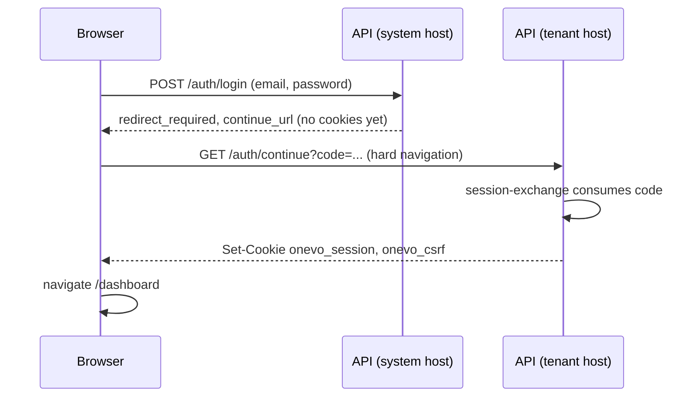
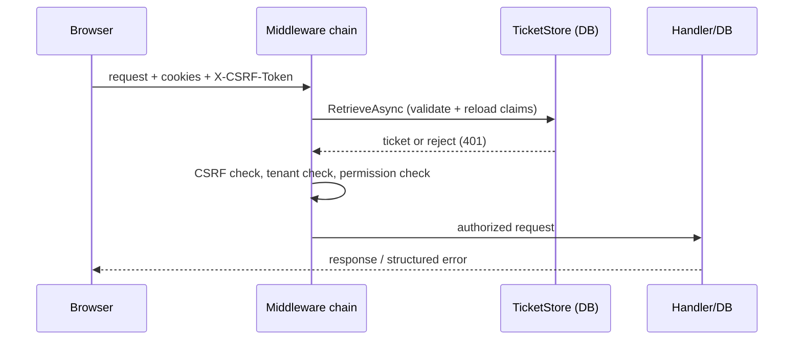
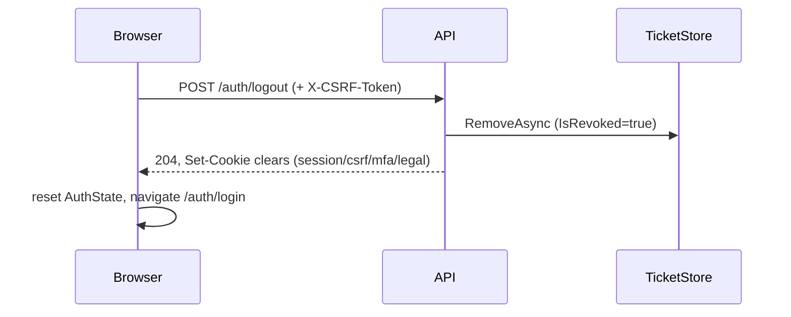

# ONEVO Authentication — End-to-End Workflow

Source of truth: actual code in `HRMS-Backend-v1` (ASP.NET Core) and
`Hrms--Web-application---front-end---v1` (Angular 21). No invented endpoints,
classes, or behaviour. Gaps are marked **Not currently implemented**.

## 1. Authentication Overview

ONEVO uses **server-side cookie sessions only** — no JWT/access/refresh tokens
are ever sent to the browser. Two independent cookie schemes exist:
`TenantScheme` (cookie `onevo_session`) and `AdminScheme` (cookie
`admin_session`), each backed by a custom `ITicketStore` that persists the
session in PostgreSQL (`sessions` / `platform_user_sessions`) and rebuilds the
user's claims (permissions included) **from the database on every request** —
the cookie itself only carries an opaque, encrypted session key.

- **Authentication** = proving identity (login, MFA, Google SSO) → a session row is created.
- **Session validation** = on every request, `ITicketStore.RetrieveAsync` re-checks revocation/expiry and reloads claims.
- **Authorization** = permission-code checks (`[RequirePermission]` / `[RequirePlatformPermission]`) against those freshly-loaded claims.
- **Tenant isolation** = host-based tenant resolution + claim-vs-host cross-check + PostgreSQL RLS, independent of the above.

End-to-end: browser submits credentials on the base/system host → backend
validates and (if multi-tenant match, legal docs pending, or MFA enrolled)
returns an intermediate state → once fully cleared, a **one-time exchange
code** hands the browser off to the tenant's own subdomain, where the real
`onevo_session`/`onevo_csrf` cookies are finally set → every subsequent
request carries these cookies plus a mirrored CSRF header for mutations.

## 2. Authentication Components

| Layer | Component | Responsibility |
|---|---|---|
| Frontend | `core/auth/data-access/auth-api.service.ts` | Typed HTTP calls: login, acceptLegalDocuments, sessionExchange, me, logout |
| Frontend | `core/auth/state/auth.store.ts` (Signal Store) | Holds `authenticated`, `permissions`, `activeModules`, legal/redirect flags, `loading`/`error` |
| Frontend | `core/auth/feature/{login,legal-consent,session-exchange}` | Login form, legal-consent acceptance, one-time-code exchange landing page |
| Frontend | `core/guards/auth.guard.ts` | Route guard; calls `checkSession()` → `GET /auth/me` |
| Frontend | `core/interceptors/{auth,csrf,correlation,error}.interceptor.ts` | `withCredentials`, CSRF header mirroring, correlation ID, 401/403/etc. handling |
| API | `Controllers/Tenant/Auth/*`, `Controllers/Admin/DevPlatform/Auth/AdminAuthController` | Auth endpoints (see §4) |
| API | `HostTenantResolutionMiddleware`, `TenantEnforcementMiddleware`, `CsrfProtectionMiddleware`, `AuthRateLimitingMiddleware`, `PermissionVersionMiddleware` | Pipeline security stages (§5) |
| Application | `BaseLoginCommand(Handler/Validator)`, `LoginContinuationService`, `TenantSessionExchangeService`, MFA/legal commands | Use-case orchestration |
| Infrastructure | `TenantDatabaseTicketStore` / `AdminDatabaseTicketStore` | DB-backed `ITicketStore` implementations |
| Infrastructure | `BCryptPasswordHasher`, `BaseLoginFixedWorkVerifier`, `OtpNetTotpService` | Password hashing, timing-safe candidate check, TOTP MFA |
| DB | `sessions`, `platform_user_sessions`, `tenant_session_exchange_challenges`, `mfa_challenges`, `users`, `roles`, `permissions`, `tenants` | Persistent auth state, all RLS-protected |
| Cookies | `onevo_session`, `onevo_csrf`, `onevo_mfa`, `onevo_legal_pending`, `onevo_legal_csrf`, `admin_session`, `admin_csrf`, `admin_mfa` | See §6/§10 |

## 3. Complete Login Workflow

1. User opens `/auth/login` (Angular, unguarded route). Form: `email` (required, email format), `password` (required) — `LoginComponent`.
2. Frontend does **not** resolve tenant/host explicitly; `environment.apiUrl` always targets `window.location.hostname`, and `AuthApiService.login()` additionally rewrites to the root/system host via `getSystemApiUrl`.
3. `POST {systemHost}/api/v1/auth/login` → `AuthLoginController.Login` (`[AllowAnonymous]`) → `BaseLoginCommand(Email, Password)` → `BaseLoginCommandValidator` (email format, both required, ≤254/128 chars).
4. `BaseLoginCommandHandler`: normalizes email, fetches **all** tenant/user candidates for that email across tenants, verifies password via `BaseLoginFixedWorkVerifier` (always exactly 8 BCrypt checks, padded with a dummy hash, to avoid timing leaks about candidate count).
5. Zero/overflow matches → generic 401. Multiple matches → `BaseLoginWorkspaceSelectionRequiredDto` (workspace picker, 5-min challenge). Exactly one match → `LoginContinuationService.ContinueAsync`.
6. Continuation: tenant must be Active/Trial; user must be active. Branches in order: `must_change_password` → MFA challenge (if verified TOTP exists) → legal-acceptance gate (`ILegalAcceptanceChecker`) → finalize.
7. Finalization mode is explicit, not host-inferred: `BaseDomainExchange` (base-host login) issues a 2-minute opaque exchange code and **does not** set any cookie; `TenantHostDirect` sets the real session immediately.
8. Response (`AuthSessionResponseDto`) never includes tenant/user GUIDs or tokens — only `authenticated`, `user.email`, `permissions[]`, flags, and (for the exchange case) `redirect_required: true` + `continue_url`.
9. Frontend `AuthStore.login()` patches state; `LoginComponent` reacts: `legalAcceptanceRequired` → navigate to `/auth/legal-consent`; `redirectRequired` → hard `window.location.href = continue_url` to the tenant subdomain's `/auth/continue`.
10. `SessionExchangeComponent` (route `/auth/continue`) reads `?code=`, calls `sessionExchange(code)` → `POST {tenantHost}/api/v1/auth/session-exchange` → `ConsumeAsync` re-validates and finally sets `onevo_session` + `onevo_csrf` via `ILoginSessionMaterialFactory`. Navigates to `/dashboard`.
11. Failure paths: invalid credentials → 401 generic message (enumeration-safe); missing legal docs → `legal_acceptance_required` branch; MFA enrolled → `mfa_required` branch with `onevo_mfa` cookie; rate limit → 429; expired/invalid exchange code → 401 shown as "sign-in link invalid or expired."

## 4. API-by-API Authentication Behaviour

Format: **METHOD /route** — purpose · auth · CSRF · request → handler · response/failure · source.

**POST /api/v1/auth/login** — base-domain credential login; tenant-host rejected (400). AllowAnonymous · CSRF-exempt · `BaseLoginCommand(Email,Password)` → `BaseLoginCommandHandler` · returns session/workspace-selection/mfa/legal/password-change branch · 401 generic, 429. `Controllers/Tenant/Auth/AuthLoginController.cs`.

**POST /api/v1/auth/login/select-workspace** — resolves multi-tenant email ambiguity. AllowAnonymous · CSRF-exempt · `SelectWorkspaceCommand(login_challenge, workspace)` · continues into `LoginContinuationService` · 401 on expired/invalid challenge. `AuthLoginController.cs`.

**POST /api/v1/auth/login/google** — Google ID-token login, base-host only. AllowAnonymous · CSRF-exempt · `BaseGoogleLoginCommand` · same continuation branches as password login. `AuthLoginController.cs`.

**POST /api/v1/auth/session-exchange** — consumes one-time code, sets real session cookies. AllowAnonymous · CSRF-exempt · `TenantSessionExchangeRequest(Code)` → `ITenantSessionExchangeService.ConsumeAsync` · sets `onevo_session`/`onevo_csrf` · 401 if code invalid/expired/reused. `Controllers/Tenant/Auth/AuthSessionController.cs`.

**GET /api/v1/auth/me** — current-session bootstrap, used by `authGuard`. `[Authorize(TenantPolicy)]` · n/a (GET) · `GetCurrentSessionQuery` · returns same `AuthSessionResponseDto` shape · 401 if no/expired session. `AuthSessionController.cs`.

**POST /api/v1/auth/logout** — revokes DB session, clears cookies. `[Authorize(TenantPolicy)]` · CSRF required · direct `SignOutAsync("TenantScheme")` → `TenantDatabaseTicketStore.RemoveAsync` sets `IsRevoked=true` · deletes `onevo_csrf/mfa/legal_pending/legal_csrf` · 204. `AuthSessionController.cs`.

**POST /api/v1/auth/mfa/enable** — begins TOTP setup. `[Authorize(TenantPolicy)]` · CSRF required · `EnableMfaCommand` → stores unverified `UserMfa` row · returns `MfaSetupDto(secret, qrCodeUri)` · 409 if already enabled. `AuthMfaController.cs`.

**POST /api/v1/auth/mfa/confirm-setup** — verifies first TOTP code, flips `IsVerified=true`. `[Authorize(TenantPolicy)]` · CSRF required · `ConfirmMfaSetupCommand`. `AuthMfaController.cs`.

**POST /api/v1/auth/mfa/verify** — completes login when MFA required. AllowAnonymous, requires `onevo_mfa` cookie · CSRF-exempt · `VerifyMfaCommand(Code)` → decrypt secret, verify TOTP (±90s window), 5-attempt lockout · success calls `FinishAuthenticatedLoginAsync` · 401 invalid code. `AuthMfaController.cs`.

**POST /api/v1/auth/forgot-password** — always generic response (enumeration-safe). AllowAnonymous · CSRF-exempt · `ForgotPasswordRequest(Email)` → `RequestPasswordResetCommand`/`BaseForgotPasswordCommand`. `AuthPasswordController.cs`.

**POST /api/v1/auth/reset-password** — consumes reset token, revokes all active refresh tokens for the user (force re-login). AllowAnonymous · CSRF-exempt · `ResetPasswordCommand(Token, NewPassword)` · 401/400 on invalid/expired token. `AuthPasswordController.cs`.

**POST /api/v1/auth/force-change-password** — required-password-change path. AllowAnonymous · CSRF-exempt · `ForcePasswordChangeCommand(Email, CurrentPassword, NewPassword)`. **Known gap**: continue-URL after this can point at an unreachable host when triggered from base-domain login (§12). `AuthPasswordController.cs`.

**GET /api/v1/auth/invitations/{token}** / **POST .../accept-password** / **POST .../accept-google** — invite acceptance, sets password or links Google identity, then behaves like login. AllowAnonymous · CSRF-exempt (whole prefix) · `GetInvitationByTokenQuery` / `AcceptInvitationPasswordCommand` / `AcceptInvitationGoogleCommand`. `AuthInvitationController.cs`.

**POST /api/v1/legal/acceptances/complete-login** — accepts pending legal docs mid-login. AllowAnonymous, requires `onevo_legal_pending` cookie · CSRF required manually (`onevo_legal_csrf` + `X-CSRF-Token`, validated in-action since middleware exempts this path) · `AcceptPendingLegalDocumentsCommand` · continues to finalize login. `AuthPendingLegalController.cs`.

**GET /api/v1/legal/pending** / **POST /api/v1/legal/acceptances** — post-login legal document check/acceptance for already-authenticated users. `[Authorize(TenantPolicy)]` · CSRF required for POST · `ILegalAcceptanceChecker.CheckAsync` / `SubmitLegalAcceptanceCommand`. `LegalController.cs`.

**GET /admin/v1/auth/google-config**, **POST /admin/v1/auth/google-callback**, **POST /admin/v1/auth/login** — platform-admin login (password or Google SSO), 5-failure/15-min lockout, no hardcoded admin identity (fully DB-backed). AllowAnonymous · CSRF-exempt · `AdminLoginCommand`/`AdminGoogleLoginCommand` · writes `PlatformAuthEvent` audit row every attempt · 401/423-style lock message. `AdminAuthController.cs`.

**POST /admin/v1/auth/mfa/enable|confirm-setup|verify** — mirrors tenant MFA, backed by `PlatformUser.MfaSecret/MfaStatus` directly (no join table). `AdminAuthController.cs`.

**POST /admin/v1/auth/logout** — `[Authorize(AdminPolicy)]` · CSRF required · `SignOutAsync("AdminScheme")` → revokes `platform_user_sessions` row + writes `PlatformAuthEvent(SessionRevoked)` · deletes `admin_csrf`. `AdminAuthController.cs`.

## 5. Authenticated Request Workflow

1. Browser sends request with `withCredentials: true` (forced by `auth.interceptor.ts`) so `onevo_session`/`onevo_csrf` cookies are included automatically.
2. For POST/PUT/PATCH/DELETE, `csrf.interceptor.ts` reads `onevo_csrf` (fallback `onevo_legal_csrf`) from `document.cookie` and mirrors it into header `X-CSRF-Token`.
3. Backend: `HostTenantResolutionMiddleware` resolves tenant from the `Host` header (cached, slug-pattern validated) → `AuthRateLimitingMiddleware` (POST auth routes only) → `UseAuthentication()` runs `TenantDatabaseTicketStore.RetrieveAsync`: looks up session by key hash, rejects if revoked/expired/absolute-lifetime exceeded, else **rebuilds permission claims fresh from the DB**.
4. `CsrfProtectionMiddleware` (unsafe methods, `/api/v1`+`/admin/v1` only, minus an exempt-path list): re-authenticates the relevant scheme, compares `SHA256(header token)` against the session's `csrf_token_hash` claim in constant time. Mismatch → 403.
5. `TenantEnforcementMiddleware`: cross-checks host-resolved tenant vs. session's `tenant_id` claim (mismatch → cookies deleted, 403); checks tenant status (Suspended/Cancelled/Provisioning → 403).
6. `PermissionVersionMiddleware`: **not applicable to normal `TenantScheme` cookie sessions** (they're always freshly rebuilt); only relevant to a non-browser token contract carrying `perm_ver` (see §12).
7. `UseAuthorization()` + `[RequirePermission("code")]`/`[RequirePlatformPermission("code")]` filters check the resolved permission claims → 403 if missing, 401 if unauthenticated.
8. Controller → MediatR → Application handler → Infrastructure (tenant-scoped repository, PostgreSQL RLS enforces isolation even if application-level scoping were bypassed) → response.

## 6. Session Lifecycle

| Stage | Tenant (`sessions`) | Admin (`platform_user_sessions`) |
|---|---|---|
| Creation | `TenantDatabaseTicketStore.StoreAsync`; only `SHA-256(key)` persisted | Same pattern |
| Sliding window | 30 min (`SessionPolicy.SlidingWindow`) | Same policy |
| Renewal threshold | 15 min | Same |
| Absolute lifetime | 8 h, hard cap regardless of activity | Same |
| Last-activity | Updated on every `RenewAsync` | Same |
| Revocation | `RemoveAsync` sets `IsRevoked=true` | Same + writes `PlatformAuthEvent(SessionRevoked)` |
| Password-change invalidation | `ResetPasswordCommandHandler` revokes all active `RefreshToken` rows (legacy table; see §12) — **no evidence session rows themselves are force-revoked on password reset** | Not traced |
| Account lock | Not applicable (tenant); Admin: 5 failed logins → 15-min lock | 5-attempt lockout |
| Multi-device/session | Not currently implemented (no concurrent-session limit or listing found) | Same |

## 7. Logout Workflow

1. Frontend: `DashboardHomeComponent.signOut()` → `AuthStore.logout()`.
2. `POST /api/v1/auth/logout` with CSRF header; any API error is swallowed client-side.
3. Backend: `SignOutAsync("TenantScheme")` → `TenantDatabaseTicketStore.RemoveAsync` (`IsRevoked=true`); explicitly deletes `onevo_csrf`, `onevo_mfa`, `onevo_legal_pending`, `onevo_legal_csrf`; `onevo_session` cleared by the sign-out itself. Returns 204.
4. Frontend `finally` block always resets `AuthState` to initial values and navigates to `/auth/login`, regardless of API outcome.

## 8. Authorization and Permissions

Frontend never hides UI as a security measure per se — but notably, **no
permission-gating UI consumer exists yet** (§12); `permissions[]`/`activeModules[]`
are populated in the store but unused for conditional rendering. Backend is
the sole authority: `[RequirePermission]` (tenant) and `[RequirePlatformPermission]`
(admin) filters check claims rebuilt fresh every request by `PermissionResolver`
(superuser shortcut, module entitlement filtering, role + per-user override
resolution, derived permissions). Unauthenticated → 401; authenticated but
missing permission → 403. `AdminPolicy` additionally requires a `platform_role`
claim to exist, but the doc comment is explicit that role name is never itself
an authorization rule — only permission codes are.

## 9. Authentication Error Behaviour

| Condition | Status | Frontend behaviour |
|---|---|---|
| Invalid credentials | 401 (generic, enumeration-safe) | Shown as `store.error()` inline on login/legal forms |
| Validation failure | 400 | Inline field errors |
| Missing/expired session (mid-session) | 401 | `error.interceptor.ts`: `clearSession()` + redirect to `/auth/login` |
| Missing/expired session (`/auth/login`, `/auth/me`) | 401 | Re-thrown only — no forced redirect (guard/login page handle it) |
| Revoked session | 401 | Same as expired |
| Missing/invalid CSRF | 403 | Banner via `ErrorHandlerService` |
| Tenant/host mismatch | 403 | Banner |
| Permission denied | 403 | Banner ("You don't have access to this.") |
| Locked/disabled account (admin) | 401 + lock message | Banner |
| Rate limit exceeded | 429, `Retry-After` header | Banner ("Too many requests...") |
| Unexpected server error | 500 (generic, no stack trace) | Banner |

## 10. Security Controls

| Control | Value |
|---|---|
| HttpOnly | `onevo_session`, `admin_session`, `onevo_mfa`, `onevo_legal_pending`, `admin_mfa` = true; CSRF cookies = false (by design, double-submit) |
| Secure | `SameAsRequest` in Development, `Always` otherwise (session cookies); CSRF cookies always secure outside Development |
| SameSite | `Strict` on all cookies |
| CSRF | Header token hashed and compared to session-bound `csrf_token_hash` claim (not a plain cookie/header string match) |
| Password hashing | BCrypt work factor 12 |
| Rate limiting | Per-IP + per-identity (email/token/challenge), in-memory (`AuthRateLimitingMiddleware`, explicitly flagged "Phase 1, process-local — must be replaced before horizontal scale") |
| Tenant isolation | Host resolution → claim cross-check → EF query filters → PostgreSQL RLS (defense in depth) |
| Session revocation | DB-flag based, immediate on logout |
| Sensitive-data logging | Not verified in this pass (out of scope of code read) |
| Correlation ID | `X-Correlation-ID`, generated per-request both sides |
| CORS | Configured in `Program.cs` (not detailed in this pass) |
| HTTPS/HSTS | `Secure=Always` outside Development implies HTTPS expectation; HSTS middleware not traced in this pass |
| No frontend token storage | Confirmed — no localStorage/sessionStorage/JWT anywhere in `core/auth` |

## 11. Code Path Reference

**Frontend**: `login.component.ts` → `auth.store.ts:login()` → `auth-api.service.ts:login()` → (redirect) `session-exchange.component.ts` → `auth.store.ts:exchangeSession()` → `dashboard-home.component.ts`.

**Backend**: `AuthLoginController.Login` → `BaseLoginCommand` → `BaseLoginCommandHandler` → `LoginContinuationService.ContinueAsync` → (`ITenantSessionExchangeService.CreateAsync` or `ILoginSessionMaterialFactory.PrepareAsync`) → `AuthSessionController.SessionExchange` → `TenantDatabaseTicketStore.StoreAsync` → `sessions` table → cookie set → every later request → `TenantDatabaseTicketStore.RetrieveAsync` → `PermissionResolver` → `permissions`/`roles`/`tenants` tables.

## 12. Current Gaps and Risks

- **Frontend/backend contract mismatch (partial)**: the auth plan doc (`docs/superpowers/plans/2026-07-28-core-auth-login-legal-consent.md`) predates the `workspace`/`redirect_required`/`continue_url`/session-exchange mechanism entirely — no design doc covers the currently-implemented flow.
- **Legacy dead code**: `IJwtTokenService.GenerateDeviceToken` is registered in DI but has zero call sites anywhere in `src/` — scaffolding for an unbuilt device/agent auth surface.
- **Legacy table, narrow use**: `RefreshToken`/`IRefreshTokenRepository` exist and are only touched by `ResetPasswordCommandHandler` (revocation on password reset) — no login path ever issues one. Confirms cookie-only sessions but leaves unused infrastructure in place.
- **Known unfixed inconsistency (backend team's own report)**: `ForcePasswordChangeCommandHandler` requires tenant-host context, but the continue-URL is built from the host where login started — a base-domain-triggered forced password change can produce an unreachable `continue_url`.
- **No permission-gating UI**: `permissions[]`/`activeModules[]` are fetched and stored but no component reads them for conditional rendering yet — acceptable at this stage since only a placeholder dashboard exists, but a gap once real feature modules land.
- **No multi-session/device management**: no listing or selective revocation of concurrent sessions found on either side.
- **`PermissionVersionMiddleware` scope**: explicitly bypasses normal tenant cookie sessions; only guards a non-browser `perm_ver`-claim contract that isn't otherwise documented as built yet.
- **Missing tests observed**: no frontend test found exercising the full login → legal-consent → session-exchange → dashboard chain end-to-end (only unit specs per file); backend has strong architecture-test coverage for the login retirement/tenant-isolation guarantees but no test was found covering the `force-change-password` continue-URL inconsistency above.
- **Correlation-ID generation**: frontend `correlation.interceptor.ts` builds its UUID manually via `Math.random()` rather than `crypto.randomUUID()` — not a security-critical value, but non-standard.

## 13. Authentication Working Summary

ONEVO authenticates browsers purely through backend-controlled, database-backed
cookie sessions — never JWTs or client-stored tokens. A base-domain login
validates credentials (with timing-safe multi-tenant candidate checking),
clears MFA/legal-acceptance gates, then hands the browser to the correct
tenant subdomain via a short-lived one-time code so that session and CSRF
cookies can be set on the right host. Every subsequent request revalidates
the session and reloads permissions directly from PostgreSQL — nothing about
authorization is cached in the cookie itself. CSRF is enforced by hashing a
mirrored header value against a claim on that same session, not a simple
cookie/header string match. Logout and password reset revoke the underlying
DB session record, not just the cookie. The design is deliberately mid-migration
away from tenant-host password login and an older JWT/refresh-token model,
with architecture tests actively guarding against regressions to the retired
flow; a handful of leftover unused interfaces and one documented continue-URL
edge case remain as known, unresolved technical debt.
