# Verified Employee Check-In — Master Execution Index

**Status:** Planning complete; implementation not started.

**Current end-to-end readiness:** Approximately 35%. Activation/JWT, employee display, device enrollment, backend check-in storage, laptop photo capture, and OS geolocation exist as separate pieces. AWS liveness/matching and the secure Tray → Service → backend check-in orchestration do not yet exist.

**Design authority:** `C:\HR\HRMS-Backend-v1\docs\superpowers\specs\next\2026-08-13-verified-employee-check-in-design.md`

## Final Identity Contract

| Value | Trusted source | Rule |
|---|---|---|
| `TenantId` | validated tray-device JWT | Never read from request body |
| `UserId` | validated tray-device JWT | Authentication identity |
| `DeviceRegistrationId` | JWT `sub` | Registered device identity; never `Environment.MachineName` |
| `EmployeeId` | backend CoreHR lookup by tenant + user | Real database GUID; never client-supplied |
| Employee number/name/email | activation/profile response | Display values, not authorization claims |
| `AttendanceSessionId` | Windows Service | Generated once and shared by check-in and work session |
| Live coordinates | fresh Windows OS geolocation call | Captured on every CLOCK IN; Preferences are not trusted |
| Face verdict | backend using AWS result + enrolled reference | Tray cannot self-declare success |

## Required Runtime Flow

```mermaid
flowchart LR
    A["Employee presses CLOCK IN"] --> B["Tray obtains fresh GPS"]
    B --> C["Service creates AttendanceSessionId"]
    C --> D["Backend validates JWT employee and device"]
    D --> E["Backend creates AWS Mumbai liveness session"]
    E --> F["MAUI WebView2 uses laptop camera"]
    F --> G["Video streams directly to AWS"]
    G --> H["Backend fetches liveness result"]
    H --> I["Backend CompareFaces with private R2 enrollment image"]
    I -->|"pass"| J["Persist one verified EmployeeCheckIn"]
    J --> K["Service starts PresenceSession"]
    K --> L["Clock-out submits WorkSession with same AttendanceSessionId"]
    I -->|"spoof or mismatch"| M["Reject; never fallback"]
    H -->|"provider/location unavailable and tenant opted in"| N["PendingReview only"]
```

## Execution Order

### Part 1 — Foundation and enrollment

File: `C:\HR\HRMS-Backend-v1\docs\superpowers\plans\next\2026-08-13-verified-employee-check-in\part-1-foundation-enrollment.md`

1. Add a server-side CoreHR employee resolver and test tenant isolation.
2. Add biometric profile/attempt tables, indexes, PostgreSQL RLS, and migration.
3. Add the AWS Rekognition/STS provider fixed to Mumbai (`ap-south-1`), least-privilege IAM roles, KMS, CloudTrail, and configuration validation.
4. Add enrollment attempt/profile APIs and private R2 reference storage.
5. Package React Amplify Face Liveness inside MAUI WebView2 and prove real Windows laptop-camera compatibility.

**Gate:** Do not start Part 2 until automated tests pass and a real built-in/external laptop camera completes staging liveness. Reject virtual cameras; verify permission-denied, camera-busy, weak-light, glasses, and retry behavior.

### Part 2 — Strict online check-in

File: `C:\HR\HRMS-Backend-v1\docs\superpowers\plans\next\2026-08-13-verified-employee-check-in\part-2-strict-online-check-in.md`

6. Add `EmployeeId`, `AttendanceSessionId`, biometric correlation, verification state, fresh-location metadata, and idempotent database constraints.
7. Add strict check-in attempt endpoints; backend evaluates liveness and `CompareFaces` before creating attendance.
8. Add versioned, typed named-pipe messages containing IDs and statuses only—never image/video bytes or AWS secret values.
9. Add the Windows Service API client/coordinator; it owns JWT, attendance ID, retry count, and lifecycle authority.
10. Wire CLOCK IN UI to fresh GPS → liveness → backend verdict; only `Verified` starts monitoring and the correlated work session.

**Gate:** A double-click or network retry creates one check-in; wrong device, stale GPS, replayed AWS session, spoof, or face mismatch creates none. The Service remains stopped until the backend says `Verified`.

### Part 3 — Employer review and online fallback

File: `C:\HR\HRMS-Backend-v1\docs\superpowers\plans\next\2026-08-13-verified-employee-check-in\part-3-review-online-fallback.md`

11. Add tenant policy with strict defaults; fallback switches are off unless an authorized employer enables them.
12. Add RBAC-protected employer attendance list/detail/review APIs with immutable audit history.
13. Add backend-online provider/location fallback evidence; accepted rows are always `PendingReview`.

**Gate:** Provider outage/location failure may enter fallback only when tenant policy allows it. Spoof detection or face mismatch must always reject and must never be review fallback.

### Part 4 — Offline recovery and rollout hardening

File: `C:\HR\HRMS-Backend-v1\docs\superpowers\plans\next\2026-08-13-verified-employee-check-in\part-4-offline-rollout.md`

14. Add signed policy cache plus encrypted, biometric-specific outbox; no generic activity record or Preferences storage.
15. Synchronize offline attempts as idempotent `PendingReview` rows and enforce automatic evidence retention/deletion.
16. Add secret/media log scans, metrics, fake-provider E2E, real Windows/AWS pilot, support runbooks, and tenant-by-tenant feature-flag rollout.

**Gate:** Complete a representative Windows pilot, prove no biometric secrets/media leak into logs/SQLite/Preferences, and confirm success media is not retained while pending evidence follows the approved retention period.

## Final Acceptance Checklist

- [ ] Activation ties the installed Service to one tenant, user, and registered device using refreshable device JWTs.
- [ ] Employee name/number display comes from the server; real `EmployeeId` is resolved server-side.
- [ ] CLOCK IN captures a fresh location with timestamp and accuracy.
- [ ] Built-in or attached real Windows laptop camera completes AWS Face Liveness in Mumbai.
- [ ] Onboarding creates one active, consented face reference in private R2.
- [ ] Every strict check-in runs a new liveness session and face comparison against that reference.
- [ ] Backend is the only authority that creates verified attendance.
- [ ] One Service-generated attendance ID correlates check-in, presence, clock-out, and work-session sync.
- [ ] Three fresh liveness sessions maximum per user action; sessions and credentials are not reused.
- [ ] Retry/double-click/replay is idempotent and cannot create duplicate attendance.
- [ ] No client-supplied employee/device identity is trusted.
- [ ] No access keys, session tokens, face bytes, AWS session IDs, or exact GPS values are logged.
- [ ] No biometric bytes enter generic IPC, generic collection records, Preferences, or normal Service SQLite.
- [ ] Employer review is permission-protected and fully audited.
- [ ] Fallback is opt-in, review-only, and impossible for spoof/mismatch outcomes.
- [ ] Provider outage, offline restart, camera denial/busy state, GPS denial, and retention cleanup are tested.

## Repository Safety Before Execution

The backend currently has an unresolved merge and both repositories contain existing user changes. Finish or abort that merge deliberately before implementation. Then create isolated worktrees and execute one numbered task per commit; do not stage unrelated files.
