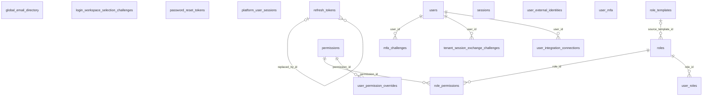

```
DB: OnevoDb_calsmoke
Last migration: 20260906134431_AddHolidayCalendarSettings
Snapshot generated: 2026-09-09T11:32:50Z
```

# Domain: Auth & Identity

### ER Diagram (same-domain relationships only)



### global_email_directory

| Column | Type | Key | Nullable | Default |
|---|---|---|---|---|
| email | text | PK | NOT NULL | – |
| tenant_id | uuid | PK, FK | NOT NULL | – |
| created_at | timestamptz |  | NOT NULL | now() |

#### References into other domains

| Source | Target | Target Domain | On Delete |
|---|---|---|---|
| `global_email_directory.tenant_id` | `tenants.id` | Tenancy & Subscription | CASCADE |

#### Referenced by other domains

_(none)_

### login_workspace_selection_challenges

| Column | Type | Key | Nullable | Default |
|---|---|---|---|---|
| id | uuid | PK | NOT NULL | – |
| challenge_hash | varchar128 |  | NOT NULL | – |
| normalized_email | varchar320 |  | NOT NULL | – |
| candidate_workspaces_json | jsonb |  | NOT NULL | – |
| purpose | varchar40 |  | NOT NULL | 'workspace_selection… |
| expires_at | timestamptz |  | NOT NULL | – |
| consumed_at | timestamptz |  | NULL | – |
| failed_attempt_count | integer |  | NOT NULL | 0 |
| created_at | timestamptz |  | NOT NULL | – |
| ip_address | varchar45 |  | NULL | – |
| user_agent | varchar500 |  | NULL | – |

#### References into other domains

_(none)_

#### Referenced by other domains

_(none)_

### mfa_challenges

| Column | Type | Key | Nullable | Default |
|---|---|---|---|---|
| id | uuid | PK | NOT NULL | – |
| tenant_id | uuid | FK | NOT NULL | – |
| user_id | uuid | FK | NOT NULL | – |
| challenge_hash | varchar128 |  | NOT NULL | – |
| origin | varchar30 |  | NOT NULL | 'password'::characte… |
| failed_attempt_count | integer |  | NOT NULL | 0 |
| expires_at | timestamptz |  | NOT NULL | – |
| consumed_at | timestamptz |  | NULL | – |
| created_at | timestamptz |  | NOT NULL | – |

#### References into other domains

| Source | Target | Target Domain | On Delete |
|---|---|---|---|
| `mfa_challenges.tenant_id` | `tenants.id` | Tenancy & Subscription | RESTRICT |

#### Referenced by other domains

_(none)_

### password_reset_tokens

| Column | Type | Key | Nullable | Default |
|---|---|---|---|---|
| id | uuid | PK | NOT NULL | – |
| user_id | uuid |  | NOT NULL | – |
| tenant_id | uuid |  | NOT NULL | – |
| token_hash | varchar128 |  | NOT NULL | – |
| expires_at | timestamptz |  | NOT NULL | – |
| used_at | timestamptz |  | NULL | – |
| created_at | timestamptz |  | NOT NULL | – |

#### References into other domains

_(none)_

#### Referenced by other domains

_(none)_

### permissions

| Column | Type | Key | Nullable | Default |
|---|---|---|---|---|
| id | uuid | PK | NOT NULL | – |
| code | varchar50 |  | NOT NULL | – |
| description | varchar255 |  | NOT NULL | – |
| module | varchar50 |  | NOT NULL | – |

#### References into other domains

_(none)_

#### Referenced by other domains

_(none)_

### platform_user_sessions

| Column | Type | Key | Nullable | Default |
|---|---|---|---|---|
| id | uuid | PK | NOT NULL | – |
| account_id | uuid | FK | NOT NULL | – |
| token_hash | varchar64 |  | NOT NULL | – |
| created_at | timestamptz |  | NOT NULL | – |
| last_activity_at | timestamptz |  | NOT NULL | – |
| expires_at | timestamptz |  | NOT NULL | – |
| revoked_at | timestamptz |  | NULL | – |
| ip_address | varchar45 |  | NULL | – |
| user_agent | varchar500 |  | NULL | – |
| csrf_token_hash | varchar128 |  | NOT NULL | – |

#### References into other domains

| Source | Target | Target Domain | On Delete |
|---|---|---|---|
| `platform_user_sessions.account_id` | `platform_users.id` | Platform Administration | CASCADE |

#### Referenced by other domains

_(none)_

### refresh_tokens

| Column | Type | Key | Nullable | Default |
|---|---|---|---|---|
| id | uuid | PK | NOT NULL | – |
| user_id | uuid |  | NOT NULL | – |
| token_hash | varchar128 |  | NOT NULL | – |
| expires_at | timestamptz |  | NOT NULL | – |
| replaced_by_id | uuid | FK | NULL | – |
| revoked_at | timestamptz |  | NULL | – |
| created_at | timestamptz |  | NOT NULL | – |
| tenant_id | uuid |  | NOT NULL | '00000000-0000-0000-… |

#### References into other domains

_(none)_

#### Referenced by other domains

_(none)_

### role_permissions

| Column | Type | Key | Nullable | Default |
|---|---|---|---|---|
| role_id | uuid | PK, FK | NOT NULL | – |
| permission_id | uuid | PK, FK | NOT NULL | – |
| tenant_id | uuid |  | NOT NULL | '00000000-0000-0000-… |

#### References into other domains

_(none)_

#### Referenced by other domains

_(none)_

### role_templates

| Column | Type | Key | Nullable | Default |
|---|---|---|---|---|
| id | uuid | PK | NOT NULL | – |
| name | varchar100 |  | NOT NULL | – |
| description | varchar255 |  | NOT NULL | – |
| module_keys_json | jsonb |  | NOT NULL | – |
| permission_codes_json | jsonb |  | NOT NULL | – |
| is_system | boolean |  | NOT NULL | – |
| version | integer |  | NOT NULL | – |
| is_active | boolean |  | NOT NULL | – |
| created_at | timestamptz |  | NOT NULL | – |
| updated_at | timestamptz |  | NULL | – |

#### References into other domains

_(none)_

#### Referenced by other domains

_(none)_

### roles

| Column | Type | Key | Nullable | Default |
|---|---|---|---|---|
| id | uuid | PK | NOT NULL | – |
| name | varchar100 |  | NOT NULL | – |
| description | varchar255 |  | NOT NULL | – |
| is_system | boolean |  | NOT NULL | – |
| tenant_id | uuid |  | NOT NULL | – |
| created_at | timestamptz |  | NOT NULL | – |
| updated_at | timestamptz |  | NULL | – |
| created_by_id | uuid |  | NOT NULL | – |
| is_deleted | boolean |  | NOT NULL | – |
| deleted_at | timestamptz |  | NULL | – |
| source_template_id | uuid | FK | NULL | – |

#### References into other domains

_(none)_

#### Referenced by other domains

| Source | Target | Source Domain | On Delete |
|---|---|---|---|
| `access_grant_requests.requested_role_id` | `roles.id` | Core HR & Employee Lifecycle | RESTRICT |
| `position_access_templates.role_id` | `roles.id` | Org Structure | RESTRICT |

### sessions

| Column | Type | Key | Nullable | Default |
|---|---|---|---|---|
| id | uuid | PK | NOT NULL | – |
| user_id | uuid |  | NOT NULL | – |
| tenant_id | uuid |  | NOT NULL | – |
| ip_address | varchar45 |  | NOT NULL | – |
| user_agent | varchar500 |  | NOT NULL | – |
| started_at | timestamptz |  | NOT NULL | – |
| last_activity_at | timestamptz |  | NOT NULL | – |
| expires_at | timestamptz |  | NOT NULL | – |
| is_revoked | boolean |  | NOT NULL | – |
| csrf_token_hash | varchar128 |  | NOT NULL | ''::character varyin… |
| key_hash | varchar128 |  | NOT NULL | ''::character varyin… |
| active_employee_id | uuid |  | NULL | – |

#### References into other domains

_(none)_

#### Referenced by other domains

_(none)_

### tenant_session_exchange_challenges

| Column | Type | Key | Nullable | Default |
|---|---|---|---|---|
| id | uuid | PK | NOT NULL | – |
| code_hash | varchar128 |  | NOT NULL | – |
| tenant_id | uuid | FK | NOT NULL | – |
| user_id | uuid | FK | NOT NULL | – |
| auth_origin | varchar64 |  | NOT NULL | – |
| ip_address | varchar128 |  | NULL | – |
| user_agent | varchar512 |  | NULL | – |
| expires_at | timestamptz |  | NOT NULL | – |
| consumed_at | timestamptz |  | NULL | – |
| created_at | timestamptz |  | NOT NULL | – |
| updated_at | timestamptz |  | NOT NULL | – |

#### References into other domains

| Source | Target | Target Domain | On Delete |
|---|---|---|---|
| `tenant_session_exchange_challenges.tenant_id` | `tenants.id` | Tenancy & Subscription | RESTRICT |

#### Referenced by other domains

_(none)_

### user_external_identities

| Column | Type | Key | Nullable | Default |
|---|---|---|---|---|
| id | uuid | PK | NOT NULL | – |
| tenant_id | uuid |  | NOT NULL | – |
| user_id | uuid |  | NOT NULL | – |
| provider | varchar32 |  | NOT NULL | – |
| provider_subject | varchar255 |  | NOT NULL | – |
| provider_email | varchar254 |  | NOT NULL | – |
| email_verified | boolean |  | NOT NULL | – |
| linked_at | timestamptz |  | NOT NULL | – |
| last_used_at | timestamptz |  | NULL | – |

#### References into other domains

_(none)_

#### Referenced by other domains

_(none)_

### user_integration_connections

| Column | Type | Key | Nullable | Default |
|---|---|---|---|---|
| id | uuid | PK | NOT NULL | – |
| tenant_id | uuid | FK | NOT NULL | – |
| user_id | uuid | FK | NOT NULL | – |
| integration_key | varchar50 | FK | NOT NULL | – |
| provider_user_id | varchar200 |  | NULL | – |
| provider_username | varchar200 |  | NULL | – |
| provider_email | varchar320 |  | NULL | – |
| access_token_encrypted | text |  | NULL | – |
| refresh_token_encrypted | text |  | NULL | – |
| token_expires_at | timestamptz |  | NULL | – |
| scopes_granted | text[] |  | NULL | – |
| status | varchar20 |  | NOT NULL | – |
| last_used_at | timestamptz |  | NULL | – |
| last_sync_at | timestamptz |  | NULL | – |
| error_message | text |  | NULL | – |
| connected_at | timestamptz |  | NOT NULL | – |
| disconnected_at | timestamptz |  | NULL | – |
| created_at | timestamptz |  | NOT NULL | – |
| updated_at | timestamptz |  | NULL | – |

#### References into other domains

| Source | Target | Target Domain | On Delete |
|---|---|---|---|
| `user_integration_connections.integration_key` | `integration_catalog.integration_key` | Platform Administration | RESTRICT |
| `user_integration_connections.tenant_id` | `tenants.id` | Tenancy & Subscription | RESTRICT |

#### Referenced by other domains

_(none)_

### user_mfa

| Column | Type | Key | Nullable | Default |
|---|---|---|---|---|
| id | uuid | PK | NOT NULL | – |
| user_id | uuid |  | NOT NULL | – |
| method_type | varchar20 |  | NOT NULL | – |
| secret | varchar512 |  | NOT NULL | – |
| is_verified | boolean |  | NOT NULL | – |
| created_at | timestamptz |  | NOT NULL | – |
| tenant_id | uuid |  | NOT NULL | '00000000-0000-0000-… |

#### References into other domains

_(none)_

#### Referenced by other domains

_(none)_

### user_permission_overrides

| Column | Type | Key | Nullable | Default |
|---|---|---|---|---|
| id | uuid | PK | NOT NULL | – |
| tenant_id | uuid |  | NOT NULL | – |
| user_id | uuid |  | NOT NULL | – |
| permission_id | uuid | FK | NOT NULL | – |
| grant_type | varchar10 |  | NOT NULL | – |
| reason | varchar255 |  | NOT NULL | – |
| granted_by | uuid |  | NOT NULL | – |
| created_at | timestamptz |  | NOT NULL | – |

#### References into other domains

_(none)_

#### Referenced by other domains

_(none)_

### user_roles

| Column | Type | Key | Nullable | Default |
|---|---|---|---|---|
| user_id | uuid | PK | NOT NULL | – |
| role_id | uuid | PK, FK | NOT NULL | – |
| assigned_at | timestamptz |  | NOT NULL | – |
| assigned_by | uuid |  | NOT NULL | – |
| expires_at | timestamptz |  | NULL | – |
| tenant_id | uuid |  | NOT NULL | '00000000-0000-0000-… |
| source_position_id | uuid |  | NULL | – |
| source_position_access_template_id | uuid |  | NULL | – |

#### References into other domains

_(none)_

#### Referenced by other domains

_(none)_

### users

| Column | Type | Key | Nullable | Default |
|---|---|---|---|---|
| id | uuid | PK | NOT NULL | – |
| email | varchar255 |  | NOT NULL | – |
| password_hash | varchar255 |  | NOT NULL | – |
| first_name | varchar100 |  | NOT NULL | – |
| last_name | varchar100 |  | NOT NULL | – |
| is_active | boolean |  | NOT NULL | – |
| email_verified | boolean |  | NOT NULL | – |
| must_change_password | boolean |  | NOT NULL | – |
| password_set_by_admin | boolean |  | NOT NULL | – |
| temporary_password_expires_at | timestamptz |  | NULL | – |
| password_reset_token_hash | varchar128 |  | NULL | – |
| password_reset_token_expires_at | timestamptz |  | NULL | – |
| last_login_at | timestamptz |  | NULL | – |
| tenant_id | uuid |  | NOT NULL | – |
| created_at | timestamptz |  | NOT NULL | – |
| updated_at | timestamptz |  | NULL | – |
| created_by_id | uuid |  | NOT NULL | – |
| is_deleted | boolean |  | NOT NULL | – |
| deleted_at | timestamptz |  | NULL | – |
| normalized_email | varchar255 |  | NOT NULL | – |

#### References into other domains

_(none)_

#### Referenced by other domains

| Source | Target | Source Domain | On Delete |
|---|---|---|---|
| `access_grant_requests.decided_by_user_id` | `users.id` | Core HR & Employee Lifecycle | RESTRICT |
| `access_grant_requests.requested_by_user_id` | `users.id` | Core HR & Employee Lifecycle | RESTRICT |
| `access_grant_requests.user_id` | `users.id` | Core HR & Employee Lifecycle | RESTRICT |
| `attendance_corrections.requested_by_id` | `users.id` | Time & Attendance | RESTRICT |
| `attendance_corrections.reviewed_by_id` | `users.id` | Time & Attendance | RESTRICT |
| `employee_checklist_tasks.assigned_to_id` | `users.id` | Core HR & Employee Lifecycle | RESTRICT |
| `file_records.uploaded_by_user_id` | `users.id` | Files & Infrastructure | RESTRICT |
| `file_upload_reservations.reserved_by_user_id` | `users.id` | Files & Infrastructure | RESTRICT |
| `legal_login_challenges.user_id` | `users.id` | Org Structure | RESTRICT |
| `tenant_integration_credentials.connected_by_user_id` | `users.id` | Tenancy & Subscription | RESTRICT |
| `work_area_change_requests.reviewed_by_id` | `users.id` | Time & Attendance | RESTRICT |
