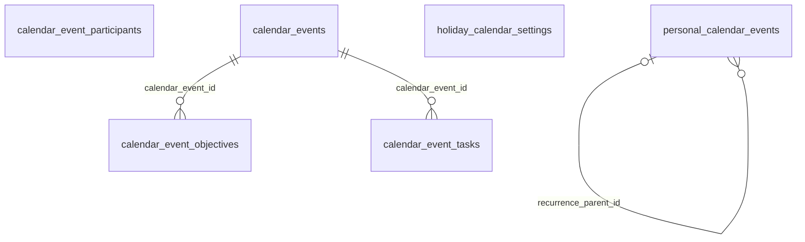

```
DB: OnevoDb_calsmoke
Last migration: 20260906134431_AddHolidayCalendarSettings
Snapshot generated: 2026-09-09T11:32:50Z
```

# Domain: Calendar

### ER Diagram (same-domain relationships only)



### calendar_event_objectives

| Column | Type | Key | Nullable | Default |
|---|---|---|---|---|
| id | uuid | PK | NOT NULL | – |
| calendar_event_id | uuid | FK | NOT NULL | – |
| objective_id | uuid | FK | NOT NULL | – |
| added_at | timestamptz |  | NOT NULL | – |

#### References into other domains

| Source | Target | Target Domain | On Delete |
|---|---|---|---|
| `calendar_event_objectives.objective_id` | `objectives.id` | Work Management | RESTRICT |

#### Referenced by other domains

_(none)_

### calendar_event_participants

| Column | Type | Key | Nullable | Default |
|---|---|---|---|---|
| id | uuid | PK | NOT NULL | – |
| event_id | uuid |  | NOT NULL | – |
| employee_id | uuid |  | NOT NULL | – |
| response_status | varchar30 |  | NOT NULL | 'pending'::character… |
| response_reason | text |  | NULL | – |
| tenant_id | uuid |  | NOT NULL | – |
| created_at | timestamptz |  | NOT NULL | – |
| updated_at | timestamptz |  | NULL | – |
| created_by_id | uuid |  | NOT NULL | – |
| is_deleted | boolean |  | NOT NULL | – |
| deleted_at | timestamptz |  | NULL | – |

#### References into other domains

_(none)_

#### Referenced by other domains

_(none)_

### calendar_event_tasks

| Column | Type | Key | Nullable | Default |
|---|---|---|---|---|
| id | uuid | PK | NOT NULL | – |
| calendar_event_id | uuid | FK | NOT NULL | – |
| task_id | uuid | FK | NOT NULL | – |
| added_at | timestamptz |  | NOT NULL | – |

#### References into other domains

| Source | Target | Target Domain | On Delete |
|---|---|---|---|
| `calendar_event_tasks.task_id` | `tasks.id` | Work Management | RESTRICT |

#### Referenced by other domains

_(none)_

### calendar_events

| Column | Type | Key | Nullable | Default |
|---|---|---|---|---|
| id | uuid | PK | NOT NULL | – |
| tenant_id | uuid |  | NOT NULL | – |
| project_id | uuid | FK | NOT NULL | – |
| name | varchar255 |  | NOT NULL | – |
| color | varchar7 |  | NOT NULL | – |
| status | varchar20 |  | NOT NULL | – |
| created_by_id | uuid |  | NOT NULL | – |
| created_at | timestamptz |  | NOT NULL | – |
| archived_by_id | uuid |  | NULL | – |
| archived_at | timestamptz |  | NULL | – |
| start_date | date |  | NOT NULL | – |
| end_date | date |  | NOT NULL | – |

#### References into other domains

| Source | Target | Target Domain | On Delete |
|---|---|---|---|
| `calendar_events.project_id` | `projects.id` | Work Management | RESTRICT |

#### Referenced by other domains

_(none)_

### holiday_calendar_settings

| Column | Type | Key | Nullable | Default |
|---|---|---|---|---|
| id | uuid | PK | NOT NULL | – |
| legal_entity_id | uuid |  | NOT NULL | – |
| default_country_code | varchar2 |  | NOT NULL | – |
| override_country_code | varchar2 |  | NULL | – |
| holiday_sync_enabled | boolean |  | NOT NULL | – |
| provider | varchar30 |  | NOT NULL | 'nager_holidays'::ch… |
| last_synced_year | integer |  | NULL | – |
| last_synced_at | timestamptz |  | NULL | – |
| updated_by_id | uuid |  | NULL | – |
| tenant_id | uuid |  | NOT NULL | – |
| created_at | timestamptz |  | NOT NULL | – |
| updated_at | timestamptz |  | NULL | – |
| created_by_id | uuid |  | NOT NULL | – |
| is_deleted | boolean |  | NOT NULL | – |
| deleted_at | timestamptz |  | NULL | – |

#### References into other domains

_(none)_

#### Referenced by other domains

_(none)_

### personal_calendar_events

| Column | Type | Key | Nullable | Default |
|---|---|---|---|---|
| id | uuid | PK | NOT NULL | – |
| title | varchar200 |  | NOT NULL | – |
| description | text |  | NULL | – |
| start_date | timestamptz |  | NOT NULL | – |
| end_date | timestamptz |  | NOT NULL | – |
| source_type | varchar30 |  | NOT NULL | – |
| source_id | uuid |  | NULL | – |
| color | varchar7 |  | NULL | – |
| recurrence | varchar20 |  | NOT NULL | 'none'::character va… |
| external_id | varchar255 |  | NULL | – |
| external_source | varchar30 |  | NULL | – |
| is_all_day | boolean |  | NOT NULL | – |
| timezone | varchar50 |  | NULL | – |
| event_status | varchar20 |  | NULL | – |
| is_private | boolean |  | NOT NULL | – |
| organizer_name | varchar200 |  | NULL | – |
| organizer_email | varchar255 |  | NULL | – |
| location | varchar500 |  | NULL | – |
| meeting_link | varchar500 |  | NULL | – |
| external_attendees | jsonb |  | NULL | – |
| recurrence_rule | text |  | NULL | – |
| external_updated_at | timestamptz |  | NULL | – |
| tenant_id | uuid |  | NOT NULL | – |
| created_at | timestamptz |  | NOT NULL | – |
| updated_at | timestamptz |  | NULL | – |
| created_by_id | uuid |  | NOT NULL | – |
| is_deleted | boolean |  | NOT NULL | – |
| deleted_at | timestamptz |  | NULL | – |
| is_recurrence_cancelled | boolean |  | NOT NULL | false |
| recurrence_original_start | timestamptz |  | NULL | – |
| recurrence_parent_id | uuid | FK | NULL | – |

#### References into other domains

_(none)_

#### Referenced by other domains

_(none)_
