```
DB: OnevoDb_calsmoke
Last migration: 20260906134431_AddHolidayCalendarSettings
Snapshot generated: 2026-09-09T11:32:50Z
```

# Domain: Core HR & Employee Lifecycle

### ER Diagram (same-domain relationships only)

```mermaid
erDiagram
  access_grant_requests {}
  bulk_onboarding_batch_rows {}
  bulk_onboarding_batches {}
  checklist_templates {}
  employee_addresses {}
  employee_bank_details {}
  employee_check_ins {}
  employee_checklist_tasks {}
  employee_dependents {}
  employee_emergency_contacts {}
  employee_hierarchy_closure {}
  employee_monitoring_overrides {}
  employee_work_sessions {}
  employees {}
  employment_statuses {}
  employment_types {}
  invitation_tokens {}
  management_coverage_records {}
  offboarding_records {}
  offboarding_task_bypass_requests {}
  onboarding_drafts {}
  work_modes {}
  employees |o--o{ access_grant_requests : "employee_id"
  onboarding_drafts |o--o{ access_grant_requests : "onboarding_draft_id"
  bulk_onboarding_batches ||--o{ bulk_onboarding_batch_rows : "batch_id"
  onboarding_drafts |o--o{ bulk_onboarding_batch_rows : "onboarding_draft_id"
  employees ||--o{ employee_addresses : "employee_id"
  employees ||--o{ employee_bank_details : "employee_id"
  checklist_templates |o--o{ employee_checklist_tasks : "template_id"
  employees ||--o{ employee_checklist_tasks : "employee_id"
  offboarding_records |o--o{ employee_checklist_tasks : "offboarding_record_id"
  employees ||--o{ employee_dependents : "employee_id"
  employees ||--o{ employee_emergency_contacts : "employee_id"
  checklist_templates |o--o{ offboarding_records : "checklist_template_id"
  employees ||--o{ offboarding_records : "employee_id"
  employee_checklist_tasks ||--o{ offboarding_task_bypass_requests : "employee_checklist_task_id"
  offboarding_records ||--o{ offboarding_task_bypass_requests : "offboarding_record_id"
  work_modes ||--o{ onboarding_drafts : "work_mode_id"
```



### access_grant_requests

| Column | Type | Key | Nullable | Default |
|---|---|---|---|---|
| id | uuid | PK | NOT NULL | – |
| tenant_id | uuid |  | NOT NULL | – |
| employee_id | uuid | FK | NULL | – |
| user_id | uuid | FK | NULL | – |
| onboarding_draft_id | uuid | FK | NULL | – |
| action_type | varchar30 |  | NOT NULL | – |
| target_position_id | uuid | FK | NOT NULL | – |
| target_department_id | uuid | FK | NOT NULL | – |
| position_access_template_id | uuid | FK | NOT NULL | – |
| requested_role_id | uuid | FK | NOT NULL | – |
| approval_status | varchar20 |  | NOT NULL | – |
| requested_by_user_id | uuid | FK | NOT NULL | – |
| decided_by_user_id | uuid | FK | NULL | – |
| requested_at | timestamptz |  | NOT NULL | – |
| decided_at | timestamptz |  | NULL | – |
| effective_from | timestamptz |  | NOT NULL | – |
| effective_to | timestamptz |  | NULL | – |
| decision_note | varchar500 |  | NULL | – |
| change_reason | text |  | NULL | – |
| reserved_position_assignment_id | uuid |  | NULL | – |

#### References into other domains

| Source | Target | Target Domain | On Delete |
|---|---|---|---|
| `access_grant_requests.target_department_id` | `departments.id` | Org Structure | RESTRICT |
| `access_grant_requests.position_access_template_id` | `position_access_templates.id` | Org Structure | RESTRICT |
| `access_grant_requests.target_position_id` | `positions.id` | Org Structure | RESTRICT |
| `access_grant_requests.requested_role_id` | `roles.id` | Auth & Identity | RESTRICT |
| `access_grant_requests.decided_by_user_id` | `users.id` | Auth & Identity | RESTRICT |
| `access_grant_requests.requested_by_user_id` | `users.id` | Auth & Identity | RESTRICT |
| `access_grant_requests.user_id` | `users.id` | Auth & Identity | RESTRICT |

#### Referenced by other domains

_(none)_

### bulk_onboarding_batch_rows

| Column | Type | Key | Nullable | Default |
|---|---|---|---|---|
| id | uuid | PK | NOT NULL | – |
| batch_id | uuid | FK | NOT NULL | – |
| row_number | integer |  | NOT NULL | – |
| raw_data_json | jsonb |  | NOT NULL | – |
| resolved_department_id | uuid |  | NULL | – |
| resolved_position_id | uuid |  | NULL | – |
| resolved_template_id | uuid |  | NULL | – |
| status | varchar30 |  | NOT NULL | – |
| error_message | text |  | NULL | – |
| onboarding_draft_id | uuid | FK | NULL | – |
| tenant_id | uuid |  | NOT NULL | – |
| created_at | timestamptz |  | NOT NULL | – |
| updated_at | timestamptz |  | NULL | – |
| created_by_id | uuid |  | NOT NULL | – |
| is_deleted | boolean |  | NOT NULL | – |
| deleted_at | timestamptz |  | NULL | – |
| resolved_reports_to_employee_id | uuid |  | NULL | – |
| resolved_work_mode_id | integer |  | NULL | – |

#### References into other domains

_(none)_

#### Referenced by other domains

_(none)_

### bulk_onboarding_batches

| Column | Type | Key | Nullable | Default |
|---|---|---|---|---|
| id | uuid | PK | NOT NULL | – |
| legal_entity_id | uuid | FK | NOT NULL | – |
| default_employment_type | varchar30 |  | NULL | – |
| default_work_mode_id | integer |  | NULL | – |
| default_checklist_template_id | uuid |  | NULL | – |
| column_mapping_json | jsonb |  | NULL | – |
| original_file_name | varchar255 |  | NOT NULL | – |
| status | varchar30 |  | NOT NULL | – |
| total_rows | integer |  | NOT NULL | – |
| valid_rows | integer |  | NULL | – |
| invalid_rows | integer |  | NULL | – |
| created_by_user_id | uuid |  | NOT NULL | – |
| completed_at | timestamptz |  | NULL | – |
| tenant_id | uuid |  | NOT NULL | – |
| created_at | timestamptz |  | NOT NULL | – |
| updated_at | timestamptz |  | NULL | – |
| created_by_id | uuid |  | NOT NULL | – |
| is_deleted | boolean |  | NOT NULL | – |
| deleted_at | timestamptz |  | NULL | – |
| selected_draft_ids_json | jsonb |  | NULL | – |
| resolution_state_json | jsonb |  | NULL | – |

#### References into other domains

| Source | Target | Target Domain | On Delete |
|---|---|---|---|
| `bulk_onboarding_batches.legal_entity_id` | `legal_entities.id` | Org Structure | RESTRICT |

#### Referenced by other domains

_(none)_

### checklist_templates

| Column | Type | Key | Nullable | Default |
|---|---|---|---|---|
| id | uuid | PK | NOT NULL | – |
| tenant_id | uuid |  | NOT NULL | – |
| name | varchar100 |  | NOT NULL | – |
| template_type | varchar20 |  | NOT NULL | – |
| department_id | uuid | FK | NULL | – |
| tasks_json | jsonb |  | NOT NULL | – |
| is_active | boolean |  | NOT NULL | true |
| legal_entity_id | uuid | FK | NULL | – |
| position_id | uuid | FK | NULL | – |

#### References into other domains

| Source | Target | Target Domain | On Delete |
|---|---|---|---|
| `checklist_templates.department_id` | `departments.id` | Org Structure | RESTRICT |
| `checklist_templates.legal_entity_id` | `legal_entities.id` | Org Structure | RESTRICT |
| `checklist_templates.position_id` | `positions.id` | Org Structure | RESTRICT |

#### Referenced by other domains

_(none)_

### employee_addresses

| Column | Type | Key | Nullable | Default |
|---|---|---|---|---|
| id | uuid | PK | NOT NULL | – |
| employee_id | uuid | FK | NOT NULL | – |
| address_type | varchar20 |  | NOT NULL | – |
| address_json | jsonb |  | NOT NULL | – |
| is_primary | boolean |  | NOT NULL | – |
| tenant_id | uuid |  | NOT NULL | – |
| created_at | timestamptz |  | NOT NULL | – |
| updated_at | timestamptz |  | NULL | – |
| created_by_id | uuid |  | NOT NULL | – |
| is_deleted | boolean |  | NOT NULL | – |
| deleted_at | timestamptz |  | NULL | – |

#### References into other domains

_(none)_

#### Referenced by other domains

_(none)_

### employee_bank_details

| Column | Type | Key | Nullable | Default |
|---|---|---|---|---|
| id | uuid | PK | NOT NULL | – |
| employee_id | uuid | FK | NOT NULL | – |
| bank_name | varchar100 |  | NOT NULL | – |
| branch_name | varchar100 |  | NOT NULL | – |
| account_holder_name | varchar100 |  | NOT NULL | – |
| account_number_encrypted | varchar500 |  | NOT NULL | – |
| account_type | varchar30 |  | NOT NULL | – |
| routing_number | varchar20 |  | NULL | – |
| is_primary | boolean |  | NOT NULL | – |
| tenant_id | uuid |  | NOT NULL | – |
| created_at | timestamptz |  | NOT NULL | – |
| updated_at | timestamptz |  | NULL | – |
| created_by_id | uuid |  | NOT NULL | – |
| is_deleted | boolean |  | NOT NULL | – |
| deleted_at | timestamptz |  | NULL | – |

#### References into other domains

_(none)_

#### Referenced by other domains

_(none)_

### employee_check_ins

| Column | Type | Key | Nullable | Default |
|---|---|---|---|---|
| id | uuid | PK | NOT NULL | – |
| tenant_id | uuid |  | NOT NULL | – |
| user_id | uuid |  | NOT NULL | – |
| device_registration_id | uuid |  | NOT NULL | – |
| latitude | double precision |  | NULL | – |
| longitude | double precision |  | NULL | – |
| location_accuracy | double precision |  | NULL | – |
| location_address | varchar500 |  | NULL | – |
| device_serial_number | varchar200 |  | NULL | – |
| face_scan_id | uuid | FK | NULL | – |
| checked_in_at | timestamptz |  | NOT NULL | – |
| created_at | timestamptz |  | NOT NULL | – |

#### References into other domains

| Source | Target | Target Domain | On Delete |
|---|---|---|---|
| `employee_check_ins.face_scan_id` | `monitoring_face_scans.id` | Monitoring & Activity | SET NULL |

#### Referenced by other domains

_(none)_

### employee_checklist_tasks

| Column | Type | Key | Nullable | Default |
|---|---|---|---|---|
| id | uuid | PK | NOT NULL | – |
| tenant_id | uuid |  | NOT NULL | – |
| employee_id | uuid | FK | NOT NULL | – |
| template_id | uuid | FK | NULL | – |
| lifecycle_type | varchar20 |  | NOT NULL | – |
| task_title | varchar200 |  | NOT NULL | – |
| owner_type | varchar30 |  | NOT NULL | – |
| sequence | integer |  | NULL | – |
| assigned_to_id | uuid | FK | NOT NULL | – |
| due_date | date |  | NOT NULL | – |
| status | varchar20 |  | NOT NULL | – |
| completed_at | timestamptz |  | NULL | – |
| is_required | boolean |  | NOT NULL | true |
| bypass_penalty_description | varchar500 |  | NULL | – |
| category | varchar40 |  | NULL | – |
| is_bypassable | boolean |  | NOT NULL | false |
| offboarding_record_id | uuid | FK | NULL | – |

#### References into other domains

| Source | Target | Target Domain | On Delete |
|---|---|---|---|
| `employee_checklist_tasks.assigned_to_id` | `users.id` | Auth & Identity | RESTRICT |

#### Referenced by other domains

_(none)_

### employee_dependents

| Column | Type | Key | Nullable | Default |
|---|---|---|---|---|
| id | uuid | PK | NOT NULL | – |
| employee_id | uuid | FK | NOT NULL | – |
| name | varchar100 |  | NOT NULL | – |
| relationship | varchar20 |  | NOT NULL | – |
| date_of_birth | date |  | NOT NULL | – |
| is_emergency_contact | boolean |  | NOT NULL | – |
| phone | varchar20 |  | NULL | – |
| tenant_id | uuid |  | NOT NULL | – |
| created_at | timestamptz |  | NOT NULL | – |
| updated_at | timestamptz |  | NULL | – |
| created_by_id | uuid |  | NOT NULL | – |
| is_deleted | boolean |  | NOT NULL | – |
| deleted_at | timestamptz |  | NULL | – |

#### References into other domains

_(none)_

#### Referenced by other domains

_(none)_

### employee_emergency_contacts

| Column | Type | Key | Nullable | Default |
|---|---|---|---|---|
| id | uuid | PK | NOT NULL | – |
| employee_id | uuid | FK | NOT NULL | – |
| name | varchar100 |  | NOT NULL | – |
| relationship | varchar30 |  | NOT NULL | – |
| phone | varchar20 |  | NOT NULL | – |
| email | varchar255 |  | NULL | – |
| is_primary | boolean |  | NOT NULL | – |
| tenant_id | uuid |  | NOT NULL | – |
| created_at | timestamptz |  | NOT NULL | – |
| updated_at | timestamptz |  | NULL | – |
| created_by_id | uuid |  | NOT NULL | – |
| is_deleted | boolean |  | NOT NULL | – |
| deleted_at | timestamptz |  | NULL | – |

#### References into other domains

_(none)_

#### Referenced by other domains

_(none)_

### employee_hierarchy_closure

| Column | Type | Key | Nullable | Default |
|---|---|---|---|---|
| tenant_id | uuid | PK | NOT NULL | – |
| ancestor_employee_id | uuid | PK | NOT NULL | – |
| descendant_employee_id | uuid | PK | NOT NULL | – |
| depth | integer |  | NOT NULL | – |
| source_position_assignment_id | uuid |  | NOT NULL | – |
| generated_at | timestamptz |  | NOT NULL | – |

#### References into other domains

_(none)_

#### Referenced by other domains

_(none)_

### employee_monitoring_overrides

| Column | Type | Key | Nullable | Default |
|---|---|---|---|---|
| id | uuid | PK | NOT NULL | – |
| tenant_id | uuid |  | NOT NULL | – |
| employee_id | uuid |  | NOT NULL | – |
| activity_monitoring | boolean |  | NULL | – |
| application_tracking | boolean |  | NULL | – |
| document_tracking | boolean |  | NULL | – |
| communication_tracking | boolean |  | NULL | – |
| screenshot_capture | boolean |  | NULL | – |
| auto_screenshot_capture | boolean |  | NULL | – |
| meeting_detection | boolean |  | NULL | – |
| device_tracking | boolean |  | NULL | – |
| work_location_verification | boolean |  | NULL | – |
| identity_verification | boolean |  | NULL | – |
| biometric | boolean |  | NULL | – |
| override_reason | varchar500 |  | NOT NULL | – |
| set_by_id | uuid |  | NOT NULL | – |
| created_at | timestamptz |  | NOT NULL | – |
| updated_at | timestamptz |  | NOT NULL | – |
| idle_threshold_minutes | integer |  | NULL | – |

#### References into other domains

_(none)_

#### Referenced by other domains

_(none)_

### employee_work_sessions

| Column | Type | Key | Nullable | Default |
|---|---|---|---|---|
| id | uuid | PK | NOT NULL | – |
| tenant_id | uuid |  | NOT NULL | – |
| user_id | uuid |  | NOT NULL | – |
| device_registration_id | uuid |  | NOT NULL | – |
| clock_in_at | timestamptz |  | NOT NULL | – |
| clock_out_at | timestamptz |  | NOT NULL | – |
| accumulated_break_seconds | integer |  | NOT NULL | – |
| accumulated_work_seconds | integer |  | NOT NULL | – |
| break_session_count | integer |  | NOT NULL | – |
| schedule_display | varchar100 |  | NULL | – |
| created_at | timestamptz |  | NOT NULL | – |

#### References into other domains

_(none)_

#### Referenced by other domains

_(none)_

### employees

| Column | Type | Key | Nullable | Default |
|---|---|---|---|---|
| id | uuid | PK | NOT NULL | – |
| user_id | uuid |  | NOT NULL | – |
| employee_number | varchar20 |  | NOT NULL | – |
| first_name | varchar100 |  | NOT NULL | – |
| last_name | varchar100 |  | NOT NULL | – |
| email | varchar255 |  | NOT NULL | – |
| phone | varchar20 |  | NULL | – |
| date_of_birth | date |  | NULL | – |
| gender | varchar10 |  | NULL | – |
| nationality_id | uuid |  | NULL | – |
| department_id | uuid |  | NULL | – |
| legal_entity_id | uuid |  | NULL | – |
| hire_date | date |  | NOT NULL | – |
| probation_end_date | date |  | NULL | – |
| termination_date | date |  | NULL | – |
| avatar_file_id | uuid |  | NULL | – |
| tenant_id | uuid |  | NOT NULL | – |
| created_at | timestamptz |  | NOT NULL | – |
| updated_at | timestamptz |  | NULL | – |
| created_by_id | uuid |  | NOT NULL | – |
| is_deleted | boolean |  | NOT NULL | – |
| deleted_at | timestamptz |  | NULL | – |
| employment_status_id | integer |  | NOT NULL | 0 |
| employment_type_id | integer |  | NOT NULL | 0 |
| work_mode_id | integer |  | NOT NULL | 0 |
| display_timezone | varchar50 |  | NULL | – |

#### References into other domains

_(none)_

#### Referenced by other domains

| Source | Target | Source Domain | On Delete |
|---|---|---|---|
| `attendance_corrections.employee_id` | `employees.id` | Time & Attendance | RESTRICT |
| `leave_approval_delegates.approver_employee_id` | `employees.id` | Leave & Time-Off | RESTRICT |
| `leave_approval_delegates.delegate_employee_id` | `employees.id` | Leave & Time-Off | RESTRICT |
| `leave_balance_audits.employee_id` | `employees.id` | Leave & Time-Off | RESTRICT |
| `leave_entitlements.employee_id` | `employees.id` | Leave & Time-Off | RESTRICT |
| `leave_request_approvers.approver_employee_id` | `employees.id` | Leave & Time-Off | RESTRICT |
| `leave_request_info_messages.sender_employee_id` | `employees.id` | Leave & Time-Off | RESTRICT |
| `leave_requests.employee_id` | `employees.id` | Leave & Time-Off | RESTRICT |
| `position_assignments.employee_id` | `employees.id` | Org Structure | RESTRICT |
| `work_area_change_requests.employee_id` | `employees.id` | Time & Attendance | RESTRICT |

### employment_statuses

| Column | Type | Key | Nullable | Default |
|---|---|---|---|---|
| id | integer | PK | NOT NULL | – |
| code | varchar50 |  | NOT NULL | – |
| label | varchar100 |  | NOT NULL | – |

#### References into other domains

_(none)_

#### Referenced by other domains

_(none)_

### employment_types

| Column | Type | Key | Nullable | Default |
|---|---|---|---|---|
| id | integer | PK | NOT NULL | – |
| code | varchar50 |  | NOT NULL | – |
| label | varchar100 |  | NOT NULL | – |

#### References into other domains

_(none)_

#### Referenced by other domains

_(none)_

### invitation_tokens

| Column | Type | Key | Nullable | Default |
|---|---|---|---|---|
| id | uuid | PK | NOT NULL | – |
| tenant_id | uuid |  | NOT NULL | – |
| user_id | uuid |  | NOT NULL | – |
| role_id | uuid |  | NULL | – |
| invited_email | varchar254 |  | NOT NULL | – |
| invited_full_name | varchar255 |  | NOT NULL | – |
| status | varchar20 |  | NOT NULL | – |
| token_hash | varchar128 |  | NOT NULL | – |
| expires_at | timestamptz |  | NOT NULL | – |
| used_at | timestamptz |  | NULL | – |
| completed_with | varchar20 |  | NULL | – |
| revoked_at | timestamptz |  | NULL | – |
| revoked_by_id | uuid |  | NULL | – |
| completion_methods_json | jsonb |  | NULL | – |
| allow_google_email_mismatch | boolean |  | NULL | – |
| allowed_email_domains_json | jsonb |  | NULL | – |
| created_at | timestamptz |  | NOT NULL | – |
| created_by_id | uuid |  | NULL | – |
| position_id | uuid |  | NULL | – |
| purpose | varchar50 |  | NOT NULL | 'general'::character… |
| legal_entity_id | uuid |  | NULL | – |
| employee_id | uuid |  | NULL | – |
| onboarding_draft_id | uuid |  | NULL | – |
| position_assignment_id | uuid |  | NULL | – |

#### References into other domains

_(none)_

#### Referenced by other domains

_(none)_

### management_coverage_records

| Column | Type | Key | Nullable | Default |
|---|---|---|---|---|
| id | uuid | PK | NOT NULL | – |
| tenant_id | uuid |  | NOT NULL | – |
| legal_entity_id | uuid | FK | NOT NULL | – |
| owner_position_id | uuid | FK | NOT NULL | – |
| covered_target_type | varchar20 |  | NOT NULL | – |
| covered_position_id | uuid | FK | NULL | – |
| covered_department_id | uuid | FK | NULL | – |
| owner_order | integer |  | NOT NULL | 1 |
| source | varchar30 |  | NOT NULL | – |
| is_locked | boolean |  | NOT NULL | true |
| status | varchar20 |  | NOT NULL | 'active'::character … |
| created_at | timestamptz |  | NOT NULL | – |
| updated_at | timestamptz |  | NULL | – |
| responsible_employee_id | uuid |  | NULL | – |

#### References into other domains

| Source | Target | Target Domain | On Delete |
|---|---|---|---|
| `management_coverage_records.covered_department_id` | `departments.id` | Org Structure | RESTRICT |
| `management_coverage_records.legal_entity_id` | `legal_entities.id` | Org Structure | RESTRICT |
| `management_coverage_records.covered_position_id` | `positions.id` | Org Structure | RESTRICT |
| `management_coverage_records.owner_position_id` | `positions.id` | Org Structure | RESTRICT |

#### Referenced by other domains

_(none)_

### offboarding_records

| Column | Type | Key | Nullable | Default |
|---|---|---|---|---|
| id | uuid | PK | NOT NULL | – |
| tenant_id | uuid |  | NOT NULL | – |
| employee_id | uuid | FK | NOT NULL | – |
| reason | varchar30 |  | NOT NULL | – |
| last_working_date | date |  | NOT NULL | – |
| knowledge_risk_level | varchar10 |  | NOT NULL | – |
| rehire_eligibility | varchar20 |  | NULL | – |
| notes | text |  | NULL | – |
| checklist_template_id | uuid | FK | NULL | – |
| exit_interview_notes | text |  | NULL | – |
| penalties_json | jsonb |  | NOT NULL | '{}'::jsonb |
| status | varchar20 |  | NOT NULL | – |
| initiated_by_id | uuid |  | NOT NULL | – |
| previous_employment_status_id | integer |  | NULL | – |
| created_at | timestamptz |  | NOT NULL | – |
| updated_at | timestamptz |  | NULL | – |
| completed_at | timestamptz |  | NULL | – |

#### References into other domains

_(none)_

#### Referenced by other domains

_(none)_

### offboarding_task_bypass_requests

| Column | Type | Key | Nullable | Default |
|---|---|---|---|---|
| id | uuid | PK | NOT NULL | – |
| tenant_id | uuid |  | NOT NULL | – |
| employee_checklist_task_id | uuid | FK | NOT NULL | – |
| offboarding_record_id | uuid | FK | NOT NULL | – |
| requested_by_id | uuid |  | NOT NULL | – |
| approver_id | uuid |  | NOT NULL | – |
| bypass_reason | varchar500 |  | NOT NULL | – |
| penalty_description | varchar500 |  | NULL | – |
| prior_task_status | varchar20 |  | NOT NULL | – |
| status | varchar20 |  | NOT NULL | – |
| requested_at | timestamptz |  | NOT NULL | – |
| decided_at | timestamptz |  | NULL | – |
| decision_comment | varchar500 |  | NULL | – |

#### References into other domains

_(none)_

#### Referenced by other domains

_(none)_

### onboarding_drafts

| Column | Type | Key | Nullable | Default |
|---|---|---|---|---|
| id | uuid | PK | NOT NULL | – |
| work_email | varchar320 |  | NOT NULL | – |
| legal_entity_id | uuid | FK | NOT NULL | – |
| department_id | uuid | FK | NULL | – |
| position_id | uuid | FK | NULL | – |
| employment_type | varchar30 |  | NOT NULL | – |
| start_date | date |  | NOT NULL | – |
| employee_number | varchar20 |  | NULL | – |
| selected_template_id | uuid |  | NULL | – |
| edited_tasks_json | jsonb |  | NULL | – |
| status | varchar30 |  | NOT NULL | – |
| draft_reason | varchar50 |  | NULL | – |
| last_saved_step | varchar50 |  | NOT NULL | – |
| started_by_id | uuid |  | NOT NULL | – |
| finalized_at | timestamptz |  | NULL | – |
| tenant_id | uuid |  | NOT NULL | – |
| created_at | timestamptz |  | NOT NULL | – |
| updated_at | timestamptz |  | NULL | – |
| created_by_id | uuid |  | NOT NULL | – |
| is_deleted | boolean |  | NOT NULL | – |
| deleted_at | timestamptz |  | NULL | – |
| first_name | varchar100 |  | NOT NULL | – |
| last_name | varchar100 |  | NOT NULL | – |
| work_mode_id | integer | FK | NOT NULL | 1 |
| reports_to_employee_id | uuid |  | NULL | – |

#### References into other domains

| Source | Target | Target Domain | On Delete |
|---|---|---|---|
| `onboarding_drafts.department_id` | `departments.id` | Org Structure | RESTRICT |
| `onboarding_drafts.legal_entity_id` | `legal_entities.id` | Org Structure | RESTRICT |
| `onboarding_drafts.position_id` | `positions.id` | Org Structure | RESTRICT |

#### Referenced by other domains

_(none)_

### work_modes

| Column | Type | Key | Nullable | Default |
|---|---|---|---|---|
| id | integer | PK | NOT NULL | – |
| code | varchar50 |  | NOT NULL | – |
| label | varchar100 |  | NOT NULL | – |
| is_active | boolean |  | NOT NULL | true |

#### References into other domains

_(none)_

#### Referenced by other domains

_(none)_
