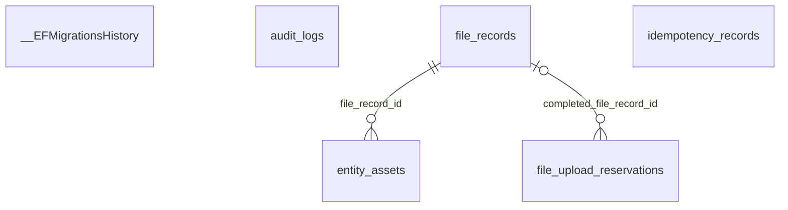

```
DB: OnevoDb_calsmoke
Last migration: 20260906134431_AddHolidayCalendarSettings
Snapshot generated: 2026-09-09T11:32:50Z
```

# Domain: Files & Infrastructure

### ER Diagram (same-domain relationships only)



### __EFMigrationsHistory

| Column | Type | Key | Nullable | Default |
|---|---|---|---|---|
| migration_id | varchar150 | PK | NOT NULL | – |
| product_version | varchar32 |  | NOT NULL | – |

#### References into other domains

_(none)_

#### Referenced by other domains

_(none)_

### audit_logs

| Column | Type | Key | Nullable | Default |
|---|---|---|---|---|
| id | uuid | PK | NOT NULL | – |
| tenant_id | uuid |  | NOT NULL | – |
| user_id | uuid |  | NULL | – |
| action | varchar100 |  | NOT NULL | – |
| resource_type | varchar50 |  | NOT NULL | – |
| resource_id | uuid |  | NULL | – |
| old_values_json | jsonb |  | NULL | – |
| new_values_json | jsonb |  | NULL | – |
| ip_address | varchar45 |  | NULL | – |
| correlation_id | uuid |  | NULL | – |
| created_at | timestamptz |  | NOT NULL | – |

#### References into other domains

_(none)_

#### Referenced by other domains

_(none)_

### entity_assets

| Column | Type | Key | Nullable | Default |
|---|---|---|---|---|
| id | uuid | PK | NOT NULL | – |
| owner_type | varchar50 |  | NOT NULL | – |
| owner_id | uuid |  | NOT NULL | – |
| asset_purpose | varchar50 |  | NOT NULL | – |
| file_record_id | uuid | FK | NOT NULL | – |
| is_primary | boolean |  | NOT NULL | – |
| sort_order | integer |  | NULL | – |
| metadata_json | jsonb |  | NULL | – |
| created_by_type | varchar30 |  | NOT NULL | – |
| tenant_id | uuid |  | NOT NULL | – |
| created_at | timestamptz |  | NOT NULL | – |
| updated_at | timestamptz |  | NULL | – |
| created_by_id | uuid |  | NOT NULL | – |
| is_deleted | boolean |  | NOT NULL | – |
| deleted_at | timestamptz |  | NULL | – |

#### References into other domains

_(none)_

#### Referenced by other domains

_(none)_

### file_records

| Column | Type | Key | Nullable | Default |
|---|---|---|---|---|
| id | uuid | PK | NOT NULL | – |
| tenant_id | uuid | FK | NOT NULL | – |
| storage_key | varchar700 |  | NOT NULL | – |
| original_file_name | varchar255 |  | NOT NULL | – |
| safe_file_name | varchar255 |  | NOT NULL | – |
| content_type | varchar150 |  | NOT NULL | – |
| detected_content_type | varchar150 |  | NULL | – |
| file_size_bytes | bigint |  | NOT NULL | – |
| checksum_sha256 | varchar64 |  | NOT NULL | – |
| uploaded_by_user_id | uuid | FK | NOT NULL | – |
| status | varchar30 |  | NOT NULL | – |
| scan_provider | varchar50 |  | NULL | – |
| scan_result_code | varchar100 |  | NULL | – |
| scan_completed_at | timestamptz |  | NULL | – |
| created_at | timestamptz |  | NOT NULL | – |
| updated_at | timestamptz |  | NULL | – |
| deleted_at | timestamptz |  | NULL | – |
| storage_deleted_at | timestamptz |  | NULL | – |

#### References into other domains

| Source | Target | Target Domain | On Delete |
|---|---|---|---|
| `file_records.tenant_id` | `tenants.id` | Tenancy & Subscription | RESTRICT |
| `file_records.uploaded_by_user_id` | `users.id` | Auth & Identity | RESTRICT |

#### Referenced by other domains

| Source | Target | Source Domain | On Delete |
|---|---|---|---|
| `leave_request_documents.file_record_id` | `file_records.id` | Leave & Time-Off | RESTRICT |
| `legal_entities.logo_file_id` | `file_records.id` | Org Structure | SET NULL |
| `monitoring_evidence_assets.file_record_id` | `file_records.id` | Monitoring & Activity | RESTRICT |

### file_upload_reservations

| Column | Type | Key | Nullable | Default |
|---|---|---|---|---|
| id | uuid | PK | NOT NULL | – |
| tenant_id | uuid | FK | NOT NULL | – |
| reserved_bytes | bigint |  | NOT NULL | – |
| status | varchar30 |  | NOT NULL | – |
| reserved_by_user_id | uuid | FK | NOT NULL | – |
| expires_at | timestamptz |  | NOT NULL | – |
| completed_file_record_id | uuid | FK | NULL | – |
| created_at | timestamptz |  | NOT NULL | – |
| updated_at | timestamptz |  | NULL | – |

#### References into other domains

| Source | Target | Target Domain | On Delete |
|---|---|---|---|
| `file_upload_reservations.tenant_id` | `tenants.id` | Tenancy & Subscription | RESTRICT |
| `file_upload_reservations.reserved_by_user_id` | `users.id` | Auth & Identity | RESTRICT |

#### Referenced by other domains

_(none)_

### idempotency_records

| Column | Type | Key | Nullable | Default |
|---|---|---|---|---|
| id | uuid | PK | NOT NULL | – |
| key | varchar200 |  | NOT NULL | – |
| scope | varchar200 |  | NOT NULL | – |
| requester_id | varchar100 |  | NOT NULL | – |
| request_hash | varchar64 |  | NOT NULL | – |
| status | varchar20 |  | NOT NULL | – |
| response_status_code | integer |  | NULL | – |
| response_body | text |  | NULL | – |
| created_at | timestamptz |  | NOT NULL | – |
| expires_at | timestamptz |  | NOT NULL | – |
| completed_at | timestamptz |  | NULL | – |

#### References into other domains

_(none)_

#### Referenced by other domains

_(none)_
