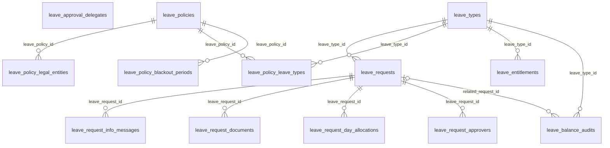

```
DB: OnevoDb_calsmoke
Last migration: 20260906134431_AddHolidayCalendarSettings
Snapshot generated: 2026-09-09T11:32:50Z
```

# Domain: Leave & Time-Off

### ER Diagram (same-domain relationships only)



### leave_approval_delegates

| Column | Type | Key | Nullable | Default |
|---|---|---|---|---|
| id | uuid | PK | NOT NULL | – |
| tenant_id | uuid |  | NOT NULL | – |
| approver_employee_id | uuid | FK | NOT NULL | – |
| delegate_employee_id | uuid | FK | NOT NULL | – |
| start_date | date |  | NOT NULL | – |
| end_date | date |  | NOT NULL | – |

#### References into other domains

| Source | Target | Target Domain | On Delete |
|---|---|---|---|
| `leave_approval_delegates.approver_employee_id` | `employees.id` | Core HR & Employee Lifecycle | RESTRICT |
| `leave_approval_delegates.delegate_employee_id` | `employees.id` | Core HR & Employee Lifecycle | RESTRICT |

#### Referenced by other domains

_(none)_

### leave_balance_audits

| Column | Type | Key | Nullable | Default |
|---|---|---|---|---|
| id | uuid | PK | NOT NULL | – |
| tenant_id | uuid |  | NOT NULL | – |
| employee_id | uuid | FK | NOT NULL | – |
| leave_type_id | uuid | FK | NOT NULL | – |
| change_type | varchar20 |  | NOT NULL | – |
| days_changed | numeric5_1 |  | NOT NULL | – |
| balance_after | numeric5_1 |  | NOT NULL | – |
| reason | varchar500 |  | NULL | – |
| related_request_id | uuid | FK | NULL | – |
| created_at | timestamptz |  | NOT NULL | – |
| created_by | uuid |  | NULL | – |

#### References into other domains

| Source | Target | Target Domain | On Delete |
|---|---|---|---|
| `leave_balance_audits.employee_id` | `employees.id` | Core HR & Employee Lifecycle | RESTRICT |

#### Referenced by other domains

_(none)_

### leave_entitlements

| Column | Type | Key | Nullable | Default |
|---|---|---|---|---|
| id | uuid | PK | NOT NULL | – |
| tenant_id | uuid |  | NOT NULL | – |
| employee_id | uuid | FK | NOT NULL | – |
| leave_type_id | uuid | FK | NOT NULL | – |
| year | integer |  | NOT NULL | – |
| total_days | numeric5_1 |  | NOT NULL | – |
| used_days | numeric5_1 |  | NOT NULL | – |
| pending_days | numeric5_1 |  | NOT NULL | – |
| carried_forward_days | numeric5_1 |  | NOT NULL | – |
| source | varchar10 |  | NOT NULL | – |
| manual_reason | text |  | NULL | – |
| created_at | timestamptz |  | NOT NULL | – |
| updated_at | timestamptz |  | NULL | – |

#### References into other domains

| Source | Target | Target Domain | On Delete |
|---|---|---|---|
| `leave_entitlements.employee_id` | `employees.id` | Core HR & Employee Lifecycle | RESTRICT |

#### Referenced by other domains

_(none)_

### leave_policies

| Column | Type | Key | Nullable | Default |
|---|---|---|---|---|
| id | uuid | PK | NOT NULL | – |
| tenant_id | uuid |  | NOT NULL | – |
| name | varchar100 |  | NOT NULL | – |
| description | text |  | NULL | – |
| country | varchar100 |  | NULL | – |
| job_level | varchar100 |  | NULL | – |
| accrual_start | varchar20 |  | NOT NULL | – |
| accrual_after_n_months | integer |  | NULL | – |
| proration_method | varchar20 |  | NOT NULL | – |
| probation_restriction | boolean |  | NOT NULL | – |
| minimum_tenure_months | integer |  | NOT NULL | – |
| first_year_reduced_percent | numeric5_2 |  | NULL | – |
| minimum_notice_days | integer |  | NOT NULL | – |
| max_consecutive_days | integer |  | NULL | – |
| min_days_per_request | numeric5_1 |  | NOT NULL | – |
| max_team_absence_percent | numeric5_2 |  | NULL | – |
| approval_mode | varchar20 |  | NOT NULL | – |
| effective_from | date |  | NOT NULL | – |
| version | integer |  | NOT NULL | – |
| is_active | boolean |  | NOT NULL | – |
| created_at | timestamptz |  | NOT NULL | – |
| updated_at | timestamptz |  | NULL | – |
| accrual_method | varchar20 |  | NOT NULL | 'annual'::character … |

#### References into other domains

_(none)_

#### Referenced by other domains

_(none)_

### leave_policy_blackout_periods

| Column | Type | Key | Nullable | Default |
|---|---|---|---|---|
| id | uuid | PK | NOT NULL | – |
| tenant_id | uuid |  | NOT NULL | – |
| leave_policy_id | uuid | FK | NOT NULL | – |
| start_date | date |  | NOT NULL | – |
| end_date | date |  | NOT NULL | – |
| reason | varchar200 |  | NULL | – |

#### References into other domains

_(none)_

#### Referenced by other domains

_(none)_

### leave_policy_leave_types

| Column | Type | Key | Nullable | Default |
|---|---|---|---|---|
| id | uuid | PK | NOT NULL | – |
| tenant_id | uuid |  | NOT NULL | – |
| leave_policy_id | uuid | FK | NOT NULL | – |
| leave_type_id | uuid | FK | NOT NULL | – |
| annual_entitlement_days | numeric5_1 |  | NOT NULL | – |
| carry_forward_max_days | numeric5_1 |  | NULL | – |
| carry_forward_expiry_months | integer |  | NULL | – |

#### References into other domains

_(none)_

#### Referenced by other domains

_(none)_

### leave_policy_legal_entities

| Column | Type | Key | Nullable | Default |
|---|---|---|---|---|
| id | uuid | PK | NOT NULL | – |
| tenant_id | uuid |  | NOT NULL | – |
| leave_policy_id | uuid | FK | NOT NULL | – |
| legal_entity_id | uuid | FK | NOT NULL | – |
| effective_date | date |  | NOT NULL | – |
| is_active | boolean |  | NOT NULL | – |

#### References into other domains

| Source | Target | Target Domain | On Delete |
|---|---|---|---|
| `leave_policy_legal_entities.legal_entity_id` | `legal_entities.id` | Org Structure | RESTRICT |

#### Referenced by other domains

_(none)_

### leave_request_approvers

| Column | Type | Key | Nullable | Default |
|---|---|---|---|---|
| id | uuid | PK | NOT NULL | – |
| tenant_id | uuid |  | NOT NULL | – |
| leave_request_id | uuid | FK | NOT NULL | – |
| approver_employee_id | uuid | FK | NOT NULL | – |
| sequence_order | integer |  | NOT NULL | – |
| status | varchar40 |  | NOT NULL | – |
| comment | varchar2000 |  | NULL | – |
| delegated_from_approver_id | uuid |  | NULL | – |
| decided_at | timestamptz |  | NULL | – |

#### References into other domains

| Source | Target | Target Domain | On Delete |
|---|---|---|---|
| `leave_request_approvers.approver_employee_id` | `employees.id` | Core HR & Employee Lifecycle | RESTRICT |

#### Referenced by other domains

_(none)_

### leave_request_day_allocations

| Column | Type | Key | Nullable | Default |
|---|---|---|---|---|
| id | uuid | PK | NOT NULL | – |
| tenant_id | uuid |  | NOT NULL | – |
| leave_request_id | uuid | FK | NOT NULL | – |
| leave_date | date |  | NOT NULL | – |
| day_unit | numeric3_1 |  | NOT NULL | – |
| paid_unit | numeric3_1 |  | NOT NULL | – |
| unpaid_unit | numeric3_1 |  | NOT NULL | – |
| status | varchar20 |  | NOT NULL | – |
| created_at | timestamptz |  | NOT NULL | – |
| cancelled_at | timestamptz |  | NULL | – |

#### References into other domains

_(none)_

#### Referenced by other domains

_(none)_

### leave_request_documents

| Column | Type | Key | Nullable | Default |
|---|---|---|---|---|
| id | uuid | PK | NOT NULL | – |
| tenant_id | uuid |  | NOT NULL | – |
| leave_request_id | uuid | FK | NOT NULL | – |
| file_record_id | uuid | FK | NOT NULL | – |

#### References into other domains

| Source | Target | Target Domain | On Delete |
|---|---|---|---|
| `leave_request_documents.file_record_id` | `file_records.id` | Files & Infrastructure | RESTRICT |

#### Referenced by other domains

_(none)_

### leave_request_info_messages

| Column | Type | Key | Nullable | Default |
|---|---|---|---|---|
| id | uuid | PK | NOT NULL | – |
| tenant_id | uuid |  | NOT NULL | – |
| leave_request_id | uuid | FK | NOT NULL | – |
| sender_employee_id | uuid | FK | NOT NULL | – |
| message | varchar2000 |  | NOT NULL | – |
| created_at | timestamptz |  | NOT NULL | – |

#### References into other domains

| Source | Target | Target Domain | On Delete |
|---|---|---|---|
| `leave_request_info_messages.sender_employee_id` | `employees.id` | Core HR & Employee Lifecycle | RESTRICT |

#### Referenced by other domains

_(none)_

### leave_requests

| Column | Type | Key | Nullable | Default |
|---|---|---|---|---|
| id | uuid | PK | NOT NULL | – |
| tenant_id | uuid |  | NOT NULL | – |
| employee_id | uuid | FK | NOT NULL | – |
| leave_type_id | uuid | FK | NOT NULL | – |
| start_date | date |  | NOT NULL | – |
| end_date | date |  | NOT NULL | – |
| half_day_period | varchar2 |  | NULL | – |
| total_days | numeric5_1 |  | NOT NULL | – |
| paid_days | numeric5_1 |  | NOT NULL | – |
| unpaid_days | numeric5_1 |  | NOT NULL | – |
| reason | text |  | NULL | – |
| status | varchar40 |  | NOT NULL | – |
| approved_by | uuid |  | NULL | – |
| approved_at | timestamptz |  | NULL | – |
| conflict_snapshot_json | jsonb |  | NULL | – |
| notice_period_missed | boolean |  | NOT NULL | – |
| submitted_on_behalf_of_by | uuid |  | NULL | – |
| cancellation_reason | text |  | NULL | – |
| partial_cancel_effective_date | date |  | NULL | – |
| created_at | timestamptz |  | NOT NULL | – |
| updated_at | timestamptz |  | NULL | – |

#### References into other domains

| Source | Target | Target Domain | On Delete |
|---|---|---|---|
| `leave_requests.employee_id` | `employees.id` | Core HR & Employee Lifecycle | RESTRICT |

#### Referenced by other domains

_(none)_

### leave_types

| Column | Type | Key | Nullable | Default |
|---|---|---|---|---|
| id | uuid | PK | NOT NULL | – |
| tenant_id | uuid |  | NOT NULL | – |
| name | varchar100 |  | NOT NULL | – |
| code | varchar20 |  | NOT NULL | – |
| description | text |  | NULL | – |
| category | varchar20 |  | NOT NULL | – |
| is_paid | boolean |  | NOT NULL | – |
| requires_approval | boolean |  | NOT NULL | – |
| requires_document | boolean |  | NOT NULL | – |
| document_required_after_days | integer |  | NULL | – |
| accepted_document_types | text[] |  | NOT NULL | – |
| max_consecutive_days | integer |  | NULL | – |
| default_days_per_year | numeric5_1 |  | NOT NULL | – |
| carry_forward_allowed | boolean |  | NOT NULL | – |
| max_carry_forward_days | numeric5_1 |  | NULL | – |
| carry_forward_expiry_months | integer |  | NULL | – |
| pro_rata_for_new_joiners | boolean |  | NOT NULL | – |
| applicable_gender | varchar10 |  | NOT NULL | – |
| minimum_notice_days | integer |  | NOT NULL | – |
| is_active | boolean |  | NOT NULL | – |
| created_at | timestamptz |  | NOT NULL | – |
| updated_at | timestamptz |  | NULL | – |

#### References into other domains

_(none)_

#### Referenced by other domains

_(none)_
