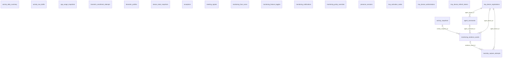

```
DB: OnevoDb_calsmoke
Last migration: 20260906134431_AddHolidayCalendarSettings
Snapshot generated: 2026-09-09T11:32:50Z
```

# Domain: Monitoring & Activity

### ER Diagram (same-domain relationships only)



### activity_daily_summary

| Column | Type | Key | Nullable | Default |
|---|---|---|---|---|
| id | uuid | PK | NOT NULL | – |
| tenant_id | uuid |  | NOT NULL | – |
| employee_id | uuid |  | NOT NULL | – |
| date | date |  | NOT NULL | – |
| total_active_minutes | integer |  | NOT NULL | – |
| total_idle_minutes | integer |  | NOT NULL | – |
| total_meeting_minutes | integer |  | NOT NULL | – |
| active_percentage | numeric5_2 |  | NOT NULL | – |
| productive_app_minutes | integer |  | NOT NULL | – |
| personal_app_minutes | integer |  | NOT NULL | – |
| unknown_app_minutes | integer |  | NOT NULL | – |
| focus_minutes | integer |  | NOT NULL | – |
| activity_score | numeric5_2 |  | NOT NULL | – |
| data_coverage_percentage | numeric5_2 |  | NOT NULL | – |
| top_apps_json | jsonb |  | NOT NULL | '[]'::jsonb |
| intensity_avg | numeric5_2 |  | NOT NULL | – |
| keyboard_total | integer |  | NOT NULL | – |
| mouse_total | integer |  | NOT NULL | – |
| document_time_minutes | integer |  | NOT NULL | – |
| deep_focus_sessions_count | integer |  | NOT NULL | – |
| data_source | varchar50 |  | NOT NULL | – |
| created_at | timestamptz |  | NOT NULL | – |
| updated_at | timestamptz |  | NULL | – |

#### References into other domains

_(none)_

#### Referenced by other domains

_(none)_

### activity_raw_buffer

| Column | Type | Key | Nullable | Default |
|---|---|---|---|---|
| id | uuid | PK | NOT NULL | – |
| tenant_id | uuid |  | NOT NULL | – |
| agent_device_id | uuid |  | NOT NULL | – |
| received_at | timestamptz |  | NOT NULL | – |
| payload_json | jsonb |  | NOT NULL | – |

#### References into other domains

_(none)_

#### Referenced by other domains

_(none)_

### activity_snapshots

| Column | Type | Key | Nullable | Default |
|---|---|---|---|---|
| id | uuid | PK | NOT NULL | – |
| tenant_id | uuid |  | NOT NULL | – |
| employee_id | uuid |  | NOT NULL | – |
| agent_device_id | uuid |  | NOT NULL | – |
| captured_at | timestamptz |  | NOT NULL | – |
| keyboard_events_count | integer |  | NOT NULL | – |
| mouse_events_count | integer |  | NOT NULL | – |
| active_seconds | integer |  | NOT NULL | – |
| idle_seconds | integer |  | NOT NULL | – |
| intensity_score | numeric5_2 |  | NOT NULL | – |
| foreground_process_name | varchar100 |  | NULL | – |
| created_at | timestamptz |  | NOT NULL | – |

#### References into other domains

_(none)_

#### Referenced by other domains

_(none)_

### agent_commands

| Column | Type | Key | Nullable | Default |
|---|---|---|---|---|
| id | uuid | PK | NOT NULL | – |
| tenant_id | uuid |  | NOT NULL | – |
| agent_device_id | uuid | FK | NOT NULL | – |
| requested_by_id | uuid |  | NOT NULL | – |
| command_type | varchar100 |  | NOT NULL | – |
| payload_json | jsonb |  | NOT NULL | '{}'::jsonb |
| status | varchar50 |  | NOT NULL | – |
| expires_at | timestamptz |  | NOT NULL | – |
| created_at | timestamptz |  | NOT NULL | – |
| delivered_at | timestamptz |  | NULL | – |
| completed_at | timestamptz |  | NULL | – |
| result_json | jsonb |  | NULL | – |

#### References into other domains

_(none)_

#### Referenced by other domains

_(none)_

### app_usage_snapshots

| Column | Type | Key | Nullable | Default |
|---|---|---|---|---|
| id | uuid | PK | NOT NULL | – |
| tenant_id | uuid |  | NOT NULL | – |
| employee_id | uuid |  | NOT NULL | – |
| agent_device_id | uuid |  | NOT NULL | – |
| captured_at | timestamptz |  | NOT NULL | – |
| process_name | varchar100 |  | NULL | – |
| window_title_hash | varchar128 |  | NULL | – |
| created_at | timestamptz |  | NOT NULL | – |

#### References into other domains

_(none)_

#### Referenced by other domains

_(none)_

### biometric_enrollment_attempts

| Column | Type | Key | Nullable | Default |
|---|---|---|---|---|
| id | uuid | PK | NOT NULL | – |
| tenant_id | uuid |  | NOT NULL | – |
| employee_id | uuid |  | NOT NULL | – |
| agent_device_id | uuid |  | NOT NULL | – |
| aws_session_id | varchar200 |  | NOT NULL | – |
| region | varchar32 |  | NOT NULL | – |
| challenge_type | varchar64 |  | NOT NULL | – |
| status | varchar20 |  | NOT NULL | – |
| confidence | real |  | NULL | – |
| failure_reason | text |  | NULL | – |
| created_at | timestamptz |  | NOT NULL | – |
| completed_at | timestamptz |  | NULL | – |

#### References into other domains

_(none)_

#### Referenced by other domains

_(none)_

### biometric_profiles

| Column | Type | Key | Nullable | Default |
|---|---|---|---|---|
| id | uuid | PK | NOT NULL | – |
| tenant_id | uuid |  | NOT NULL | – |
| employee_id | uuid |  | NOT NULL | – |
| status | varchar20 |  | NOT NULL | – |
| enrolled_at | timestamptz |  | NOT NULL | – |
| created_at | timestamptz |  | NOT NULL | – |
| updated_at | timestamptz |  | NOT NULL | – |

#### References into other domains

_(none)_

#### Referenced by other domains

_(none)_

### device_state_snapshots

| Column | Type | Key | Nullable | Default |
|---|---|---|---|---|
| id | uuid | PK | NOT NULL | – |
| tenant_id | uuid |  | NOT NULL | – |
| employee_id | uuid |  | NOT NULL | – |
| agent_device_id | uuid |  | NOT NULL | – |
| captured_at | timestamptz |  | NOT NULL | – |
| idle_seconds | integer |  | NOT NULL | – |
| is_idle | boolean |  | NOT NULL | – |
| created_at | timestamptz |  | NOT NULL | – |

#### References into other domains

_(none)_

#### Referenced by other domains

_(none)_

### exceptions

| Column | Type | Key | Nullable | Default |
|---|---|---|---|---|
| id | uuid | PK | NOT NULL | – |
| tenant_id | uuid |  | NOT NULL | – |
| employee_id | uuid |  | NOT NULL | – |
| type | varchar30 |  | NOT NULL | – |
| status | varchar20 |  | NOT NULL | – |
| title | varchar200 |  | NOT NULL | – |
| description | varchar2000 |  | NOT NULL | – |
| metadata_json | jsonb |  | NOT NULL | '{}'::jsonb |
| detected_at | timestamptz |  | NOT NULL | – |
| acknowledged_at | timestamptz |  | NULL | – |
| acknowledged_by_id | uuid |  | NULL | – |
| resolved_at | timestamptz |  | NULL | – |
| resolved_by_id | uuid |  | NULL | – |
| escalated_at | timestamptz |  | NULL | – |

#### References into other domains

_(none)_

#### Referenced by other domains

_(none)_

### inactivity_capture_attempts

| Column | Type | Key | Nullable | Default |
|---|---|---|---|---|
| id | uuid | PK | NOT NULL | – |
| tenant_id | uuid |  | NOT NULL | – |
| employee_id | uuid |  | NOT NULL | – |
| agent_device_id | uuid | FK | NOT NULL | – |
| work_session_id | uuid |  | NULL | – |
| idle_started_at | timestamptz |  | NOT NULL | – |
| prompted_at | timestamptz |  | NOT NULL | – |
| decision_at | timestamptz |  | NULL | – |
| captured_at | timestamptz |  | NULL | – |
| idle_duration_seconds | integer |  | NOT NULL | – |
| monitor_count | integer |  | NOT NULL | – |
| outcome | varchar30 |  | NOT NULL | – |
| failure_code | varchar50 |  | NULL | – |
| evidence_asset_id | uuid | FK | NULL | – |
| policy_version | varchar64 |  | NOT NULL | – |
| created_at | timestamptz |  | NOT NULL | – |
| updated_at | timestamptz |  | NOT NULL | – |

#### References into other domains

_(none)_

#### Referenced by other domains

_(none)_

### meeting_signals

| Column | Type | Key | Nullable | Default |
|---|---|---|---|---|
| id | uuid | PK | NOT NULL | – |
| tenant_id | uuid |  | NOT NULL | – |
| employee_id | uuid |  | NOT NULL | – |
| agent_device_id | uuid |  | NOT NULL | – |
| captured_at | timestamptz |  | NOT NULL | – |
| is_meeting_app_running | boolean |  | NOT NULL | – |
| process_name | text |  | NULL | – |
| created_at | timestamptz |  | NOT NULL | – |

#### References into other domains

_(none)_

#### Referenced by other domains

_(none)_

### monitoring_evidence_assets

| Column | Type | Key | Nullable | Default |
|---|---|---|---|---|
| id | uuid | PK | NOT NULL | – |
| tenant_id | uuid |  | NOT NULL | – |
| employee_id | uuid |  | NOT NULL | – |
| agent_device_id | uuid | FK | NULL | – |
| activity_snapshot_id | uuid | FK | NULL | – |
| agent_command_id | uuid | FK | NULL | – |
| file_record_id | uuid | FK | NOT NULL | – |
| evidence_type | varchar50 |  | NOT NULL | – |
| source | varchar50 |  | NOT NULL | – |
| trigger_type | varchar50 |  | NOT NULL | – |
| retention_policy_id | uuid |  | NULL | – |
| legal_hold_id | uuid |  | NULL | – |
| metadata_json | jsonb |  | NOT NULL | '{}'::jsonb |
| captured_at | timestamptz |  | NOT NULL | – |
| created_at | timestamptz |  | NOT NULL | – |

#### References into other domains

| Source | Target | Target Domain | On Delete |
|---|---|---|---|
| `monitoring_evidence_assets.file_record_id` | `file_records.id` | Files & Infrastructure | RESTRICT |

#### Referenced by other domains

_(none)_

### monitoring_face_scans

| Column | Type | Key | Nullable | Default |
|---|---|---|---|---|
| id | uuid | PK | NOT NULL | – |
| tenant_id | uuid |  | NOT NULL | – |
| check_in_id | uuid |  | NOT NULL | – |
| storage_key | varchar1000 |  | NOT NULL | – |
| file_size_bytes | bigint |  | NOT NULL | – |
| content_type | varchar100 |  | NOT NULL | – |
| status | varchar50 |  | NOT NULL | – |
| created_at | timestamptz |  | NOT NULL | – |
| updated_at | timestamptz |  | NULL | – |

#### References into other domains

_(none)_

#### Referenced by other domains

| Source | Target | Source Domain | On Delete |
|---|---|---|---|
| `employee_check_ins.face_scan_id` | `monitoring_face_scans.id` | Core HR & Employee Lifecycle | SET NULL |

### monitoring_feature_toggles

| Column | Type | Key | Nullable | Default |
|---|---|---|---|---|
| id | uuid | PK | NOT NULL | – |
| tenant_id | uuid |  | NOT NULL | – |
| activity_monitoring | boolean |  | NOT NULL | – |
| application_tracking | boolean |  | NOT NULL | – |
| document_tracking | boolean |  | NOT NULL | – |
| communication_tracking | boolean |  | NOT NULL | – |
| screenshot_capture | boolean |  | NOT NULL | – |
| auto_screenshot_capture | boolean |  | NOT NULL | – |
| meeting_detection | boolean |  | NOT NULL | – |
| device_tracking | boolean |  | NOT NULL | – |
| work_location_verification | boolean |  | NOT NULL | – |
| identity_verification | boolean |  | NOT NULL | – |
| biometric | boolean |  | NOT NULL | – |
| created_at | timestamptz |  | NOT NULL | – |
| updated_at | timestamptz |  | NOT NULL | – |
| idle_threshold_minutes | integer |  | NULL | – |
| legal_entity_id | uuid | FK | NULL | – |

#### References into other domains

| Source | Target | Target Domain | On Delete |
|---|---|---|---|
| `monitoring_feature_toggles.legal_entity_id` | `legal_entities.id` | Org Structure | RESTRICT |

#### Referenced by other domains

_(none)_

### monitoring_notifications

| Column | Type | Key | Nullable | Default |
|---|---|---|---|---|
| id | uuid | PK | NOT NULL | – |
| tenant_id | uuid |  | NOT NULL | – |
| employee_id | uuid |  | NOT NULL | – |
| type | varchar30 |  | NOT NULL | – |
| title | varchar200 |  | NOT NULL | – |
| message | varchar1000 |  | NOT NULL | – |
| metadata_json | text |  | NOT NULL | – |
| created_at | timestamptz |  | NOT NULL | – |
| delivered_to_tray_at | timestamptz |  | NULL | – |
| read_at | timestamptz |  | NULL | – |

#### References into other domains

_(none)_

#### Referenced by other domains

_(none)_

### monitoring_policy_overrides

| Column | Type | Key | Nullable | Default |
|---|---|---|---|---|
| id | uuid | PK | NOT NULL | – |
| tenant_id | uuid |  | NOT NULL | – |
| scope_type | varchar50 |  | NOT NULL | – |
| scope_id | uuid |  | NOT NULL | – |
| activity_monitoring | boolean |  | NULL | – |
| application_tracking | boolean |  | NULL | – |
| document_tracking | boolean |  | NULL | – |
| communication_tracking | boolean |  | NULL | – |
| screenshot_capture | boolean |  | NULL | – |
| auto_screenshot_capture | boolean |  | NULL | – |
| meeting_detection | boolean |  | NULL | – |
| device_tracking | boolean |  | NULL | – |
| work_location_verification | boolean |  | NULL | – |
| identity_verification | boolean |  | NULL | – |
| biometric | boolean |  | NULL | – |
| override_reason | varchar500 |  | NOT NULL | – |
| set_by_id | uuid |  | NOT NULL | – |
| created_at | timestamptz |  | NOT NULL | – |
| updated_at | timestamptz |  | NOT NULL | – |
| idle_threshold_minutes | integer |  | NULL | – |

#### References into other domains

_(none)_

#### Referenced by other domains

_(none)_

### presence_sessions

| Column | Type | Key | Nullable | Default |
|---|---|---|---|---|
| id | uuid | PK | NOT NULL | – |
| tenant_id | uuid |  | NOT NULL | – |
| employee_id | uuid |  | NOT NULL | – |
| date | date |  | NOT NULL | – |
| first_seen_at | timestamptz |  | NULL | – |
| last_seen_at | timestamptz |  | NULL | – |
| total_present_minutes | integer |  | NOT NULL | – |
| total_break_minutes | integer |  | NOT NULL | – |
| source | varchar20 |  | NULL | – |
| status | varchar20 |  | NULL | – |
| created_at | timestamptz |  | NOT NULL | – |
| updated_at | timestamptz |  | NOT NULL | – |

#### References into other domains

_(none)_

#### Referenced by other domains

| Source | Target | Source Domain | On Delete |
|---|---|---|---|
| `attendance_corrections.presence_session_id` | `presence_sessions.id` | Time & Attendance | RESTRICT |

### tray_activation_codes

| Column | Type | Key | Nullable | Default |
|---|---|---|---|---|
| id | uuid | PK | NOT NULL | – |
| tenant_id | uuid |  | NOT NULL | – |
| user_id | uuid |  | NOT NULL | – |
| code_hash | varchar128 |  | NOT NULL | – |
| expires_at | timestamptz |  | NOT NULL | – |
| used_at | timestamptz |  | NULL | – |
| created_at | timestamptz |  | NOT NULL | – |
| legal_entity_id | uuid | FK | NULL | – |

#### References into other domains

| Source | Target | Target Domain | On Delete |
|---|---|---|---|
| `tray_activation_codes.legal_entity_id` | `legal_entities.id` | Org Structure | RESTRICT |

#### Referenced by other domains

_(none)_

### tray_device_authorizations

| Column | Type | Key | Nullable | Default |
|---|---|---|---|---|
| id | uuid | PK | NOT NULL | – |
| device_code_hash | varchar128 |  | NOT NULL | – |
| user_code_hash | varchar128 |  | NOT NULL | – |
| device_fingerprint_hash | varchar128 |  | NOT NULL | – |
| device_name | varchar200 |  | NOT NULL | – |
| device_os | varchar100 |  | NOT NULL | – |
| client_version | varchar50 |  | NOT NULL | – |
| status | varchar20 |  | NOT NULL | – |
| approved_tenant_id | uuid |  | NULL | – |
| approved_user_id | uuid |  | NULL | – |
| created_at | timestamptz |  | NOT NULL | – |
| expires_at | timestamptz |  | NOT NULL | – |
| approved_at | timestamptz |  | NULL | – |
| consumed_at | timestamptz |  | NULL | – |
| last_polled_at | timestamptz |  | NULL | – |
| poll_violation_count | integer |  | NOT NULL | – |
| approved_legal_entity_id | uuid | FK | NULL | – |

#### References into other domains

| Source | Target | Target Domain | On Delete |
|---|---|---|---|
| `tray_device_authorizations.approved_legal_entity_id` | `legal_entities.id` | Org Structure | RESTRICT |

#### Referenced by other domains

_(none)_

### tray_device_refresh_tokens

| Column | Type | Key | Nullable | Default |
|---|---|---|---|---|
| id | uuid | PK | NOT NULL | – |
| tenant_id | uuid |  | NOT NULL | – |
| user_id | uuid |  | NOT NULL | – |
| device_registration_id | uuid |  | NOT NULL | – |
| token_hash | varchar128 |  | NOT NULL | – |
| expires_at | timestamptz |  | NOT NULL | – |
| is_revoked | boolean |  | NOT NULL | false |
| revoked_at | timestamptz |  | NULL | – |
| revoked_reason | varchar100 |  | NULL | – |
| created_at | timestamptz |  | NOT NULL | – |

#### References into other domains

_(none)_

#### Referenced by other domains

_(none)_

### tray_device_registrations

| Column | Type | Key | Nullable | Default |
|---|---|---|---|---|
| id | uuid | PK | NOT NULL | – |
| tenant_id | uuid |  | NOT NULL | – |
| user_id | uuid |  | NOT NULL | – |
| device_name | varchar200 |  | NOT NULL | – |
| device_os | varchar100 |  | NOT NULL | – |
| device_fingerprint | varchar512 |  | NOT NULL | – |
| is_active | boolean |  | NOT NULL | true |
| activated_at | timestamptz |  | NOT NULL | – |
| last_seen_at | timestamptz |  | NULL | – |
| deactivated_at | timestamptz |  | NULL | – |
| created_at | timestamptz |  | NOT NULL | – |
| legal_entity_id | uuid | FK | NULL | – |

#### References into other domains

| Source | Target | Target Domain | On Delete |
|---|---|---|---|
| `tray_device_registrations.legal_entity_id` | `legal_entities.id` | Org Structure | RESTRICT |

#### Referenced by other domains

_(none)_
