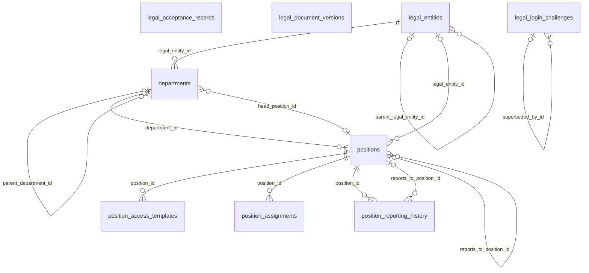

```
DB: OnevoDb_calsmoke
Last migration: 20260906134431_AddHolidayCalendarSettings
Snapshot generated: 2026-09-09T11:32:50Z
```

# Domain: Org Structure

### ER Diagram (same-domain relationships only)



### departments

| Column | Type | Key | Nullable | Default |
|---|---|---|---|---|
| id | uuid | PK | NOT NULL | – |
| tenant_id | uuid |  | NOT NULL | – |
| legal_entity_id | uuid | FK | NOT NULL | – |
| name | varchar100 |  | NOT NULL | – |
| code | varchar20 |  | NULL | – |
| parent_department_id | uuid | FK | NULL | – |
| is_active | boolean |  | NOT NULL | – |
| created_at | timestamptz |  | NOT NULL | – |
| updated_at | timestamptz |  | NULL | – |
| head_position_id | uuid | FK | NULL | – |

#### References into other domains

_(none)_

#### Referenced by other domains

| Source | Target | Source Domain | On Delete |
|---|---|---|---|
| `access_grant_requests.target_department_id` | `departments.id` | Core HR & Employee Lifecycle | RESTRICT |
| `checklist_templates.department_id` | `departments.id` | Core HR & Employee Lifecycle | RESTRICT |
| `management_coverage_records.covered_department_id` | `departments.id` | Core HR & Employee Lifecycle | RESTRICT |
| `onboarding_drafts.department_id` | `departments.id` | Core HR & Employee Lifecycle | RESTRICT |

### legal_acceptance_records

| Column | Type | Key | Nullable | Default |
|---|---|---|---|---|
| id | uuid | PK | NOT NULL | – |
| tenant_id | uuid |  | NOT NULL | – |
| user_id | uuid |  | NOT NULL | – |
| ip_address | varchar45 |  | NULL | – |
| document_type | varchar80 |  | NOT NULL | – |
| document_version | varchar50 |  | NOT NULL | – |
| decision | varchar20 |  | NOT NULL | – |
| required | boolean |  | NOT NULL | – |
| decided_at | timestamptz |  | NOT NULL | – |
| user_agent | varchar500 |  | NULL | – |
| source | varchar30 |  | NOT NULL | – |

#### References into other domains

_(none)_

#### Referenced by other domains

_(none)_

### legal_document_versions

| Column | Type | Key | Nullable | Default |
|---|---|---|---|---|
| id | uuid | PK | NOT NULL | – |
| document_type | varchar80 |  | NOT NULL | – |
| version | varchar50 |  | NOT NULL | – |
| title | varchar200 |  | NOT NULL | – |
| content_url | varchar500 |  | NULL | – |
| is_required | boolean |  | NOT NULL | – |
| block_scope | varchar40 |  | NOT NULL | – |
| status | varchar20 |  | NOT NULL | – |
| published_by_id | uuid | FK | NULL | – |
| published_at | timestamptz |  | NULL | – |
| publish_reason | text |  | NULL | – |
| created_at | timestamptz |  | NOT NULL | – |
| updated_at | timestamptz |  | NOT NULL | – |
| content_json | jsonb |  | NOT NULL | – |
| content_html | text |  | NOT NULL | – |
| content_text | text |  | NOT NULL | – |
| content_hash | varchar128 |  | NOT NULL | – |

#### References into other domains

| Source | Target | Target Domain | On Delete |
|---|---|---|---|
| `legal_document_versions.published_by_id` | `platform_users.id` | Platform Administration | SET NULL |

#### Referenced by other domains

_(none)_

### legal_entities

| Column | Type | Key | Nullable | Default |
|---|---|---|---|---|
| id | uuid | PK | NOT NULL | – |
| tenant_id | uuid |  | NOT NULL | – |
| name | varchar200 |  | NOT NULL | – |
| registration_number | varchar50 |  | NULL | – |
| country_code | varchar3 |  | NOT NULL | – |
| currency_code | varchar3 |  | NOT NULL | – |
| is_active | boolean |  | NOT NULL | – |
| is_primary | boolean |  | NOT NULL | – |
| created_at | timestamptz |  | NOT NULL | – |
| updated_at | timestamptz |  | NULL | – |
| company_code | varchar20 |  | NULL | – |
| date_format | varchar20 |  | NOT NULL | 'DD MMM YYYY'::chara… |
| default_language | varchar10 |  | NOT NULL | 'en-US'::character v… |
| email | varchar254 |  | NULL | – |
| financial_year_start_month | integer |  | NOT NULL | 1 |
| week_start_day | integer |  | NOT NULL | 1 |
| logo_file_id | uuid | FK | NULL | – |
| parent_legal_entity_id | uuid | FK | NULL | – |
| phone_number | varchar20 |  | NULL | – |
| standard_working_days | jsonb |  | NOT NULL | '[1, 2, 3, 4, 5]'::j… |
| tax_registration_number | varchar80 |  | NULL | – |
| time_format | varchar10 |  | NOT NULL | '12h'::character var… |
| timezone | varchar50 |  | NULL | – |
| vat_gst_number | varchar50 |  | NULL | – |
| website | varchar255 |  | NULL | – |
| address_json | text |  | NULL | – |
| work_end_time | time |  | NULL | – |
| work_start_time | time |  | NULL | – |
| break_duration_minutes | integer |  | NULL | – |

#### References into other domains

| Source | Target | Target Domain | On Delete |
|---|---|---|---|
| `legal_entities.logo_file_id` | `file_records.id` | Files & Infrastructure | SET NULL |

#### Referenced by other domains

| Source | Target | Source Domain | On Delete |
|---|---|---|---|
| `attendance_corrections.legal_entity_id` | `legal_entities.id` | Time & Attendance | RESTRICT |
| `bulk_onboarding_batches.legal_entity_id` | `legal_entities.id` | Core HR & Employee Lifecycle | RESTRICT |
| `checklist_templates.legal_entity_id` | `legal_entities.id` | Core HR & Employee Lifecycle | RESTRICT |
| `clock_in_policies.legal_entity_id` | `legal_entities.id` | Time & Attendance | RESTRICT |
| `leave_policy_legal_entities.legal_entity_id` | `legal_entities.id` | Leave & Time-Off | RESTRICT |
| `management_coverage_records.legal_entity_id` | `legal_entities.id` | Core HR & Employee Lifecycle | RESTRICT |
| `monitoring_feature_toggles.legal_entity_id` | `legal_entities.id` | Monitoring & Activity | RESTRICT |
| `onboarding_drafts.legal_entity_id` | `legal_entities.id` | Core HR & Employee Lifecycle | RESTRICT |
| `projects.owning_legal_entity_id` | `legal_entities.id` | Work Management | RESTRICT |
| `tray_activation_codes.legal_entity_id` | `legal_entities.id` | Monitoring & Activity | RESTRICT |
| `tray_device_authorizations.approved_legal_entity_id` | `legal_entities.id` | Monitoring & Activity | RESTRICT |
| `tray_device_registrations.legal_entity_id` | `legal_entities.id` | Monitoring & Activity | RESTRICT |
| `work_area_change_requests.legal_entity_id` | `legal_entities.id` | Time & Attendance | RESTRICT |

### legal_login_challenges

| Column | Type | Key | Nullable | Default |
|---|---|---|---|---|
| id | uuid | PK | NOT NULL | – |
| tenant_id | uuid | FK | NOT NULL | – |
| user_id | uuid | FK | NOT NULL | – |
| challenge_hash | varchar128 |  | NOT NULL | – |
| csrf_token_hash | varchar128 |  | NOT NULL | – |
| origin | varchar30 |  | NOT NULL | – |
| expires_at | timestamptz |  | NOT NULL | – |
| superseded_at | timestamptz |  | NULL | – |
| superseded_by_id | uuid | FK | NULL | – |
| consumed_at | timestamptz |  | NULL | – |
| created_at | timestamptz |  | NOT NULL | – |

#### References into other domains

| Source | Target | Target Domain | On Delete |
|---|---|---|---|
| `legal_login_challenges.tenant_id` | `tenants.id` | Tenancy & Subscription | RESTRICT |
| `legal_login_challenges.user_id` | `users.id` | Auth & Identity | RESTRICT |

#### Referenced by other domains

_(none)_

### position_access_templates

| Column | Type | Key | Nullable | Default |
|---|---|---|---|---|
| id | uuid | PK | NOT NULL | – |
| tenant_id | uuid |  | NOT NULL | – |
| position_id | uuid | FK | NOT NULL | – |
| role_id | uuid | FK | NOT NULL | – |
| requires_approval | boolean |  | NOT NULL | false |
| is_active | boolean |  | NOT NULL | true |
| created_at | timestamptz |  | NOT NULL | – |
| updated_at | timestamptz |  | NULL | – |

#### References into other domains

| Source | Target | Target Domain | On Delete |
|---|---|---|---|
| `position_access_templates.role_id` | `roles.id` | Auth & Identity | RESTRICT |

#### Referenced by other domains

| Source | Target | Source Domain | On Delete |
|---|---|---|---|
| `access_grant_requests.position_access_template_id` | `position_access_templates.id` | Core HR & Employee Lifecycle | RESTRICT |

### position_assignments

| Column | Type | Key | Nullable | Default |
|---|---|---|---|---|
| id | uuid | PK | NOT NULL | – |
| employee_id | uuid | FK | NOT NULL | – |
| position_id | uuid | FK | NOT NULL | – |
| assignment_kind | varchar30 |  | NOT NULL | – |
| effective_from | date |  | NOT NULL | – |
| effective_to | date |  | NULL | – |
| assignment_status | varchar20 |  | NOT NULL | – |
| tenant_id | uuid |  | NOT NULL | – |
| created_at | timestamptz |  | NOT NULL | – |
| updated_at | timestamptz |  | NULL | – |
| created_by_id | uuid |  | NOT NULL | – |
| is_deleted | boolean |  | NOT NULL | – |
| deleted_at | timestamptz |  | NULL | – |
| change_reason | text |  | NULL | – |
| reports_to_employee_id | uuid |  | NULL | – |

#### References into other domains

| Source | Target | Target Domain | On Delete |
|---|---|---|---|
| `position_assignments.employee_id` | `employees.id` | Core HR & Employee Lifecycle | RESTRICT |

#### Referenced by other domains

_(none)_

### position_reporting_history

| Column | Type | Key | Nullable | Default |
|---|---|---|---|---|
| id | uuid | PK | NOT NULL | – |
| tenant_id | uuid |  | NOT NULL | – |
| position_id | uuid | FK | NOT NULL | – |
| reports_to_position_id | uuid | FK | NULL | – |
| effective_from | date |  | NOT NULL | – |
| effective_to | date |  | NULL | – |
| change_reason | varchar250 |  | NULL | – |
| created_at | timestamptz |  | NOT NULL | – |
| created_by_user_id | uuid |  | NULL | – |

#### References into other domains

_(none)_

#### Referenced by other domains

_(none)_

### positions

| Column | Type | Key | Nullable | Default |
|---|---|---|---|---|
| id | uuid | PK | NOT NULL | – |
| name | varchar100 |  | NOT NULL | – |
| default_role_id | uuid |  | NULL | – |
| tenant_id | uuid |  | NOT NULL | – |
| created_at | timestamptz |  | NOT NULL | – |
| updated_at | timestamptz |  | NULL | – |
| created_by_id | uuid |  | NOT NULL | – |
| is_deleted | boolean |  | NOT NULL | – |
| deleted_at | timestamptz |  | NULL | – |
| code | varchar5 |  | NULL | – |
| department_id | uuid | FK | NULL | – |
| is_active | boolean |  | NOT NULL | true |
| legal_entity_id | uuid | FK | NULL | – |
| max_occupancy | integer |  | NOT NULL | 1 |
| position_type | varchar20 |  | NOT NULL | 'unique'::character … |
| reports_to_position_id | uuid | FK | NULL | – |

#### References into other domains

_(none)_

#### Referenced by other domains

| Source | Target | Source Domain | On Delete |
|---|---|---|---|
| `access_grant_requests.target_position_id` | `positions.id` | Core HR & Employee Lifecycle | RESTRICT |
| `checklist_templates.position_id` | `positions.id` | Core HR & Employee Lifecycle | RESTRICT |
| `management_coverage_records.covered_position_id` | `positions.id` | Core HR & Employee Lifecycle | RESTRICT |
| `management_coverage_records.owner_position_id` | `positions.id` | Core HR & Employee Lifecycle | RESTRICT |
| `onboarding_drafts.position_id` | `positions.id` | Core HR & Employee Lifecycle | RESTRICT |
