```
DB: OnevoDb_calsmoke
Last migration: 20260906134431_AddHolidayCalendarSettings
Snapshot generated: 2026-09-09T11:32:50Z
```

# Domain: Platform Administration

### ER Diagram (same-domain relationships only)

```mermaid
erDiagram
  configuration_templates {}
  integration_catalog {}
  payment_gateway_configs {}
  payment_gateway_country_routes {}
  payment_gateway_credentials {}
  platform_auth_events {}
  platform_oauth_app_credentials {}
  platform_oauth_apps {}
  platform_permissions {}
  platform_providers {}
  platform_role_permissions {}
  platform_roles {}
  platform_service_keys {}
  platform_user_credentials {}
  platform_user_invites {}
  platform_user_roles {}
  platform_users {}
  platform_users ||--o{ configuration_templates : "created_by_id"
  platform_oauth_apps ||--o{ integration_catalog : "onevo_app_provider"
  platform_users ||--o{ integration_catalog : "created_by_id"
  platform_providers ||--o{ payment_gateway_configs : "provider"
  payment_gateway_configs ||--o{ payment_gateway_country_routes : "gateway_config_id"
  payment_gateway_configs ||--o{ payment_gateway_credentials : "payment_gateway_config_id"
  platform_users |o--o{ platform_auth_events : "user_id"
  platform_oauth_apps ||--o{ platform_oauth_app_credentials : "platform_oauth_app_id"
  platform_users |o--o{ platform_oauth_app_credentials : "deactivated_by_id"
  platform_users ||--o{ platform_oauth_app_credentials : "rotated_by_id"
  platform_providers ||--o{ platform_oauth_apps : "provider"
  platform_users ||--o{ platform_oauth_apps : "updated_by_id"
  platform_permissions ||--o{ platform_role_permissions : "permission_code"
  platform_roles ||--o{ platform_role_permissions : "role_id"
  platform_users |o--o{ platform_role_permissions : "granted_by_id"
  platform_users |o--o{ platform_roles : "created_by_id"
  platform_providers ||--o{ platform_service_keys : "service_key"
  platform_users ||--o{ platform_service_keys : "updated_by_id"
  platform_users ||--o{ platform_user_credentials : "platform_user_id"
  platform_users ||--o{ platform_user_invites : "invited_by_id"
  platform_users |o--o{ platform_user_invites : "platform_user_id"
  platform_roles ||--o{ platform_user_roles : "role_id"
  platform_users |o--o{ platform_user_roles : "assigned_by_id"
  platform_users ||--o{ platform_user_roles : "user_id"
  platform_users |o--o{ platform_users : "created_by_id"
```



### configuration_templates

| Column | Type | Key | Nullable | Default |
|---|---|---|---|---|
| id | uuid | PK | NOT NULL | – |
| template_key | varchar100 |  | NOT NULL | – |
| template_type | varchar50 |  | NOT NULL | – |
| name | varchar150 |  | NOT NULL | – |
| description | varchar500 |  | NULL | – |
| version | integer |  | NOT NULL | – |
| module_keys_json | jsonb |  | NOT NULL | – |
| industry_profile_tag | varchar50 |  | NULL | – |
| payload_json | jsonb |  | NOT NULL | – |
| is_system | boolean |  | NOT NULL | – |
| is_active | boolean |  | NOT NULL | – |
| created_by_id | uuid | FK | NOT NULL | – |
| created_at | timestamptz |  | NOT NULL | – |
| updated_at | timestamptz |  | NULL | – |

#### References into other domains

_(none)_

#### Referenced by other domains

| Source | Target | Source Domain | On Delete |
|---|---|---|---|
| `tenant_configuration_template_applications.configuration_template_id` | `configuration_templates.id` | Tenancy & Subscription | RESTRICT |

### integration_catalog

| Column | Type | Key | Nullable | Default |
|---|---|---|---|---|
| integration_key | varchar50 | PK | NOT NULL | – |
| display_name | varchar100 |  | NOT NULL | – |
| description | text |  | NULL | – |
| connection_scope | varchar20 |  | NOT NULL | – |
| onevo_app_provider | varchar30 | FK | NOT NULL | – |
| logo_url | varchar500 |  | NULL | – |
| is_active | boolean |  | NOT NULL | – |
| created_by_id | uuid | FK | NOT NULL | – |
| created_at | timestamptz |  | NOT NULL | – |

#### References into other domains

_(none)_

#### Referenced by other domains

| Source | Target | Source Domain | On Delete |
|---|---|---|---|
| `module_integration_links.integration_key` | `integration_catalog.integration_key` | Tenancy & Subscription | RESTRICT |
| `tenant_integration_credentials.integration_key` | `integration_catalog.integration_key` | Tenancy & Subscription | RESTRICT |
| `user_integration_connections.integration_key` | `integration_catalog.integration_key` | Auth & Identity | RESTRICT |

### payment_gateway_configs

| Column | Type | Key | Nullable | Default |
|---|---|---|---|---|
| id | uuid | PK | NOT NULL | – |
| gateway_key | varchar80 |  | NOT NULL | – |
| provider | varchar30 | FK | NOT NULL | – |
| environment | varchar20 |  | NOT NULL | – |
| display_name | varchar100 |  | NOT NULL | – |
| logo_url | varchar500 |  | NULL | – |
| public_key | varchar255 |  | NULL | – |
| merchant_id | varchar100 |  | NULL | – |
| webhook_url | varchar500 |  | NULL | – |
| is_active | boolean |  | NOT NULL | – |
| created_by_id | uuid |  | NULL | – |
| created_at | timestamptz |  | NOT NULL | – |
| updated_at | timestamptz |  | NOT NULL | – |

#### References into other domains

_(none)_

#### Referenced by other domains

_(none)_

### payment_gateway_country_routes

| Column | Type | Key | Nullable | Default |
|---|---|---|---|---|
| id | uuid | PK | NOT NULL | – |
| country_code | varchar2 |  | NOT NULL | – |
| country_name_snapshot | varchar120 |  | NULL | – |
| gateway_config_id | uuid | FK | NOT NULL | – |
| environment | varchar20 |  | NOT NULL | – |
| is_active | boolean |  | NOT NULL | – |
| created_by_id | uuid |  | NULL | – |
| created_at | timestamptz |  | NOT NULL | – |
| updated_at | timestamptz |  | NOT NULL | – |

#### References into other domains

_(none)_

#### Referenced by other domains

_(none)_

### payment_gateway_credentials

| Column | Type | Key | Nullable | Default |
|---|---|---|---|---|
| id | uuid | PK | NOT NULL | – |
| payment_gateway_config_id | uuid | FK | NOT NULL | – |
| secret_encrypted | bytea |  | NOT NULL | – |
| webhook_secret_encrypted | bytea |  | NULL | – |
| encryption_key_version | varchar50 |  | NOT NULL | – |
| credential_version | integer |  | NOT NULL | – |
| is_active | boolean |  | NOT NULL | – |
| rotated_by_id | uuid |  | NOT NULL | – |
| rotated_at | timestamptz |  | NOT NULL | – |
| deactivated_by_id | uuid |  | NULL | – |
| deactivated_at | timestamptz |  | NULL | – |

#### References into other domains

_(none)_

#### Referenced by other domains

_(none)_

### platform_auth_events

| Column | Type | Key | Nullable | Default |
|---|---|---|---|---|
| id | uuid | PK | NOT NULL | – |
| user_id | uuid | FK | NULL | – |
| event_type | varchar80 |  | NOT NULL | – |
| source_ip | varchar45 |  | NULL | – |
| user_agent | text |  | NULL | – |
| metadata_json | jsonb |  | NULL | – |
| created_at | timestamptz |  | NOT NULL | – |

#### References into other domains

_(none)_

#### Referenced by other domains

_(none)_

### platform_oauth_app_credentials

| Column | Type | Key | Nullable | Default |
|---|---|---|---|---|
| id | uuid | PK | NOT NULL | – |
| platform_oauth_app_id | uuid | FK | NOT NULL | – |
| client_secret_encrypted | text |  | NOT NULL | – |
| private_key_encrypted | text |  | NULL | – |
| encryption_key_version | varchar50 |  | NOT NULL | – |
| credential_version | integer |  | NOT NULL | – |
| is_active | boolean |  | NOT NULL | – |
| rotated_by_id | uuid | FK | NOT NULL | – |
| rotated_at | timestamptz |  | NOT NULL | – |
| deactivated_by_id | uuid | FK | NULL | – |
| deactivated_at | timestamptz |  | NULL | – |

#### References into other domains

_(none)_

#### Referenced by other domains

_(none)_

### platform_oauth_apps

| Column | Type | Key | Nullable | Default |
|---|---|---|---|---|
| id | uuid | PK | NOT NULL | – |
| provider | varchar30 | FK, UK | NOT NULL | – |
| app_name | varchar100 |  | NOT NULL | – |
| logo_url | varchar500 |  | NULL | – |
| client_id | varchar200 |  | NOT NULL | – |
| authorization_url | varchar500 |  | NOT NULL | – |
| token_url | varchar500 |  | NOT NULL | – |
| default_scopes | text[] |  | NOT NULL | – |
| is_active | boolean |  | NOT NULL | – |
| last_verified_at | timestamptz |  | NULL | – |
| updated_by_id | uuid | FK | NOT NULL | – |
| updated_at | timestamptz |  | NOT NULL | – |

#### References into other domains

_(none)_

#### Referenced by other domains

_(none)_

### platform_permissions

| Column | Type | Key | Nullable | Default |
|---|---|---|---|---|
| code | varchar120 | PK | NOT NULL | – |
| module_key | varchar80 |  | NOT NULL | – |
| description | text |  | NULL | – |
| is_high_risk | boolean |  | NOT NULL | – |

#### References into other domains

_(none)_

#### Referenced by other domains

_(none)_

### platform_providers

| Column | Type | Key | Nullable | Default |
|---|---|---|---|---|
| id | uuid | PK | NOT NULL | – |
| provider_key | varchar50 | UK | NOT NULL | – |
| display_name | varchar100 |  | NOT NULL | – |
| provider_family | varchar50 |  | NOT NULL | – |
| is_active | boolean |  | NOT NULL | true |
| created_at | timestamptz |  | NOT NULL | – |
| updated_at | timestamptz |  | NOT NULL | – |

#### References into other domains

_(none)_

#### Referenced by other domains

_(none)_

### platform_role_permissions

| Column | Type | Key | Nullable | Default |
|---|---|---|---|---|
| role_id | uuid | PK, FK | NOT NULL | – |
| permission_code | varchar120 | PK, FK | NOT NULL | – |
| granted_by_id | uuid | FK | NULL | – |
| granted_at | timestamptz |  | NOT NULL | – |

#### References into other domains

_(none)_

#### Referenced by other domains

_(none)_

### platform_roles

| Column | Type | Key | Nullable | Default |
|---|---|---|---|---|
| id | uuid | PK | NOT NULL | – |
| name | varchar100 |  | NOT NULL | – |
| description | text |  | NULL | – |
| is_system | boolean |  | NOT NULL | – |
| is_active | boolean |  | NOT NULL | – |
| created_by_id | uuid | FK | NULL | – |
| created_at | timestamptz |  | NOT NULL | – |
| updated_at | timestamptz |  | NOT NULL | – |

#### References into other domains

_(none)_

#### Referenced by other domains

_(none)_

### platform_service_keys

| Column | Type | Key | Nullable | Default |
|---|---|---|---|---|
| id | uuid | PK | NOT NULL | – |
| service_key | varchar50 | FK | NOT NULL | – |
| display_name | varchar80 |  | NOT NULL | – |
| api_key_encrypted | text |  | NOT NULL | – |
| is_active | boolean |  | NOT NULL | – |
| last_verified_at | timestamptz |  | NULL | – |
| updated_by_id | uuid | FK | NOT NULL | – |
| updated_at | timestamptz |  | NOT NULL | – |

#### References into other domains

_(none)_

#### Referenced by other domains

_(none)_

### platform_user_credentials

| Column | Type | Key | Nullable | Default |
|---|---|---|---|---|
| id | uuid | PK | NOT NULL | – |
| platform_user_id | uuid | FK | NOT NULL | – |
| credential_type | varchar40 |  | NOT NULL | – |
| password_hash | varchar255 |  | NULL | – |
| password_algorithm | varchar80 |  | NULL | – |
| password_changed_at | timestamptz |  | NULL | – |
| must_change_password | boolean |  | NOT NULL | false |
| failed_login_count | integer |  | NOT NULL | 0 |
| locked_until | timestamptz |  | NULL | – |
| reset_token_hash | varchar255 |  | NULL | – |
| reset_token_expires_at | timestamptz |  | NULL | – |
| last_used_at | timestamptz |  | NULL | – |
| revoked_at | timestamptz |  | NULL | – |
| created_at | timestamptz |  | NOT NULL | – |
| updated_at | timestamptz |  | NULL | – |

#### References into other domains

_(none)_

#### Referenced by other domains

_(none)_

### platform_user_invites

| Column | Type | Key | Nullable | Default |
|---|---|---|---|---|
| id | uuid | PK | NOT NULL | – |
| email | varchar255 |  | NOT NULL | – |
| full_name | varchar255 |  | NOT NULL | – |
| invite_token_hash | varchar64 |  | NOT NULL | – |
| invited_by_id | uuid | FK | NOT NULL | – |
| expires_at | timestamptz |  | NOT NULL | – |
| accepted_at | timestamptz |  | NULL | – |
| revoked_at | timestamptz |  | NULL | – |
| created_at | timestamptz |  | NOT NULL | – |
| platform_user_id | uuid | FK | NULL | – |

#### References into other domains

_(none)_

#### Referenced by other domains

_(none)_

### platform_user_roles

| Column | Type | Key | Nullable | Default |
|---|---|---|---|---|
| user_id | uuid | PK, FK | NOT NULL | – |
| role_id | uuid | PK, FK | NOT NULL | – |
| assigned_by_id | uuid | FK | NULL | – |
| assigned_at | timestamptz |  | NOT NULL | – |

#### References into other domains

_(none)_

#### Referenced by other domains

_(none)_

### platform_users

| Column | Type | Key | Nullable | Default |
|---|---|---|---|---|
| id | uuid | PK | NOT NULL | – |
| email | varchar255 |  | NOT NULL | – |
| full_name | varchar255 |  | NOT NULL | – |
| google_sub | varchar255 |  | NULL | – |
| status | varchar20 |  | NOT NULL | – |
| mfa_status | varchar20 |  | NOT NULL | – |
| invite_status | varchar20 |  | NOT NULL | – |
| created_by_id | uuid | FK | NULL | – |
| created_at | timestamptz |  | NOT NULL | – |
| last_login_at | timestamptz |  | NULL | – |
| mfa_secret | varchar500 |  | NULL | – |

#### References into other domains

_(none)_

#### Referenced by other domains

| Source | Target | Source Domain | On Delete |
|---|---|---|---|
| `billing_audit_logs.actor_admin_user_id` | `platform_users.id` | Tenancy & Subscription | SET NULL |
| `legal_document_versions.published_by_id` | `platform_users.id` | Org Structure | SET NULL |
| `module_integration_links.linked_by_id` | `platform_users.id` | Tenancy & Subscription | RESTRICT |
| `platform_user_sessions.account_id` | `platform_users.id` | Auth & Identity | CASCADE |
| `tenant_configuration_template_applications.applied_by_id` | `platform_users.id` | Tenancy & Subscription | RESTRICT |
| `tenant_status_histories.changed_by_id` | `platform_users.id` | Tenancy & Subscription | SET NULL |
