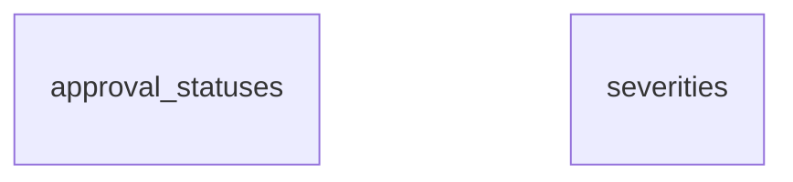

```
DB: OnevoDb_calsmoke
Last migration: 20260906134431_AddHolidayCalendarSettings
Snapshot generated: 2026-09-09T11:32:50Z
```

# Domain: Reference Data

### ER Diagram (same-domain relationships only)



### approval_statuses

| Column | Type | Key | Nullable | Default |
|---|---|---|---|---|
| id | integer | PK | NOT NULL | – |
| code | varchar50 |  | NOT NULL | – |
| label | varchar100 |  | NOT NULL | – |

#### References into other domains

_(none)_

#### Referenced by other domains

_(none)_

### severities

| Column | Type | Key | Nullable | Default |
|---|---|---|---|---|
| id | integer | PK | NOT NULL | – |
| code | varchar50 |  | NOT NULL | – |
| label | varchar100 |  | NOT NULL | – |

#### References into other domains

_(none)_

#### Referenced by other domains

_(none)_
