```
DB: OnevoDb_calsmoke
Last migration: 20260906134431_AddHolidayCalendarSettings
Snapshot generated: 2026-09-09T11:32:50Z
```

# Domain: Tenancy & Subscription

### ER Diagram (same-domain relationships only)

```mermaid
erDiagram
  billing_audit_logs {}
  feature_access_grants {}
  module_catalog {}
  module_catalog_price_history {}
  module_features {}
  module_integration_links {}
  module_permission_ownership {}
  subscription_invoices {}
  subscription_plans {}
  tenant_auth_policies {}
  tenant_configuration_template_applications {}
  tenant_integration_credentials {}
  tenant_one_time_charges {}
  tenant_provisioning_states {}
  tenant_setup_selections {}
  tenant_status_histories {}
  tenant_storage_stats {}
  tenant_subscriptions {}
  tenants {}
  subscription_invoices |o--o{ billing_audit_logs : "invoice_id"
  tenants |o--o{ billing_audit_logs : "tenant_id"
  module_catalog ||--o{ module_catalog_price_history : "module_key"
  module_catalog ||--o{ module_features : "module_key"
  module_catalog ||--o{ module_integration_links : "module_key"
  module_catalog ||--o{ module_permission_ownership : "module_key"
  tenant_subscriptions |o--o{ subscription_invoices : "tenant_subscription_id"
  tenants ||--o{ subscription_invoices : "tenant_id"
  tenants ||--o{ tenant_configuration_template_applications : "tenant_id"
  tenants ||--o{ tenant_integration_credentials : "tenant_id"
  tenants ||--o{ tenant_status_histories : "tenant_id"
  tenants ||--o{ tenant_storage_stats : "tenant_id"
```



### billing_audit_logs

| Column | Type | Key | Nullable | Default |
|---|---|---|---|---|
| id | uuid | PK | NOT NULL | – |
| tenant_id | uuid | FK | NULL | – |
| invoice_id | uuid | FK | NULL | – |
| actor_admin_user_id | uuid | FK | NULL | – |
| action | varchar80 |  | NOT NULL | – |
| message | varchar1000 |  | NOT NULL | – |
| metadata_json | jsonb |  | NULL | – |
| created_at | timestamptz |  | NOT NULL | – |

#### References into other domains

| Source | Target | Target Domain | On Delete |
|---|---|---|---|
| `billing_audit_logs.actor_admin_user_id` | `platform_users.id` | Platform Administration | SET NULL |

#### Referenced by other domains

_(none)_

### feature_access_grants

| Column | Type | Key | Nullable | Default |
|---|---|---|---|---|
| id | uuid | PK | NOT NULL | – |
| tenant_id | uuid |  | NOT NULL | – |
| grantee_type | varchar10 |  | NOT NULL | – |
| grantee_id | uuid |  | NOT NULL | – |
| module | varchar50 |  | NOT NULL | – |
| is_enabled | boolean |  | NOT NULL | – |
| granted_by | uuid |  | NOT NULL | – |
| created_at | timestamptz |  | NOT NULL | – |
| updated_at | timestamptz |  | NULL | – |

#### References into other domains

_(none)_

#### Referenced by other domains

_(none)_

### module_catalog

| Column | Type | Key | Nullable | Default |
|---|---|---|---|---|
| module_key | varchar100 | PK | NOT NULL | – |
| name | varchar150 |  | NOT NULL | – |
| pillar | varchar50 |  | NOT NULL | – |
| phase | varchar30 |  | NOT NULL | – |
| pricing_unit | varchar30 |  | NOT NULL | – |
| storage_reference | jsonb |  | NOT NULL | – |
| is_active | boolean |  | NOT NULL | – |
| created_at | timestamptz |  | NOT NULL | – |
| updated_at | timestamptz |  | NULL | – |
| ai_token_reference | jsonb |  | NOT NULL | '{}'::jsonb |
| is_ai_enabled | boolean |  | NOT NULL | false |
| is_storage_consuming | boolean |  | NOT NULL | false |
| pricing_reference | jsonb |  | NOT NULL | '{}'::jsonb |

#### References into other domains

_(none)_

#### Referenced by other domains

_(none)_

### module_catalog_price_history

| Column | Type | Key | Nullable | Default |
|---|---|---|---|---|
| id | uuid | PK | NOT NULL | – |
| module_key | varchar100 | FK | NOT NULL | – |
| old_pricing_reference | jsonb |  | NULL | – |
| new_pricing_reference | jsonb |  | NULL | – |
| old_storage_reference | jsonb |  | NULL | – |
| new_storage_reference | jsonb |  | NULL | – |
| old_ai_token_reference | jsonb |  | NULL | – |
| new_ai_token_reference | jsonb |  | NULL | – |
| old_pricing_unit | varchar30 |  | NULL | – |
| new_pricing_unit | varchar30 |  | NULL | – |
| changed_by_id | uuid |  | NOT NULL | – |
| reason | text |  | NOT NULL | – |
| changed_at | timestamptz |  | NOT NULL | – |

#### References into other domains

_(none)_

#### Referenced by other domains

_(none)_

### module_features

| Column | Type | Key | Nullable | Default |
|---|---|---|---|---|
| feature_key | varchar120 | PK | NOT NULL | – |
| module_key | varchar100 | FK | NOT NULL | – |
| name | varchar150 |  | NOT NULL | – |
| description | text |  | NULL | – |
| is_default_included | boolean |  | NOT NULL | – |
| is_active | boolean |  | NOT NULL | – |
| created_at | timestamptz |  | NOT NULL | – |
| updated_at | timestamptz |  | NULL | – |

#### References into other domains

_(none)_

#### Referenced by other domains

_(none)_

### module_integration_links

| Column | Type | Key | Nullable | Default |
|---|---|---|---|---|
| module_key | varchar80 | PK, FK | NOT NULL | – |
| integration_key | varchar50 | PK, FK | NOT NULL | – |
| linked_by_id | uuid | FK | NOT NULL | – |
| linked_at | timestamptz |  | NOT NULL | – |

#### References into other domains

| Source | Target | Target Domain | On Delete |
|---|---|---|---|
| `module_integration_links.integration_key` | `integration_catalog.integration_key` | Platform Administration | RESTRICT |
| `module_integration_links.linked_by_id` | `platform_users.id` | Platform Administration | RESTRICT |

#### Referenced by other domains

_(none)_

### module_permission_ownership

| Column | Type | Key | Nullable | Default |
|---|---|---|---|---|
| module_key | varchar100 | PK, FK | NOT NULL | – |
| permission_code | varchar120 | PK | NOT NULL | – |
| is_default_permission | boolean |  | NOT NULL | – |
| created_at | timestamptz |  | NOT NULL | – |
| updated_at | timestamptz |  | NULL | – |

#### References into other domains

_(none)_

#### Referenced by other domains

_(none)_

### subscription_invoices

| Column | Type | Key | Nullable | Default |
|---|---|---|---|---|
| id | uuid | PK | NOT NULL | – |
| tenant_id | uuid | FK | NOT NULL | – |
| tenant_subscription_id | uuid | FK | NULL | – |
| invoice_number | varchar50 |  | NOT NULL | – |
| external_invoice_id | varchar100 |  | NULL | – |
| gateway_provider | varchar50 |  | NULL | – |
| status | varchar20 |  | NOT NULL | – |
| currency | varchar3 |  | NOT NULL | – |
| subtotal_amount | numeric12_2 |  | NOT NULL | – |
| tax_amount | numeric12_2 |  | NOT NULL | – |
| discount_amount | numeric12_2 |  | NOT NULL | – |
| total_amount | numeric12_2 |  | NOT NULL | – |
| period_start | date |  | NULL | – |
| period_end | date |  | NULL | – |
| issued_at | timestamptz |  | NULL | – |
| due_at | timestamptz |  | NULL | – |
| paid_at | timestamptz |  | NULL | – |
| voided_at | timestamptz |  | NULL | – |
| created_at | timestamptz |  | NOT NULL | – |
| updated_at | timestamptz |  | NULL | – |

#### References into other domains

_(none)_

#### Referenced by other domains

_(none)_

### subscription_plans

| Column | Type | Key | Nullable | Default |
|---|---|---|---|---|
| id | uuid | PK | NOT NULL | – |
| name | varchar100 |  | NOT NULL | – |
| code | varchar20 |  | NOT NULL | – |
| tier | varchar20 |  | NOT NULL | – |
| feature_limits_json | jsonb |  | NULL | – |
| included_modules_json | jsonb |  | NULL | – |
| company_size_range | varchar30 |  | NOT NULL | – |
| pricing_unit | varchar30 |  | NOT NULL | – |
| calculated_monthly_price | numeric10_2 |  | NOT NULL | – |
| calculated_annual_price | numeric10_2 |  | NOT NULL | – |
| override_monthly_price | numeric10_2 |  | NULL | – |
| override_annual_price | numeric10_2 |  | NULL | – |
| ai_token_limit_per_month | integer |  | NULL | – |
| currency | varchar3 |  | NOT NULL | – |
| is_active | boolean |  | NOT NULL | – |
| created_at | timestamptz |  | NOT NULL | – |
| updated_at | timestamptz |  | NULL | – |
| trial_period_days | integer |  | NOT NULL | 0 |
| unpaid_grace_period_days | integer |  | NOT NULL | 0 |

#### References into other domains

_(none)_

#### Referenced by other domains

_(none)_

### tenant_auth_policies

| Column | Type | Key | Nullable | Default |
|---|---|---|---|---|
| id | uuid | PK | NOT NULL | – |
| tenant_id | uuid |  | NOT NULL | – |
| password_completion_allowed | boolean |  | NOT NULL | – |
| google_completion_allowed | boolean |  | NOT NULL | – |
| google_email_mismatch_default | boolean |  | NOT NULL | – |
| allowed_login_domains_json | text |  | NULL | – |
| mfa_required | boolean |  | NOT NULL | – |
| created_at | timestamptz |  | NOT NULL | – |
| updated_at | timestamptz |  | NULL | – |

#### References into other domains

_(none)_

#### Referenced by other domains

_(none)_

### tenant_configuration_template_applications

| Column | Type | Key | Nullable | Default |
|---|---|---|---|---|
| id | uuid | PK | NOT NULL | – |
| tenant_id | uuid | FK | NOT NULL | – |
| configuration_template_id | uuid | FK | NOT NULL | – |
| template_type | varchar50 |  | NOT NULL | – |
| applied_version | integer |  | NOT NULL | – |
| applied_payload_json | jsonb |  | NOT NULL | – |
| custom_payload_json | jsonb |  | NULL | – |
| warnings_json | jsonb |  | NULL | – |
| status | varchar20 |  | NOT NULL | – |
| applied_by_id | uuid | FK | NOT NULL | – |
| applied_at | timestamptz |  | NOT NULL | – |

#### References into other domains

| Source | Target | Target Domain | On Delete |
|---|---|---|---|
| `tenant_configuration_template_applications.configuration_template_id` | `configuration_templates.id` | Platform Administration | RESTRICT |
| `tenant_configuration_template_applications.applied_by_id` | `platform_users.id` | Platform Administration | RESTRICT |

#### Referenced by other domains

_(none)_

### tenant_integration_credentials

| Column | Type | Key | Nullable | Default |
|---|---|---|---|---|
| id | uuid | PK | NOT NULL | – |
| tenant_id | uuid | FK | NOT NULL | – |
| integration_key | varchar50 | FK | NOT NULL | – |
| access_token_encrypted | text |  | NULL | – |
| refresh_token_encrypted | text |  | NULL | – |
| token_expires_at | timestamptz |  | NULL | – |
| scopes_granted | text[] |  | NOT NULL | – |
| external_account_id | varchar200 |  | NULL | – |
| external_account_name | varchar200 |  | NULL | – |
| status | varchar20 |  | NOT NULL | – |
| last_sync_at | timestamptz |  | NULL | – |
| error_message | text |  | NULL | – |
| connected_at | timestamptz |  | NOT NULL | – |
| connected_by_user_id | uuid | FK | NOT NULL | – |
| disconnected_at | timestamptz |  | NULL | – |

#### References into other domains

| Source | Target | Target Domain | On Delete |
|---|---|---|---|
| `tenant_integration_credentials.integration_key` | `integration_catalog.integration_key` | Platform Administration | RESTRICT |
| `tenant_integration_credentials.connected_by_user_id` | `users.id` | Auth & Identity | RESTRICT |

#### Referenced by other domains

_(none)_

### tenant_one_time_charges

| Column | Type | Key | Nullable | Default |
|---|---|---|---|---|
| id | uuid | PK | NOT NULL | – |
| setup_option_key | varchar100 |  | NOT NULL | – |
| description | varchar500 |  | NOT NULL | – |
| amount | numeric12_2 |  | NOT NULL | – |
| currency | varchar3 |  | NOT NULL | – |
| status | varchar20 |  | NOT NULL | – |
| charged_once | boolean |  | NOT NULL | – |
| tenant_id | uuid |  | NOT NULL | – |
| created_at | timestamptz |  | NOT NULL | – |
| updated_at | timestamptz |  | NULL | – |
| created_by_id | uuid |  | NOT NULL | – |
| is_deleted | boolean |  | NOT NULL | – |
| deleted_at | timestamptz |  | NULL | – |

#### References into other domains

_(none)_

#### Referenced by other domains

_(none)_

### tenant_provisioning_states

| Column | Type | Key | Nullable | Default |
|---|---|---|---|---|
| tenant_id | uuid | PK | NOT NULL | – |
| current_step | varchar50 |  | NOT NULL | – |
| tenant_details_completed_at | timestamptz |  | NULL | – |
| subscription_completed_at | timestamptz |  | NULL | – |
| modules_completed_at | timestamptz |  | NULL | – |
| roles_completed_at | timestamptz |  | NULL | – |
| settings_completed_at | timestamptz |  | NULL | – |
| owner_invite_completed_at | timestamptz |  | NULL | – |
| activation_ready | boolean |  | NOT NULL | – |
| activated_at | timestamptz |  | NULL | – |
| last_updated_by_id | uuid |  | NULL | – |
| updated_at | timestamptz |  | NOT NULL | – |

#### References into other domains

_(none)_

#### Referenced by other domains

_(none)_

### tenant_setup_selections

| Column | Type | Key | Nullable | Default |
|---|---|---|---|---|
| id | uuid | PK | NOT NULL | – |
| tenant_id | uuid |  | NOT NULL | – |
| setup_option_key | varchar100 |  | NOT NULL | – |
| status | varchar50 |  | NOT NULL | – |
| created_at | timestamptz |  | NOT NULL | – |
| completed_at | timestamptz |  | NULL | – |
| completed_by_id | uuid |  | NULL | – |

#### References into other domains

_(none)_

#### Referenced by other domains

_(none)_

### tenant_status_histories

| Column | Type | Key | Nullable | Default |
|---|---|---|---|---|
| id | uuid | PK | NOT NULL | – |
| tenant_id | uuid | FK | NOT NULL | – |
| from_status | varchar20 |  | NOT NULL | – |
| to_status | varchar20 |  | NOT NULL | – |
| reason | varchar500 |  | NULL | – |
| changed_by_id | uuid | FK | NULL | – |
| changed_at | timestamptz |  | NOT NULL | – |

#### References into other domains

| Source | Target | Target Domain | On Delete |
|---|---|---|---|
| `tenant_status_histories.changed_by_id` | `platform_users.id` | Platform Administration | SET NULL |

#### Referenced by other domains

_(none)_

### tenant_storage_stats

| Column | Type | Key | Nullable | Default |
|---|---|---|---|---|
| tenant_id | uuid | PK, FK | NOT NULL | – |
| used_r2_bytes | bigint |  | NOT NULL | – |
| used_db_bytes | bigint |  | NOT NULL | – |
| reserved_r2_bytes | bigint |  | NOT NULL | – |
| last_calculated_at | timestamptz |  | NULL | – |
| updated_at | timestamptz |  | NULL | – |

#### References into other domains

_(none)_

#### Referenced by other domains

_(none)_

### tenant_subscriptions

| Column | Type | Key | Nullable | Default |
|---|---|---|---|---|
| id | uuid | PK | NOT NULL | – |
| tenant_id | uuid |  | NOT NULL | – |
| plan_id | uuid |  | NOT NULL | – |
| billing_cycle | varchar20 |  | NOT NULL | – |
| status | varchar20 |  | NOT NULL | – |
| current_period_start | date |  | NOT NULL | – |
| current_period_end | date |  | NOT NULL | – |
| payment_provider_ref | varchar200 |  | NULL | – |
| commercial_model | varchar30 |  | NOT NULL | – |
| billing_currency | varchar3 |  | NOT NULL | – |
| subscription_collection_mode | varchar30 |  | NULL | – |
| gateway_provider | varchar50 |  | NULL | – |
| gateway_customer_ref | varchar200 |  | NULL | – |
| gateway_subscription_ref | varchar200 |  | NULL | – |
| license_payment_mode | varchar30 |  | NULL | – |
| full_license_amount | numeric14_2 |  | NULL | – |
| license_paid_at | date |  | NULL | – |
| license_reference | varchar100 |  | NULL | – |
| maintenance_collection_mode | varchar30 |  | NULL | – |
| maintenance_billing_cycle | varchar20 |  | NULL | – |
| contract_start_date | date |  | NOT NULL | – |
| contract_end_date | date |  | NULL | – |
| maintenance_status | varchar20 |  | NULL | – |
| maintenance_start_date | date |  | NULL | – |
| maintenance_renewal_date | date |  | NULL | – |
| maintenance_rate | numeric5_2 |  | NULL | – |
| maintenance_amount | numeric14_2 |  | NULL | – |
| company_size_range | varchar30 |  | NOT NULL | – |
| selected_modules | jsonb |  | NOT NULL | – |
| calculated_monthly_price | numeric10_2 |  | NOT NULL | – |
| calculated_annual_price | numeric10_2 |  | NOT NULL | – |
| override_monthly_price | numeric10_2 |  | NULL | – |
| override_annual_price | numeric10_2 |  | NULL | – |
| ai_token_limit_per_month | integer |  | NULL | – |
| custom_contract_value | numeric14_2 |  | NULL | – |
| discount_percent | numeric5_2 |  | NULL | – |
| created_by_id | uuid |  | NULL | – |
| created_at | timestamptz |  | NOT NULL | – |
| updated_at | timestamptz |  | NULL | – |
| access_ends_at | timestamptz |  | NULL | – |
| trial_end_date | timestamptz |  | NULL | – |
| trial_start_date | timestamptz |  | NULL | – |
| unpaid_grace_period_days | integer |  | NOT NULL | 0 |
| included_seats | integer |  | NULL | – |
| overage_allowed | boolean |  | NULL | – |

#### References into other domains

_(none)_

#### Referenced by other domains

_(none)_

### tenants

| Column | Type | Key | Nullable | Default |
|---|---|---|---|---|
| id | uuid | PK | NOT NULL | – |
| name | varchar200 |  | NOT NULL | – |
| slug | varchar100 |  | NOT NULL | – |
| industry_profile | varchar30 |  | NOT NULL | – |
| company_size_range | varchar30 |  | NOT NULL | – |
| status | varchar20 |  | NOT NULL | – |
| subscription_plan_id | uuid |  | NULL | – |
| settings_json | jsonb |  | NULL | – |
| created_at | timestamptz |  | NOT NULL | – |
| updated_at | timestamptz |  | NULL | – |

#### References into other domains

_(none)_

#### Referenced by other domains

| Source | Target | Source Domain | On Delete |
|---|---|---|---|
| `file_records.tenant_id` | `tenants.id` | Files & Infrastructure | RESTRICT |
| `file_upload_reservations.tenant_id` | `tenants.id` | Files & Infrastructure | RESTRICT |
| `global_email_directory.tenant_id` | `tenants.id` | Auth & Identity | CASCADE |
| `legal_login_challenges.tenant_id` | `tenants.id` | Org Structure | RESTRICT |
| `mfa_challenges.tenant_id` | `tenants.id` | Auth & Identity | RESTRICT |
| `tenant_session_exchange_challenges.tenant_id` | `tenants.id` | Auth & Identity | RESTRICT |
| `user_integration_connections.tenant_id` | `tenants.id` | Auth & Identity | RESTRICT |
