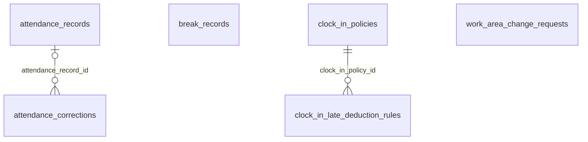

```
DB: OnevoDb_calsmoke
Last migration: 20260906134431_AddHolidayCalendarSettings
Snapshot generated: 2026-09-09T11:32:50Z
```

# Domain: Time & Attendance

### ER Diagram (same-domain relationships only)



### attendance_corrections

| Column | Type | Key | Nullable | Default |
|---|---|---|---|---|
| id | uuid | PK | NOT NULL | – |
| tenant_id | uuid |  | NOT NULL | – |
| employee_id | uuid | FK | NOT NULL | – |
| legal_entity_id | uuid | FK | NOT NULL | – |
| presence_session_id | uuid | FK | NULL | – |
| attendance_record_id | uuid | FK | NULL | – |
| work_date | date |  | NOT NULL | – |
| correction_type | varchar30 |  | NOT NULL | – |
| original_clock_in_at | timestamptz |  | NULL | – |
| original_clock_out_at | timestamptz |  | NULL | – |
| requested_clock_in_at | timestamptz |  | NULL | – |
| requested_clock_out_at | timestamptz |  | NULL | – |
| original_break_json | jsonb |  | NULL | – |
| requested_break_json | jsonb |  | NULL | – |
| reason | varchar255 |  | NOT NULL | – |
| notes | text |  | NULL | – |
| status | varchar20 |  | NOT NULL | – |
| requested_by_id | uuid | FK | NOT NULL | – |
| reviewed_by_id | uuid | FK | NULL | – |
| reviewed_at | timestamptz |  | NULL | – |
| review_comment | text |  | NULL | – |
| created_at | timestamptz |  | NOT NULL | – |
| updated_at | timestamptz |  | NOT NULL | – |
| approval_required | boolean |  | NOT NULL | – |

#### References into other domains

| Source | Target | Target Domain | On Delete |
|---|---|---|---|
| `attendance_corrections.employee_id` | `employees.id` | Core HR & Employee Lifecycle | RESTRICT |
| `attendance_corrections.legal_entity_id` | `legal_entities.id` | Org Structure | RESTRICT |
| `attendance_corrections.presence_session_id` | `presence_sessions.id` | Monitoring & Activity | RESTRICT |
| `attendance_corrections.requested_by_id` | `users.id` | Auth & Identity | RESTRICT |
| `attendance_corrections.reviewed_by_id` | `users.id` | Auth & Identity | RESTRICT |

#### Referenced by other domains

_(none)_

### attendance_records

| Column | Type | Key | Nullable | Default |
|---|---|---|---|---|
| id | uuid | PK | NOT NULL | – |
| tenant_id | uuid |  | NOT NULL | – |
| employee_id | uuid |  | NOT NULL | – |
| date | date |  | NOT NULL | – |
| expected_working_day | boolean |  | NOT NULL | – |
| work_time_type | varchar20 |  | NULL | – |
| scheduled_start | time |  | NULL | – |
| scheduled_end | time |  | NULL | – |
| required_work_minutes | integer |  | NULL | – |
| expected_work_area | varchar10 |  | NULL | – |
| schedule_timezone | varchar50 |  | NULL | – |
| is_holiday | boolean |  | NOT NULL | – |
| holiday_name | varchar100 |  | NULL | – |
| actual_start | timestamptz |  | NULL | – |
| actual_end | timestamptz |  | NULL | – |
| worked_minutes | integer |  | NOT NULL | – |
| break_minutes | integer |  | NOT NULL | – |
| late_minutes | integer |  | NULL | – |
| attendance_source | varchar20 |  | NULL | – |
| status | varchar30 |  | NOT NULL | – |
| created_at | timestamptz |  | NOT NULL | – |
| updated_at | timestamptz |  | NOT NULL | – |

#### References into other domains

_(none)_

#### Referenced by other domains

_(none)_

### break_records

| Column | Type | Key | Nullable | Default |
|---|---|---|---|---|
| id | uuid | PK | NOT NULL | – |
| tenant_id | uuid |  | NOT NULL | – |
| employee_id | uuid |  | NOT NULL | – |
| break_start | timestamptz |  | NOT NULL | – |
| break_end | timestamptz |  | NULL | – |
| break_type | varchar30 |  | NULL | – |
| auto_detected | boolean |  | NOT NULL | – |
| created_at | timestamptz |  | NOT NULL | – |

#### References into other domains

_(none)_

#### Referenced by other domains

_(none)_

### clock_in_late_deduction_rules

| Column | Type | Key | Nullable | Default |
|---|---|---|---|---|
| id | uuid | PK | NOT NULL | – |
| tenant_id | uuid |  | NOT NULL | – |
| clock_in_policy_id | uuid | FK | NOT NULL | – |
| late_arrival_minute | integer |  | NOT NULL | – |
| multiplier | numeric5_2 |  | NOT NULL | – |
| time_off_type_id | uuid |  | NOT NULL | – |
| is_active | boolean |  | NOT NULL | – |
| created_at | timestamptz |  | NOT NULL | – |
| updated_at | timestamptz |  | NOT NULL | – |

#### References into other domains

_(none)_

#### Referenced by other domains

_(none)_

### clock_in_policies

| Column | Type | Key | Nullable | Default |
|---|---|---|---|---|
| id | uuid | PK | NOT NULL | – |
| tenant_id | uuid |  | NOT NULL | – |
| legal_entity_id | uuid | FK | NOT NULL | – |
| name | varchar120 |  | NOT NULL | – |
| scope_type | varchar30 |  | NOT NULL | – |
| department_ids | uuid[] |  | NULL | – |
| position_ids | uuid[] |  | NULL | – |
| employee_ids | uuid[] |  | NULL | – |
| effective_from | date |  | NOT NULL | – |
| effective_to | date |  | NULL | – |
| location_verification_required | boolean |  | NOT NULL | – |
| allowed_radius_meters | integer |  | NULL | – |
| onsite_biometric_enabled | boolean |  | NOT NULL | – |
| onsite_web_enabled | boolean |  | NOT NULL | – |
| onsite_tray_enabled | boolean |  | NOT NULL | – |
| onsite_photo_required | boolean |  | NOT NULL | – |
| remote_biometric_enabled | boolean |  | NOT NULL | – |
| remote_web_enabled | boolean |  | NOT NULL | – |
| remote_tray_enabled | boolean |  | NOT NULL | – |
| remote_photo_required | boolean |  | NOT NULL | – |
| either_biometric_enabled | boolean |  | NOT NULL | – |
| either_web_enabled | boolean |  | NOT NULL | – |
| either_tray_enabled | boolean |  | NOT NULL | – |
| either_photo_required | boolean |  | NOT NULL | – |
| either_location_check_required | boolean |  | NOT NULL | – |
| either_source_rule | varchar30 |  | NOT NULL | – |
| field_biometric_enabled | boolean |  | NOT NULL | – |
| field_web_enabled | boolean |  | NOT NULL | – |
| field_tray_enabled | boolean |  | NOT NULL | – |
| field_photo_requirement | varchar20 |  | NOT NULL | – |
| correction_requires_approval | boolean |  | NOT NULL | – |
| notification_recipient_resolver | varchar50 |  | NOT NULL | – |
| is_active | boolean |  | NOT NULL | – |
| created_by_id | uuid |  | NOT NULL | – |
| created_at | timestamptz |  | NOT NULL | – |
| updated_at | timestamptz |  | NOT NULL | – |

#### References into other domains

| Source | Target | Target Domain | On Delete |
|---|---|---|---|
| `clock_in_policies.legal_entity_id` | `legal_entities.id` | Org Structure | RESTRICT |

#### Referenced by other domains

_(none)_

### work_area_change_requests

| Column | Type | Key | Nullable | Default |
|---|---|---|---|---|
| id | uuid | PK | NOT NULL | – |
| tenant_id | uuid |  | NOT NULL | – |
| employee_id | uuid | FK | NOT NULL | – |
| legal_entity_id | uuid | FK | NOT NULL | – |
| date | date |  | NOT NULL | – |
| current_expected_work_area | varchar10 |  | NOT NULL | – |
| requested_work_area | varchar10 |  | NOT NULL | – |
| reason | text |  | NOT NULL | – |
| status | varchar20 |  | NOT NULL | – |
| requested_at | timestamptz |  | NOT NULL | – |
| reviewed_by_id | uuid | FK | NULL | – |
| reviewed_at | timestamptz |  | NULL | – |
| review_comment | text |  | NULL | – |

#### References into other domains

| Source | Target | Target Domain | On Delete |
|---|---|---|---|
| `work_area_change_requests.employee_id` | `employees.id` | Core HR & Employee Lifecycle | RESTRICT |
| `work_area_change_requests.legal_entity_id` | `legal_entities.id` | Org Structure | RESTRICT |
| `work_area_change_requests.reviewed_by_id` | `users.id` | Auth & Identity | RESTRICT |

#### Referenced by other domains

_(none)_
