```
DB: OnevoDb_calsmoke
Last migration: 20260906134431_AddHolidayCalendarSettings
Snapshot generated: 2026-09-09T11:32:50Z
```

# Domain: Work Management

### ER Diagram (same-domain relationships only)

```mermaid
erDiagram
  labels {}
  objective_change_requests {}
  objectives {}
  project_categories {}
  project_member_invitations {}
  project_members {}
  projects {}
  release_calendar {}
  sprints {}
  task_assignments {}
  task_categories {}
  task_clocking_sessions {}
  task_creation_requests {}
  task_edit_logs {}
  task_edit_requests {}
  task_percentage_logs {}
  task_status_change_logs {}
  task_statuses {}
  tasks {}
  version_statuses {}
  versions {}
  projects ||--o{ labels : "project_id"
  objectives ||--o{ objective_change_requests : "objective_id"
  objectives |o--o{ objectives : "parent_objective_id"
  projects ||--o{ objectives : "project_id"
  objectives ||--o{ project_member_invitations : "objective_id"
  projects ||--o{ project_member_invitations : "project_id"
  objectives ||--o{ project_members : "objective_id"
  projects ||--o{ project_members : "project_id"
  projects ||--o{ release_calendar : "project_id"
  versions ||--o{ release_calendar : "version_id"
  tasks ||--o{ task_assignments : "task_id"
  tasks ||--o{ task_clocking_sessions : "task_id"
  objectives ||--o{ task_creation_requests : "objective_id"
  tasks |o--o{ task_creation_requests : "created_task_id"
  task_edit_requests |o--o{ task_edit_logs : "edit_request_id"
  tasks ||--o{ task_edit_logs : "task_id"
  tasks ||--o{ task_edit_requests : "task_id"
  task_clocking_sessions |o--o{ task_percentage_logs : "clocking_session_id"
  tasks ||--o{ task_percentage_logs : "task_id"
  task_statuses ||--o{ task_status_change_logs : "from_status_id"
  task_statuses ||--o{ task_status_change_logs : "to_status_id"
  tasks ||--o{ task_status_change_logs : "task_id"
  sprints |o--o{ tasks : "sprint_id"
  task_categories ||--o{ tasks : "category_id"
  task_statuses ||--o{ tasks : "status_id"
  projects ||--o{ versions : "project_id"
  version_statuses ||--o{ versions : "status_id"
```



### labels

| Column | Type | Key | Nullable | Default |
|---|---|---|---|---|
| id | uuid | PK | NOT NULL | – |
| project_id | uuid | FK | NOT NULL | – |
| name | varchar50 |  | NOT NULL | – |
| color | varchar20 |  | NOT NULL | – |
| tenant_id | uuid |  | NOT NULL | – |
| created_at | timestamptz |  | NOT NULL | – |
| updated_at | timestamptz |  | NULL | – |
| created_by_id | uuid |  | NOT NULL | – |
| is_deleted | boolean |  | NOT NULL | – |
| deleted_at | timestamptz |  | NULL | – |

#### References into other domains

_(none)_

#### Referenced by other domains

_(none)_

### objective_change_requests

| Column | Type | Key | Nullable | Default |
|---|---|---|---|---|
| id | uuid | PK | NOT NULL | – |
| objective_id | uuid | FK | NOT NULL | – |
| request_type | varchar20 |  | NOT NULL | – |
| requested_by_id | uuid |  | NOT NULL | – |
| reporting_manager_id | uuid |  | NOT NULL | – |
| status | varchar20 |  | NOT NULL | – |
| payload_json | jsonb |  | NULL | – |
| decided_at | timestamptz |  | NULL | – |
| decided_by_id | uuid |  | NULL | – |
| tenant_id | uuid |  | NOT NULL | – |
| created_at | timestamptz |  | NOT NULL | – |
| updated_at | timestamptz |  | NULL | – |
| created_by_id | uuid |  | NOT NULL | – |
| is_deleted | boolean |  | NOT NULL | – |
| deleted_at | timestamptz |  | NULL | – |

#### References into other domains

_(none)_

#### Referenced by other domains

_(none)_

### objectives

| Column | Type | Key | Nullable | Default |
|---|---|---|---|---|
| id | uuid | PK | NOT NULL | – |
| project_id | uuid | FK | NOT NULL | – |
| parent_objective_id | uuid | FK | NULL | – |
| is_default | boolean |  | NOT NULL | – |
| title | varchar255 |  | NOT NULL | – |
| description | text |  | NULL | – |
| owner_id | uuid |  | NOT NULL | – |
| is_active | boolean |  | NOT NULL | – |
| start_date | date |  | NOT NULL | – |
| end_date | date |  | NOT NULL | – |
| progress | numeric5_2 |  | NOT NULL | 0.0 |
| actual_hours | numeric18_2 |  | NULL | – |
| allocated_hours | numeric18_2 |  | NOT NULL | 0.0 |
| completed_hours | numeric18_2 |  | NOT NULL | 0.0 |
| tenant_id | uuid |  | NOT NULL | – |
| created_at | timestamptz |  | NOT NULL | – |
| updated_at | timestamptz |  | NULL | – |
| created_by_id | uuid |  | NOT NULL | – |
| is_deleted | boolean |  | NOT NULL | – |
| deleted_at | timestamptz |  | NULL | – |
| reporting_manager_id | uuid |  | NULL | – |
| achieved_at | timestamptz |  | NULL | – |
| is_achieved | boolean |  | NOT NULL | false |

#### References into other domains

_(none)_

#### Referenced by other domains

| Source | Target | Source Domain | On Delete |
|---|---|---|---|
| `calendar_event_objectives.objective_id` | `objectives.id` | Calendar | RESTRICT |

### project_categories

| Column | Type | Key | Nullable | Default |
|---|---|---|---|---|
| id | uuid | PK | NOT NULL | – |
| name | varchar100 |  | NOT NULL | – |
| is_active | boolean |  | NOT NULL | – |
| tenant_id | uuid |  | NOT NULL | – |
| created_at | timestamptz |  | NOT NULL | – |
| updated_at | timestamptz |  | NULL | – |
| created_by_id | uuid |  | NOT NULL | – |
| is_deleted | boolean |  | NOT NULL | – |
| deleted_at | timestamptz |  | NULL | – |

#### References into other domains

_(none)_

#### Referenced by other domains

_(none)_

### project_member_invitations

| Column | Type | Key | Nullable | Default |
|---|---|---|---|---|
| id | uuid | PK | NOT NULL | – |
| project_id | uuid | FK | NOT NULL | – |
| objective_id | uuid | FK | NOT NULL | – |
| invited_employee_id | uuid |  | NOT NULL | – |
| status | varchar20 |  | NOT NULL | – |
| invited_by_id | uuid |  | NOT NULL | – |
| decided_at | timestamptz |  | NULL | – |
| expires_at | timestamptz |  | NULL | – |
| tenant_id | uuid |  | NOT NULL | – |
| created_at | timestamptz |  | NOT NULL | – |
| updated_at | timestamptz |  | NULL | – |
| created_by_id | uuid |  | NOT NULL | – |
| is_deleted | boolean |  | NOT NULL | – |
| deleted_at | timestamptz |  | NULL | – |
| invite_type | varchar20 |  | NOT NULL | 'member'::character … |

#### References into other domains

_(none)_

#### Referenced by other domains

_(none)_

### project_members

| Column | Type | Key | Nullable | Default |
|---|---|---|---|---|
| id | uuid | PK | NOT NULL | – |
| project_id | uuid | FK | NOT NULL | – |
| objective_id | uuid | FK | NOT NULL | – |
| employee_id | uuid |  | NOT NULL | – |
| membership_source | varchar30 |  | NOT NULL | – |
| is_active | boolean |  | NOT NULL | – |
| joined_at | timestamptz |  | NOT NULL | – |
| removed_at | timestamptz |  | NULL | – |
| tenant_id | uuid |  | NOT NULL | – |
| created_at | timestamptz |  | NOT NULL | – |
| updated_at | timestamptz |  | NULL | – |
| created_by_id | uuid |  | NOT NULL | – |
| is_deleted | boolean |  | NOT NULL | – |
| deleted_at | timestamptz |  | NULL | – |

#### References into other domains

_(none)_

#### Referenced by other domains

_(none)_

### projects

| Column | Type | Key | Nullable | Default |
|---|---|---|---|---|
| id | uuid | PK | NOT NULL | – |
| owning_legal_entity_id | uuid | FK | NOT NULL | – |
| category_id | uuid |  | NOT NULL | – |
| name | varchar200 |  | NOT NULL | – |
| identifier | varchar20 |  | NOT NULL | – |
| next_task_number | bigint |  | NOT NULL | 1 |
| description | text |  | NULL | – |
| lead_id | uuid |  | NOT NULL | – |
| start_date | date |  | NOT NULL | – |
| target_date | date |  | NOT NULL | – |
| color | varchar20 |  | NULL | – |
| actual_hours | numeric18_2 |  | NULL | – |
| allocated_hours | numeric18_2 |  | NOT NULL | 0.0 |
| completed_hours | numeric18_2 |  | NOT NULL | 0.0 |
| is_active | boolean |  | NOT NULL | – |
| tenant_id | uuid |  | NOT NULL | – |
| created_at | timestamptz |  | NOT NULL | – |
| updated_at | timestamptz |  | NULL | – |
| created_by_id | uuid |  | NOT NULL | – |
| is_deleted | boolean |  | NOT NULL | – |
| deleted_at | timestamptz |  | NULL | – |
| achieved_at | timestamptz |  | NULL | – |
| is_achieved | boolean |  | NOT NULL | false |

#### References into other domains

| Source | Target | Target Domain | On Delete |
|---|---|---|---|
| `projects.owning_legal_entity_id` | `legal_entities.id` | Org Structure | RESTRICT |

#### Referenced by other domains

| Source | Target | Source Domain | On Delete |
|---|---|---|---|
| `calendar_events.project_id` | `projects.id` | Calendar | RESTRICT |

### release_calendar

| Column | Type | Key | Nullable | Default |
|---|---|---|---|---|
| id | uuid | PK | NOT NULL | – |
| project_id | uuid | FK | NOT NULL | – |
| version_id | uuid | FK | NOT NULL | – |
| recipient_user_id | uuid |  | NOT NULL | – |
| scheduled_date | date |  | NOT NULL | – |
| reminder_type | varchar30 |  | NOT NULL | – |
| notes | text |  | NULL | – |
| is_active | boolean |  | NOT NULL | – |
| tenant_id | uuid |  | NOT NULL | – |
| created_at | timestamptz |  | NOT NULL | – |
| updated_at | timestamptz |  | NULL | – |
| created_by_id | uuid |  | NOT NULL | – |
| is_deleted | boolean |  | NOT NULL | – |
| deleted_at | timestamptz |  | NULL | – |

#### References into other domains

_(none)_

#### Referenced by other domains

_(none)_

### sprints

| Column | Type | Key | Nullable | Default |
|---|---|---|---|---|
| id | uuid | PK | NOT NULL | – |
| project_id | uuid |  | NOT NULL | – |
| objective_id | uuid |  | NOT NULL | – |
| name | varchar100 |  | NOT NULL | – |
| start_date | date |  | NOT NULL | – |
| end_date | date |  | NOT NULL | – |
| status | varchar20 |  | NOT NULL | – |
| completed_at | timestamptz |  | NULL | – |
| achieved_at | timestamptz |  | NULL | – |
| tenant_id | uuid |  | NOT NULL | – |
| created_at | timestamptz |  | NOT NULL | – |
| updated_at | timestamptz |  | NULL | – |
| created_by_id | uuid |  | NOT NULL | – |
| is_deleted | boolean |  | NOT NULL | – |
| deleted_at | timestamptz |  | NULL | – |
| is_manually_overridden | boolean |  | NOT NULL | false |

#### References into other domains

_(none)_

#### Referenced by other domains

_(none)_

### task_assignments

| Column | Type | Key | Nullable | Default |
|---|---|---|---|---|
| id | uuid | PK | NOT NULL | – |
| task_id | uuid | FK | NOT NULL | – |
| user_id | uuid |  | NOT NULL | – |
| employee_id | uuid |  | NOT NULL | – |
| assigned_by_id | uuid |  | NOT NULL | – |
| assigned_at | timestamptz |  | NOT NULL | – |

#### References into other domains

_(none)_

#### Referenced by other domains

_(none)_

### task_categories

| Column | Type | Key | Nullable | Default |
|---|---|---|---|---|
| id | uuid | PK | NOT NULL | – |
| project_id | uuid |  | NOT NULL | – |
| name | varchar100 |  | NOT NULL | – |
| display_order | integer |  | NOT NULL | – |
| tenant_id | uuid |  | NOT NULL | – |
| created_at | timestamptz |  | NOT NULL | – |
| updated_at | timestamptz |  | NULL | – |
| created_by_id | uuid |  | NOT NULL | – |
| is_deleted | boolean |  | NOT NULL | – |
| deleted_at | timestamptz |  | NULL | – |

#### References into other domains

_(none)_

#### Referenced by other domains

_(none)_

### task_clocking_sessions

| Column | Type | Key | Nullable | Default |
|---|---|---|---|---|
| id | uuid | PK | NOT NULL | – |
| task_id | uuid | FK | NOT NULL | – |
| employee_id | uuid |  | NOT NULL | – |
| clock_in_at | timestamptz |  | NOT NULL | – |
| clock_out_at | timestamptz |  | NULL | – |
| duration_minutes | integer |  | NULL | – |
| reason | text |  | NULL | – |
| tenant_id | uuid |  | NOT NULL | – |
| created_at | timestamptz |  | NOT NULL | – |
| updated_at | timestamptz |  | NULL | – |
| created_by_id | uuid |  | NOT NULL | – |
| is_deleted | boolean |  | NOT NULL | – |
| deleted_at | timestamptz |  | NULL | – |

#### References into other domains

_(none)_

#### Referenced by other domains

_(none)_

### task_creation_requests

| Column | Type | Key | Nullable | Default |
|---|---|---|---|---|
| id | uuid | PK | NOT NULL | – |
| objective_id | uuid | FK | NOT NULL | – |
| requested_by_employee_id | uuid |  | NOT NULL | – |
| payload_json | jsonb |  | NOT NULL | – |
| status | varchar20 |  | NOT NULL | – |
| decided_by_employee_id | uuid |  | NULL | – |
| decision_comment | text |  | NULL | – |
| created_task_id | uuid | FK | NULL | – |
| decided_at | timestamptz |  | NULL | – |
| tenant_id | uuid |  | NOT NULL | – |
| created_at | timestamptz |  | NOT NULL | – |
| updated_at | timestamptz |  | NULL | – |
| created_by_id | uuid |  | NOT NULL | – |
| is_deleted | boolean |  | NOT NULL | – |
| deleted_at | timestamptz |  | NULL | – |

#### References into other domains

_(none)_

#### Referenced by other domains

_(none)_

### task_edit_logs

| Column | Type | Key | Nullable | Default |
|---|---|---|---|---|
| id | uuid | PK | NOT NULL | – |
| task_id | uuid | FK | NOT NULL | – |
| employee_id | uuid |  | NOT NULL | – |
| source | varchar20 |  | NOT NULL | – |
| edit_request_id | uuid | FK | NULL | – |
| old_values_json | jsonb |  | NOT NULL | – |
| new_values_json | jsonb |  | NOT NULL | – |
| reason | text |  | NULL | – |
| changed_at | timestamptz |  | NOT NULL | – |
| tenant_id | uuid |  | NOT NULL | – |
| created_at | timestamptz |  | NOT NULL | – |
| updated_at | timestamptz |  | NULL | – |
| created_by_id | uuid |  | NOT NULL | – |
| is_deleted | boolean |  | NOT NULL | – |
| deleted_at | timestamptz |  | NULL | – |

#### References into other domains

_(none)_

#### Referenced by other domains

_(none)_

### task_edit_requests

| Column | Type | Key | Nullable | Default |
|---|---|---|---|---|
| id | uuid | PK | NOT NULL | – |
| task_id | uuid | FK | NOT NULL | – |
| requested_by_employee_id | uuid |  | NOT NULL | – |
| payload_json | jsonb |  | NOT NULL | – |
| status | varchar20 |  | NOT NULL | – |
| decided_by_employee_id | uuid |  | NULL | – |
| decision_comment | text |  | NULL | – |
| decided_at | timestamptz |  | NULL | – |
| tenant_id | uuid |  | NOT NULL | – |
| created_at | timestamptz |  | NOT NULL | – |
| updated_at | timestamptz |  | NULL | – |
| created_by_id | uuid |  | NOT NULL | – |
| is_deleted | boolean |  | NOT NULL | – |
| deleted_at | timestamptz |  | NULL | – |
| reason | text |  | NULL | – |

#### References into other domains

_(none)_

#### Referenced by other domains

_(none)_

### task_percentage_logs

| Column | Type | Key | Nullable | Default |
|---|---|---|---|---|
| id | uuid | PK | NOT NULL | – |
| task_id | uuid | FK | NOT NULL | – |
| employee_id | uuid |  | NOT NULL | – |
| previous_percent | integer |  | NOT NULL | – |
| new_percent | integer |  | NOT NULL | – |
| source | varchar20 |  | NOT NULL | – |
| clocking_session_id | uuid | FK | NULL | – |
| reason | text |  | NULL | – |
| changed_at | timestamptz |  | NOT NULL | – |
| tenant_id | uuid |  | NOT NULL | – |
| created_at | timestamptz |  | NOT NULL | – |
| updated_at | timestamptz |  | NULL | – |
| created_by_id | uuid |  | NOT NULL | – |
| is_deleted | boolean |  | NOT NULL | – |
| deleted_at | timestamptz |  | NULL | – |

#### References into other domains

_(none)_

#### Referenced by other domains

_(none)_

### task_status_change_logs

| Column | Type | Key | Nullable | Default |
|---|---|---|---|---|
| id | uuid | PK | NOT NULL | – |
| task_id | uuid | FK | NOT NULL | – |
| employee_id | uuid |  | NOT NULL | – |
| from_status_id | uuid | FK | NOT NULL | – |
| to_status_id | uuid | FK | NOT NULL | – |
| changed_at | timestamptz |  | NOT NULL | – |
| tenant_id | uuid |  | NOT NULL | – |
| created_at | timestamptz |  | NOT NULL | – |
| updated_at | timestamptz |  | NULL | – |
| created_by_id | uuid |  | NOT NULL | – |
| is_deleted | boolean |  | NOT NULL | – |
| deleted_at | timestamptz |  | NULL | – |

#### References into other domains

_(none)_

#### Referenced by other domains

_(none)_

### task_statuses

| Column | Type | Key | Nullable | Default |
|---|---|---|---|---|
| id | uuid | PK | NOT NULL | – |
| project_id | uuid |  | NOT NULL | – |
| objective_id | uuid |  | NULL | – |
| name | varchar100 |  | NOT NULL | – |
| display_order | integer |  | NOT NULL | – |
| requires_approval | boolean |  | NOT NULL | – |
| approver_id | uuid |  | NULL | – |
| marks_task_complete | boolean |  | NOT NULL | – |
| tenant_id | uuid |  | NOT NULL | – |
| created_at | timestamptz |  | NOT NULL | – |
| updated_at | timestamptz |  | NULL | – |
| created_by_id | uuid |  | NOT NULL | – |
| is_deleted | boolean |  | NOT NULL | – |
| deleted_at | timestamptz |  | NULL | – |
| visibility | varchar20 |  | NOT NULL | 'public'::character … |

#### References into other domains

_(none)_

#### Referenced by other domains

_(none)_

### tasks

| Column | Type | Key | Nullable | Default |
|---|---|---|---|---|
| id | uuid | PK | NOT NULL | – |
| project_id | uuid |  | NOT NULL | – |
| parent_task_id | uuid |  | NULL | – |
| objective_id | uuid |  | NOT NULL | – |
| short_id | varchar50 |  | NOT NULL | – |
| title | varchar500 |  | NOT NULL | – |
| description | text |  | NULL | – |
| status_id | uuid | FK | NOT NULL | – |
| priority | varchar20 |  | NOT NULL | – |
| story_points | integer |  | NULL | – |
| due_date | date |  | NULL | – |
| estimated_hours | numeric18_2 |  | NULL | – |
| completed_hours | numeric18_2 |  | NOT NULL | – |
| progress_percent | integer |  | NOT NULL | – |
| started_at | timestamptz |  | NULL | – |
| completed_at | timestamptz |  | NULL | – |
| tenant_id | uuid |  | NOT NULL | – |
| created_at | timestamptz |  | NOT NULL | – |
| updated_at | timestamptz |  | NULL | – |
| created_by_id | uuid |  | NOT NULL | – |
| is_deleted | boolean |  | NOT NULL | – |
| deleted_at | timestamptz |  | NULL | – |
| sprint_id | uuid | FK | NULL | – |
| category_id | uuid | FK | NOT NULL | – |

#### References into other domains

_(none)_

#### Referenced by other domains

| Source | Target | Source Domain | On Delete |
|---|---|---|---|
| `calendar_event_tasks.task_id` | `tasks.id` | Calendar | RESTRICT |

### version_statuses

| Column | Type | Key | Nullable | Default |
|---|---|---|---|---|
| id | integer | PK | NOT NULL | – |
| code | varchar20 |  | NOT NULL | – |
| label | varchar50 |  | NOT NULL | – |

#### References into other domains

_(none)_

#### Referenced by other domains

_(none)_

### versions

| Column | Type | Key | Nullable | Default |
|---|---|---|---|---|
| id | uuid | PK | NOT NULL | – |
| project_id | uuid | FK | NOT NULL | – |
| name | varchar100 |  | NOT NULL | – |
| description | text |  | NULL | – |
| status_id | integer | FK | NOT NULL | – |
| tenant_id | uuid |  | NOT NULL | – |
| created_at | timestamptz |  | NOT NULL | – |
| updated_at | timestamptz |  | NULL | – |
| created_by_id | uuid |  | NOT NULL | – |
| is_deleted | boolean |  | NOT NULL | – |
| deleted_at | timestamptz |  | NULL | – |

#### References into other domains

_(none)_

#### Referenced by other domains

_(none)_
