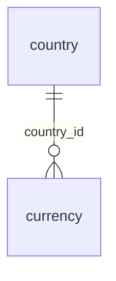

# Postgres Schema Snapshot — Generation Spec

> Point-in-time, per-domain ER documentation generated from `information_schema` + `pg_catalog`.
> This file = **stable rules**. Section 7 (domain→table map) is **data** — move it to its own
> file (`domain-map.yaml` or similar) once the team is comfortable, so schema growth doesn't
> require editing rules.

---

## 1. Purpose

A **static snapshot**, not a live diagram. Answers "what did the schema look like as of migration X,
timestamp Y" — for onboarding, audits, and pre/post-migration diffing. Regenerated on demand, not
on every commit.

## 2. Scope

**In scope:** base tables only (`table_type = 'BASE TABLE'`), across the 13 domains below.

**Out of scope (do not attempt):**
- Views, materialized views, functions, procs, triggers
- Non-unique indexes (PK/UNIQUE only)
- CHECK / EXCLUSION constraints
- Row-Level Security policies
- Sequences, identity/serial internals, generated columns, collations, column comments
- Enum/domain type *definitions* (name only, not the values)
- Composite FK expansion into multiple edges (keep as one relationship)
- App-level-only associations: polymorphic refs, EF owned types, TPH discriminators, shadow properties
- Row data, counts, sample values
- External systems (Nager Holidays, Google/Outlook Calendar, payment providers) — only their
  local config tables count as in-scope tables
- Migration history / schema diff narrative ("as of migration X, Y changed") — this is a
  snapshot, not a changelog

## 3. Required header (every generated doc)

```
DB: <database_name>
Last migration: <EF migration id, from __EFMigrationsHistory>
Snapshot generated: <UTC timestamp>
```

## 4. Extraction queries (run these first — this is the "how")

**4.1 Last applied EF migration**
```sql
SELECT "MigrationId"
FROM "__EFMigrationsHistory"
ORDER BY "MigrationId" DESC
LIMIT 1;
```

**4.2 Columns, in definition order, with type/nullable/default**
```sql
SELECT
  c.table_name,
  c.ordinal_position,
  c.column_name,
  c.data_type,
  c.udt_name,                      -- needed for enums / arrays
  c.character_maximum_length,
  c.numeric_precision,
  c.numeric_scale,
  c.is_nullable,
  c.column_default
FROM information_schema.columns c
JOIN information_schema.tables t
  ON t.table_schema = c.table_schema AND t.table_name = c.table_name
WHERE t.table_type = 'BASE TABLE'
  AND t.table_schema = 'public'
ORDER BY c.table_name, c.ordinal_position;
```

**4.3 PK / UNIQUE / FK constraints, with referenced table+column and delete rule**
```sql
SELECT
  tc.table_name,
  tc.constraint_type,
  tc.constraint_name,
  kcu.column_name,
  kcu.ordinal_position,
  ccu.table_name  AS ref_table,
  ccu.column_name AS ref_column,
  rc.delete_rule
FROM information_schema.table_constraints tc
JOIN information_schema.key_column_usage kcu
  ON tc.constraint_name = kcu.constraint_name
 AND tc.table_schema   = kcu.table_schema
LEFT JOIN information_schema.referential_constraints rc
  ON tc.constraint_name = rc.constraint_name
 AND tc.table_schema   = rc.constraint_schema
LEFT JOIN information_schema.constraint_column_usage ccu
  ON rc.unique_constraint_name  = ccu.constraint_name
 AND rc.unique_constraint_schema = ccu.table_schema
WHERE tc.table_schema = 'public'
  AND tc.constraint_type IN ('PRIMARY KEY','UNIQUE','FOREIGN KEY')
ORDER BY tc.table_name, tc.constraint_type, kcu.ordinal_position;
```

Run these three, dump results as CSV/JSON — that raw output + this spec is everything a generator
(script or LLM) needs per domain.

## 5. Type simplification (Postgres → Mermaid-safe label)

| Postgres | Mermaid label |
|---|---|
| `character varying(n)` | `varcharN` (e.g. `varchar150`) |
| `character varying` (no limit) | `varchar` |
| `timestamp with time zone` | `timestamptz` |
| `timestamp without time zone` | `timestamp` |
| `numeric(p,s)` | `numericP_S` |
| `USER-DEFINED` (enum) | use `udt_name` as-is (type name only) |
| any array (`_int4`, `_text`, ...) | base type + `[]`, e.g. `text[]`, `int4[]` |
| `boolean`, `uuid`, `jsonb`, `integer`, `bigint`, `text`, `date` | unchanged |

## 6. Per-table block template

```
### <table_name>
| Column | Type | Key | Nullable | Default |
|---|---|---|---|---|
| id | uuid | PK | NOT NULL | gen_random_uuid()… |
| tenant_id | uuid | FK, UK(w/ email) | NOT NULL | – |
| email | varchar320 | UK | NOT NULL | – |
| created_at | timestamptz | | NOT NULL | now() |
```
- Column order = `ordinal_position`
- Key column: `PK` / `FK` / `UK` — combine if a column is more than one (e.g. `PK, FK`)
- Default: truncate to ~20 chars + `…` if longer (function calls, casts)

## 7. Relationship rules

**Same-domain FK → drawn in the domain's Mermaid `erDiagram`:**

| FK column nullability | Notation |
|---|---|
| `NOT NULL` | `Parent \|\|--o{ Child : "fk_column"` (exactly-one parent) |
| nullable | `Parent \|o--o{ Child : "fk_column"` (zero-or-one parent) |

Child side is always zero-or-many (`o{`) — a parent row doesn't guarantee children.

**Cross-domain FK → never drawn.** Instead, two tables per domain doc:

```
#### References into other domains
| Source | Target | Target Domain | On Delete |
|---|---|---|---|
| leave_request.employee_id | employee.id | Core HR & Employee Lifecycle | RESTRICT |

#### Referenced by other domains
| Source | Target | Source Domain | On Delete |
|---|---|---|---|
| shift_assignment.employee_id | employee.id | Time & Attendance | CASCADE |
```

## 8. Domain → table map (DATA — move to separate file once stable)

| Domain | Tables |
|---|---|
| Auth & Identity | 18 |
| Tenancy & Subscription | 19 |
| Platform Administration | 17 |
| Org Structure | 9 |
| Core HR & Employee Lifecycle | 22 |
| Time & Attendance | 6 |
| Leave & Time-Off | 13 |
| Calendar | 6 |
| Work Management | 21 |
| Monitoring & Activity | 21 |
| Notifications & Outbox | 3 |
| Files & Infrastructure | 6 |
| Reference Data | 2 |
| **Total** | **163** |

Use this as a sanity check: after generation, count of documented base tables should equal 163.
If not, either scope filter (`table_type`, schema name) is wrong, or the map is stale.

## 9. Workflow (who does what, when)

1. Run queries in §4 against the target DB. Save raw output (CSV/JSON) under
   `/schema-snapshots/raw/<migration_id>/`.
2. Feed raw output + this spec, one domain at a time, to the generator (script or LLM prompt).
3. Generator produces one Markdown file per domain, each starting with the §3 header.
4. Reviewer checks: table count matches §8, no cross-domain edges drawn in any diagram, all
   `ON DELETE` rules present for cross-domain rows.
5. Commit output under `/schema-snapshots/<migration_id>-<YYYY-MM-DD>/`, one file per domain.
6. Regenerate only after an EF migration lands on the shared/main environment — not per PR.

## 10. Maintenance

- This spec file changes rarely (only if conventions change) — PR + review like code.
- §8 domain map changes whenever a table is added or moved — update in the same PR as the
  migration that causes it.
- Keep last N snapshots only; older ones can be deleted, they're superseded by newer migration ids.

## 11. Worked example — what a finished domain document looks like

Everything in §3–§7 stitched together, for one small **fictional** domain. Real output follows
this exact shape, just longer (more tables, bigger diagrams).

---

```
DB: acme_hr_prod
Last migration: 20260815120000_AddCurrencyPrecision
Snapshot generated: 2026-09-09T04:12:00Z
```

# Domain: Reference Data

### ER Diagram (same-domain relationships only)



### country

| Column | Type | Key | Nullable | Default |
|---|---|---|---|---|
| id | uuid | PK | NOT NULL | gen_random_uuid()… |
| iso_code | varchar3 | UK | NOT NULL | – |
| name | varchar100 | | NOT NULL | – |

#### References into other domains
_(none)_

#### Referenced by other domains
| Source | Target | Source Domain | On Delete |
|---|---|---|---|
| employee.country_id | country.id | Core HR & Employee Lifecycle | RESTRICT |

### currency

| Column | Type | Key | Nullable | Default |
|---|---|---|---|---|
| id | uuid | PK | NOT NULL | gen_random_uuid()… |
| country_id | uuid | PK, FK | NOT NULL | – |
| code | varchar3 | UK | NOT NULL | – |
| precision | smallint | | NOT NULL | 2 |

#### References into other domains
_(none — `country_id` is same-domain, already drawn above)_

#### Referenced by other domains
| Source | Target | Source Domain | On Delete |
|---|---|---|---|
| tenant.default_currency_id | currency.id | Tenancy & Subscription | RESTRICT |

---

That's the full unit a generator should produce **once per domain, 13 times total**: header →
same-domain diagram → each table's column block → that table's two cross-domain sections.

## 12. Presentation layer — how this gets browsed

Raw Markdown per domain is fine for a git repo (GitHub/GitLab render Mermaid natively), but for
day-to-day lookup the team should view it as one browsable page, not 13 separate files.

**Layout**
- Sidebar (fixed): snapshot header (DB name, migration id, timestamp) at top, a domain filter box,
  then the 13 domains as a nav list, each with its table count. Current domain marked, not colored
  text — a single indicator dot is enough.
- Main panel: selected domain's diagram first, then each table as a **collapsible card**
  (`<details>`/`<summary>` — free keyboard/accessibility support, no custom JS needed). Card body =
  column table, then "References into other domains" / "Referenced by other domains" underneath.
- A small legend (PK / FK / UK) pinned near the top of the main panel — badges should always be
  legible without memorizing a color code.

**Empty domains** (not yet generated for this snapshot) should say so plainly and name the fix —
e.g. "Not generated yet — run the extraction queries in §4 and regenerate" — not a blank page.

**Build step:** simplest option is a small script that reads the 13 generated `.md` files and
drops their content into this HTML shell — no server, no framework, opens as a static file or
from any internal file host.

A mockup of this exact layout (with the Reference Data domain fully populated from §11, and the
other 12 shown in their empty state) is attached alongside this spec:
`schema-snapshot-viewer-mockup.html`.
